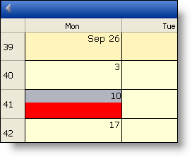
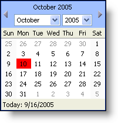

////

|metadata|
{
    "name": "webschedule-set-the-style-of-the-active-day",
    "controlName": ["WebSchedule"],
    "tags": ["How Do I","Scheduling","Styling"],
    "guid": "{A17EAEAA-0198-4BCF-9AF8-00D9F294A6C2}",  
    "buildFlags": [],
    "createdOn": "0001-01-01T00:00:00Z"
}
|metadata|
////

= Set the Style of the Active Day

Sometimes you may want the  pick:[asp-net="link:infragistics4.webui.shared.v{ProductVersion}~infragistics.webui.shared.smartdate~utcnow.html[ActiveDayUtc]"]  to stand out from the rest of the visible days on a WebCalendarView™ and WebMonthView™. The property that controls the styling of the active day is called the  pick:[asp-net="link:infragistics4.webui.webschedule.v{ProductVersion}~infragistics.webui.webschedule.dayorientedscheduleview~activedaystyle.html[ActiveDayStyle]"] .

The ActiveDayStyle object uses the same Style class that is defined for most Infragistics ASP.NET controls.

The code below changes the three views' ActiveDayStyle BackColor to Red, and sets the ActiveDayUtc to October 11, 2005.

*In Visual Basic:*

----
Imports Infragistics.WebUI.Shared
...
Private Sub Page_Load(ByVal sender As System.Object, ByVal _
  e As System.EventArgs) Handles MyBase.Load
        Me.WebCalendarView1.ActiveDayStyle.BackColor = Color.Red
        Me.WebMonthView1.ActiveDayStyle.BackColor = Color.Red
        Me.WebScheduleInfo1.ActiveDay = _
          Me.WebScheduleInfo1.ConvertTimeZoneTimeToUtc(New SmartDate(2005, 10, 10))
End Sub
----

*In C#:*

----
using Infragistics.WebUI.Shared;
...
private void Page_Load(object sender, System.EventArgs e)
{
        this.WebCalendarView1.ActiveDayStyle.BackColor = Color.Red;
        this.WebMonthView1.ActiveDayStyle.BackColor = Color.Red;
        this.WebScheduleInfo1.ActiveDay = 
          this.WebScheduleInfo1.ConvertTimeZoneTimeToUtc(new SmartDate(2005, 10, 10));
}
----