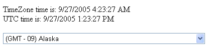

////

|metadata|
{
    "name": "webschedule-setting-the-time-zone",
    "controlName": ["WebSchedule"],
    "tags": ["How Do I","Localization","Scheduling","Styling"],
    "guid": "{BDDDBC01-E0C9-4E8A-847C-F1BB81DA6144}",  
    "buildFlags": [],
    "createdOn": "0001-01-01T00:00:00Z"
}
|metadata|
////

= Setting the Time Zone

== Before You Begin:

WebSchedule™ supports users from multiple time zones in a single web application. Properties such as  pick:[asp-net="link:infragistics4.webui.shared.v{ProductVersion}~infragistics.webui.shared.smartdate~utcnow.html[ActiveDayUtc]"]  are in Coordinated Universal Time (UTC) to facilitate such applications, and Views for users in different time zones will be adjusted accordingly.

Before beginning this walkthrough, you should be familiar with how to set up a WebScheduleInfo™ and WebSchedule View controls on a page. You should have a WebScheduleInfo on a web form with a valid connection to your WebSchedule database.

== Follow These Steps:

[start=1]
. *Add an ASP.NET DropDownList with TimeZone options to the web form.*

This provides the end user with a way of selecting a time zone to use. Code for such a DropDownList is provided here:

*In HTML:*

----
<asp:dropdownlist id="timeZoneList" runat="server" AutoPostBack="True">
        <asp:ListItem value="-12">(GMT - 12) International Date Line West</asp:ListItem>
        <asp:ListItem value="-11">(GMT - 11) Midway Island, Samoa</asp:ListItem>
        <asp:ListItem value="-10">(GMT - 10) Hawaii</asp:ListItem>
        <asp:ListItem value="-9">(GMT - 09) Alaska</asp:ListItem>
        <asp:ListItem value="-9">(GMT - 09) Hawaii (DST)</asp:ListItem>
        <asp:ListItem value="-8">(GMT - 08) Pacific Time (US & Canada); Tijuana</asp:ListItem>
        <asp:ListItem value="-8">(GMT - 08) Yukon Time (DST)</asp:ListItem>
        <asp:ListItem value="-7">(GMT - 07) Pacific Time (DST)</asp:ListItem>
        <asp:ListItem value="-7">(GMT - 07) Arizona</asp:ListItem>
        <asp:ListItem value="-7">(GMT - 07) Chihuahua, La Paz, Mazatlan</asp:ListItem>
        <asp:ListItem value="-7">(GMT - 07) Mountain Time (US & Canada)</asp:ListItem>
        <asp:ListItem value="-6">(GMT - 06) Mountain Time (DST)</asp:ListItem>
        <asp:ListItem value="-6">(GMT - 06) Central Time(US & Canada)</asp:ListItem>
        <asp:ListItem value="-6">(GMT - 06) Guadalajara, Mexico City, Monterrey</asp:ListItem>
        <asp:ListItem value="-6">(GMT - 06) Saskatchewan</asp:ListItem>
        <asp:ListItem value="-5">(GMT - 05) Central Time (DST)</asp:ListItem>
        <asp:ListItem value="-5">(GMT - 05) Bogota, Lima, Quito</asp:ListItem>
        <asp:ListItem value="-5">(GMT - 05) Eastern Time(US & Canada)</asp:ListItem>
        <asp:ListItem value="-5">(GMT - 05) Indiana (East) </asp:ListItem>
        <asp:ListItem value="-4">(GMT - 04) Eastern Time (DST)</asp:ListItem>
        <asp:ListItem value="-4">(GMT - 04) Atlantic Time(Canada)</asp:ListItem>
        <asp:ListItem value="-4">(GMT - 04) Caracas, La Paz, Santiago</asp:ListItem>
        <asp:ListItem value="-3.5">(GMT - 3.5) Newfoundland</asp:ListItem>
        <asp:ListItem value="-3">(GMT - 03) Atlantic Time (DST)</asp:ListItem>
        <asp:ListItem value="-3">(GMT - 03) Brasillia</asp:ListItem>
        <asp:ListItem value="-3">(GMT - 03)  Buenos Aires, Georgetown</asp:ListItem>
        <asp:ListItem value="-3">(GMT - 03)  Greenland</asp:ListItem>
        <asp:ListItem value="-2">(GMT - 02) Mid-Atlantic</asp:ListItem>
        <asp:ListItem value="-1">(GMT - 01) Azores</asp:ListItem>
        <asp:ListItem value="-1">(GMT - 01) Cape Verde Is.</asp:ListItem>
        <asp:ListItem value="0">(GMT) Casablanca, Monrovia</asp:ListItem>
        <asp:ListItem value="0">(GMT) Greenwich Mean Time: Dublin, Edinburgh, Lisbon, London</asp:ListItem>
        <asp:ListItem value="1">(GMT + 01) Belgrade, Bratislava, Budapest, Ljubljana, Prague</asp:ListItem>
        <asp:ListItem value="1">(GMT + 01) Brussels, Copenhagen, Madrid, Paris</asp:ListItem>
        <asp:ListItem value="1">(GMT + 01) Sarajevo, Skopje, Warsaw, Zagreb</asp:ListItem>
        <asp:ListItem value="1">(GMT + 01) West Central Africa</asp:ListItem>
        <asp:ListItem value="2">(GMT + 02) Athens, Beirut, Istanbul, Minsk</asp:ListItem>
        <asp:ListItem value="2">(GMT + 02) Bucharest</asp:ListItem>
        <asp:ListItem value="2">(GMT + 02) Cairo</asp:ListItem>
        <asp:ListItem value="2">(GMT + 02) Harare, Pretoria</asp:ListItem>
        <asp:ListItem value="2">(GMT + 02) Helsinki, Kyiv, Riga, Sofia, Tallinn, Vilnius</asp:ListItem>
        <asp:ListItem value="2">(GMT + 02) Jerusalem</asp:ListItem>
        <asp:ListItem value="3">(GMT + 03) Baghdad</asp:ListItem>
        <asp:ListItem value="3">(GMT + 03) Kuwait, Riyadh</asp:ListItem>
        <asp:ListItem value="3">(GMT + 03) Moscow, St. Petersburg, Volgograd</asp:ListItem>
        <asp:ListItem value="3">(GMT + 03) Nairobi</asp:ListItem>
        <asp:ListItem value="3.5">(GMT + 3.5) Tehran</asp:ListItem>
        <asp:ListItem value="4">(GMT + 04) Abu Dhabi, Muscat</asp:ListItem>
        <asp:ListItem value="4">(GMT + 04) Baku, Tbilisi, Yerevan</asp:ListItem>
        <asp:ListItem value="4.5">(GMT + 4.5) Kabul</asp:ListItem>
        <asp:ListItem value="5">(GMT + 05) Ekaterinburg</asp:ListItem>
        <asp:ListItem value="5">(GMT + 05) Islamabad, Karachi, Tashkent</asp:ListItem>
        <asp:ListItem value="5.5">(GMT + 5.5) Chennai, Kolkata, Mumbai, New Delhi</asp:ListItem>
        <asp:ListItem value="5.75">(GMT + 5.75) Kathmandu</asp:ListItem>
        <asp:ListItem value="6">(GMT + 06) Almaty, Novosibirsk</asp:ListItem>
        <asp:ListItem value="6">(GMT + 06) Astana, Dhaka</asp:ListItem>
        <asp:ListItem value="6">(GMT + 06) Sri Jayawardenepura</asp:ListItem>
        <asp:ListItem value="6.5">(GMT + 6.5) Rangoon</asp:ListItem>
        <asp:ListItem value="7">(GMT + 07) Bangkok, Hanoi, Jakarta</asp:ListItem>
        <asp:ListItem value="7">(GMT + 07) Krasnoyarsk</asp:ListItem>
        <asp:ListItem value="8">(GMT + 08) Beijing, Chongqing, Honk Kong, Urumqi</asp:ListItem>
        <asp:ListItem value="8">(GMT + 08) Irkutsk, Ulaan Bataar</asp:ListItem>
        <asp:ListItem value="8">(GMT + 08)Kuala Lumpur, Singapore</asp:ListItem>
        <asp:ListItem value="8">(GMT + 08) Perth</asp:ListItem>
        <asp:ListItem value="8">(GMT + 08) Taipei</asp:ListItem>
        <asp:ListItem value="9">(GMT + 9) Osaka, Sapporo, Tokyo</asp:ListItem>
        <asp:ListItem value="9">(GMT + 09) Seoul</asp:ListItem>
        <asp:ListItem value="9">(GMT + 09) Yakutsk</asp:ListItem>
        <asp:ListItem value="9.5">(GMT + 9.5) Adelaide</asp:ListItem>
        <asp:ListItem value="9.5">(GMT + 9.5) Darwin</asp:ListItem>
        <asp:ListItem value="10">(GMT + 10) Brisbane</asp:ListItem>
        <asp:ListItem value="10">(GMT + 10) Canberra, Melbourne, Sydney</asp:ListItem>
        <asp:ListItem value="10">(GMT + 10) Guam, Port Moresby</asp:ListItem>
        <asp:ListItem value="10">(GMT + 10) Hobart</asp:ListItem>
        <asp:ListItem value="10">(GMT + 10) Vladivostok</asp:ListItem>
        <asp:ListItem value="11">(GMT + 11) Magadan, Solomon Is., New Caledonia</asp:ListItem>
        <asp:ListItem value="12">(GMT + 12) Auckland, Wellington</asp:ListItem>
        <asp:ListItem value="12">(GMT + 12) Fiji, Kamchatka, Marshall Is. </asp:ListItem>
        <asp:ListItem value="13">(GMT + 13) Nuku'alofa</asp:ListItem>
</asp:dropdownlist>
----

[start=2]
. *Write code in the DropDownList's SelectedIndexChanged event handler to change the WebScheduleInfo's TimeZoneOffset property.*

The TimeZone offset, expressed as a number of hours, can be retrieved from the Value of the SelectedItem of the DropDownList created in the previous step. By using this value in conjunction with the TimeSpan.FromHours method, the TimeZoneOffset property of the WebScheduleInfo object can be set.

In the code snippet below, Response.Write is used to print the TimeZone time and UTC time after this property setting. This demonstrates the use of the WebScheduleInfo's  pick:[asp-net="link:infragistics4.webui.webschedule.v{ProductVersion}~infragistics.webui.webschedule.webscheduleinfo~utcnow.html[UtcNow]"]  property, and the useful  pick:[asp-net="link:infragistics4.webui.webschedule.v{ProductVersion}~infragistics.webui.webschedule.webscheduleinfo~convertutctotimezonetime.html[ConvertUtcToTimeZoneTime]"]  method.

*In Visual Basic:*

----
Private Sub timeZoneList_SelectedIndexChanged(ByVal sender As Object, ByVal e As System.EventArgs) Handles timeZoneList.SelectedIndexChanged
        Dim offset As Double = Double.Parse(Me.timeZoneList.SelectedItem.Value)
        Me.WebScheduleInfo1.TimeZoneOffset = TimeSpan.FromHours(offset)
        Response.Write("TimeZone time is: " + _
                Me.WebScheduleInfo1.ConvertUtcToTimeZoneTime(Me.WebScheduleInfo1.UtcNow).ToString() + _
                " ")
        Response.Write("UTC time is: " + Me.WebScheduleInfo1.UtcNow.ToString())
End Sub
----

*In C#:*

----
private void timeZoneList_SelectedIndexChanged(object sender, System.EventArgs e)
{
        double offset = double.Parse(this.timeZoneList.SelectedItem.Value);
        this.WebScheduleInfo1.TimeZoneOffset = TimeSpan.FromHours(offset);
        Response.Write("TimeZone time is: " + 
                this.WebScheduleInfo1.ConvertUtcToTimeZoneTime(this.WebScheduleInfo1.UtcNow).ToString() + 
                " ");
        Response.Write("UTC time is: " + this.WebScheduleInfo1.UtcNow.ToString());
}
----

[start=3]
. *Run the application.*

Change the value in the DropDownList to observe the effect of this code. The TimeZone time and UTC time, as retrieved through the WebScheduleInfo, are printed to the page.

== What You Accomplished:

You created a DropDownList which allows the end user to change the current TimeZoneOffset of the WebScheduleInfo.

Now, you should be familiar with how UTC and TimeZone time are used in WebSchedule.

