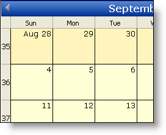

////

|metadata|
{
    "name": "webschedule-show-weekends-as-separate-days",
    "controlName": ["WebSchedule"],
    "tags": ["How Do I","Scheduling","Styling"],
    "guid": "{72F075D2-5453-4B98-92ED-7EBA1DBEA584}",  
    "buildFlags": [],
    "createdOn": "0001-01-01T00:00:00Z"
}
|metadata|
////

= Show Weekends as Separate Days

WebMonthView™ by default shows the Weekends compressed as one day. You can change this functionality if you want by setting the  pick:[asp-net="link:{ApiPlatform}webui.webschedule{ApiVersion}~infragistics.webui.webschedule.webmonthview~weekenddisplayformat.html[WeekendDisplayFormat]"]  property.

The code below shows the setting of this property using the  pick:[asp-net="link:{ApiPlatform}webui.webschedule{ApiVersion}~infragistics.webui.webschedule.weekenddisplayformat.html[WeekendDisplayFormat]"]  enumeration.

*In Visual Basic:*

----
Imports Infragistics.WebUI.WebSchedule
...
Private Sub Page_Load(ByVal sender As System.Object, ByVal e _
  As System.EventArgs) Handles MyBase.Load
	Me.WebMonthView1.WeekendDisplayFormat = WeekendDisplayFormat.Full
End Sub
----

*In C#:*

----
using Infragistics.WebUI.WebSchedule;
...
private void Page_Load(object sender, System.EventArgs e)
{
	this.WebMonthView1.WeekendDisplayFormat = WeekendDisplayFormat.Full;
}
----