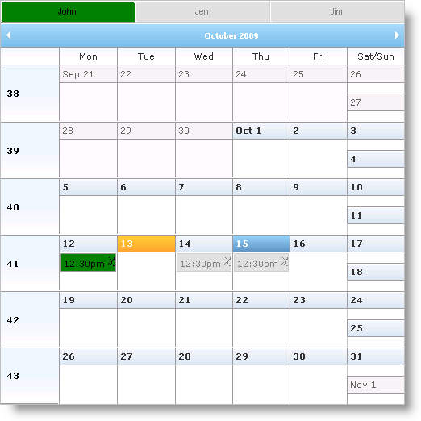

////

|metadata|
{
    "name": "webschedule-styling-active-and-inactive-resources",
    "controlName": ["WebSchedule"],
    "tags": ["How Do I","Scheduling","Styling"],
    "guid": "{B244334B-4379-4A20-9196-37A78260404D}",  
    "buildFlags": [],
    "createdOn": "0001-01-01T00:00:00Z"
}
|metadata|
////

= Styling Active and Inactive Resources

Multi Resource View gives you multiple buttons for multiple resources allowing you to switch between different resources available. You can change the styles for these buttons as well as the styles for their appointments.

You can use the following style properties to style resources and activities for Multi Resource View:

* link:infragistics4.webui.webschedule.v{ProductVersion}~infragistics.webui.webschedule.webscheduleviewbase~fadedappointmentstyle.html[FadedAppointmentStyle]– Style for inactive appointments and inactive resource buttons.
* link:infragistics4.webui.webschedule.v{ProductVersion}~infragistics.webui.webschedule.webscheduleviewbase~resourcebuttonactivestyle.html[ResourceButtonActiveStyle] – Style for active resource buttons.
* link:infragistics4.webui.webschedule.v{ProductVersion}~infragistics.webui.webschedule.webscheduleviewbase~resourcebuttonstyle.html[ResourceButtonStyle] – Style for all resource buttons. Overwrites the above styles if this is set.

The following code shows you how to set the active resource button and its appointments to a green color and inactive buttons and appointments to a silver color.

*In HTML:*

----

…
<igsch:WebMonthView ID="WebMonthView1" runat='server' WebScheduleInfoID="WebScheduleInfo1">
    <%--Set active button color--%> 
    <ResourceButtonActiveStyle CssClass="activeResource">
    </ResourceButtonActiveStyle>
    <%-- Set inactive button and appointment color --%>
    <FadedAppointmentStyle CssClass="inactiveResource">
    </FadedAppointmentStyle>
    <%-- Set active appointment color --%>
    <AppointmentStyle CssClass="activeResource">
    </AppointmentStyle>
</igsch:WebMonthView>
----

== Related Topics

link:webschedule-about-multi-resource-view.html[About Multi Resource View]

link:webschedule-set-visible-resources.html[Set Visible Resources]