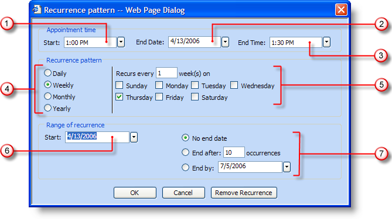
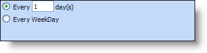
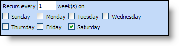
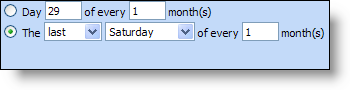
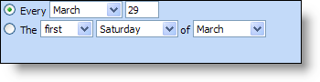

////

|metadata|
{
    "name": "webschedule-using-the-recurrence-pattern-dialog-box",
    "controlName": ["WebSchedule"],
    "tags": ["Design Environment","Patterns and Practices","Scheduling"],
    "guid": "{A1A8B8CA-9E97-4D5A-BC60-D8FD19F8B5F6}",  
    "buildFlags": [],
    "createdOn": "2006-10-04T00:00:00Z"
}
|metadata|
////

= Using the Recurrence Pattern Dialog Box

The recurrence pattern dialog box is a simple way to set up complex recurring appointments. To open the dialog box, double-click on any day in any calendar view – this will open the Appointment dialog box. At the top of the Appointment dialog box is a button called Recurrence. Clicking this button opens the Recurrence Pattern dialog box shown below. Each section of the dialog box is explained in greater detail beneath the screenshot.

[start=1]
. Appointment Start Time – This field displays the time of day that the recurring appointment will begin. Clicking the drop-down arrow displays time options in intervals of half hours.
[start=2]
. Appointment End Date – The appointment end date refers to the root appointment, not the entire recurrence. For example, the root appointment could be Monday through Wednesday. Monday, the start date, would already be known by the specific day you double-clicked to open the appointment dialog box. The end date would then be three days later on Wednesday. The Recurrence Pattern section of the dialog box can then be used to set whether that initial three-day appointment takes place weekly, monthly, or yearly.
[start=3]
. Appointment End Time – This is the time of day that the recurring appointment will end. Clicking the drop-down arrow displays time options in intervals of half hours.
[start=4]
. Recurrence Pattern – Your recurring appointment can occur every day (Daily), once a week (Weekly), once a month (Monthly), or once a year (Yearly). For example, if a department meeting is held every Friday at 9:00 am, the end user would select Weekly.
[start=5]
. Recurrence Pattern Specifics – If a recurring appointment recurs daily, the end user can choose whether the appointment occurs every day, every other day, or any other combination. The end user also has the option of the appointment recurring on weekdays (Monday through Friday).

If a recurring appointment recurs weekly, the end user can choose how many weeks exist between the appointments; as well as what day(s) the appointment is on.

If a recurring appointment recurs monthly, the end user can choose which day of the month that the appointment occurs, as well as how many months between occurrences of the appointment. An alternate method of setting up a monthly recurring appointment is to choose which week of the month (e.g. first, second, last) and which day of the week (e.g. Monday, Tuesday, Wednesday).

If a recurring appointment recurs yearly, the end user can either choose a specific date (e.g. March, 29) or the day of a specific month (e.g. first Saturday in March, last Monday in January).

[start=6]
. Range of recurrence (Beginning) – The start date of the recurrence is automatically filled in with the date that is double-clicked in order to open the Appointment dialog box. Clicking the drop-down arrow opens a calendar so that the end user can change the beginning of the recurrence.
[start=7]
. Range of recurrence (End) – The end date of the recurrence (not the root appointment). The recurrence can have no end date, end after a specific number of occurrences, or end by a specific date.