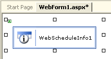
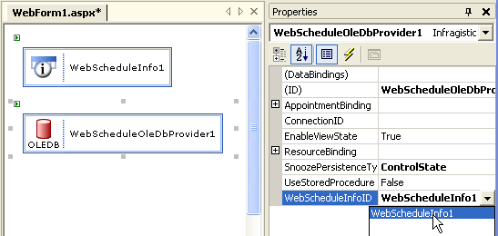
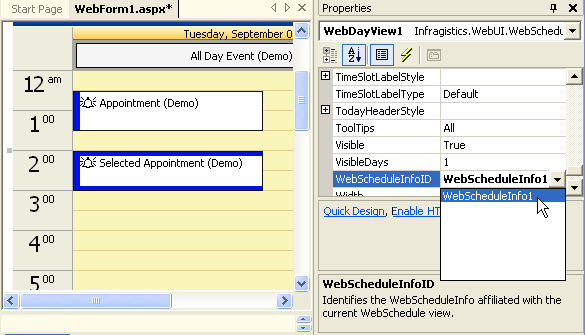
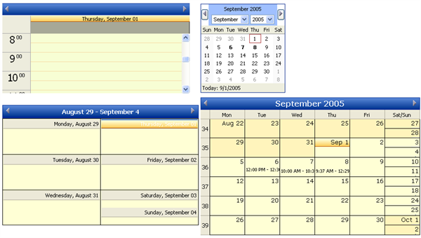

////

|metadata|
{
    "name": "webschedule-using-the-webschedule-controls-quick-design",
    "controlName": ["WebSchedule"],
    "tags": ["Design Environment","Getting Started","Scheduling"],
    "guid": "{1ECF14B6-398D-49F5-A447-F5190C421AE5}",  
    "buildFlags": [],
    "createdOn": "2005-06-09T00:00:00Z"
}
|metadata|
////

= Using the WebSchedule Controls Quick Design

== Before You Begin:

The purpose of this walk-through is to familiarize the application developer with the WebSchedule™ controls, and outline the initial steps required to work with them.

This walk-through assumes that the reader is using Visual Studio .NET.

== Follow These Steps:

[start=1]
. *Add a WebScheduleInfo control to the WebForm.*

The WebScheduleInfo™ object is required by and central to the operations of all WebSchedule controls.

Locate the Infragistics WebScheduleInfo control in the Visual Studio .NET toolbox and drag it onto the WebForm.

[start=2]
. *Add a WebScheduleDataProvider control to the WebForm and set its WebScheduleInfoID property.*

WebSchedule controls must always be connected to data. The WebScheduleInfo object uses a WebSchedule data provider to connect to a database with WebSchedule data. This walk-through uses the WebScheduleOleDbProvider™.

Find the Infragistics WebScheduleOleDbProvider control in the Visual Studio .NET toolbox and drag it onto the WebForm. Select this control and in the Properties grid, set its WebScheduleInfoID property to the ID of the WebScheduleInfo control.

By default, the DataProvider will be bound to the Access sample database which is provided in the Infragistics ASP.NET Installation. For the purpose of this walk-through, this is fine. For information on how to use an Access database in a different location, refer to link:webschedule-connecting-webschedule-to-a-database-in-visual-studio-2005.html[Connecting WebSchedule to a Database in Visual Studio 2005].

[start=3]
. *Add WebSchedule controls to the WebForm and set their WebScheduleInfoID properties.*

Using the Visual Studio .NET toolbox, add a WebCalendarView™, WebDayView™ and WebMonthView™ to the WebForm. For each control added, set the WebScheduleInfoID property to the ID of the WebScheduleInfo control that was added in step 1.

[start=4]
. *Run the project.*
[start=5]
. Now build the project and browse to the page. All the WebSchedule controls will appear, and they will be synchronized with each other. You can now observe the following WebSchedule control behaviors:

** Click on a day in the MonthView control, and observe how the page posts back to the server and all the controls synchronize to the new Active Day.
** Double-click on a day, or a time-slot in the WebDayView, to bring up the appointment dialog and add an appointment.
** This appointment will be written to the WebSchedule database and will be visible for all future visits to the page.
** If the "Reminder" option was selected in the appointment dialog, a reminder dialog will appear at the appropriate time, if the page is visited 15 minutes before the appointment time.
** The appointment can be extended or rescheduled by resizing or dragging it in the WebDayView.

== What You Accomplished:

You created a data-driven schedule application using all the WebSchedule controls with their default settings.

You should now be familiar with the steps necessary to get WebSchedule controls running, and prepared to start customizing these controls' appearance and behavior.

