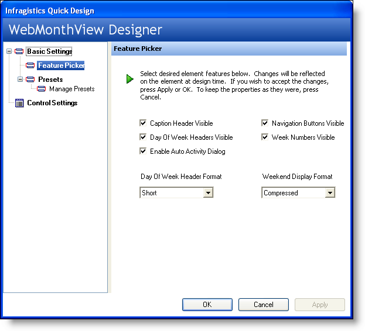
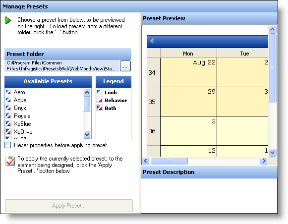
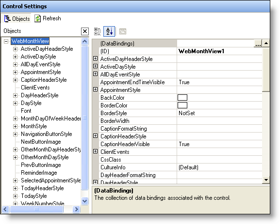
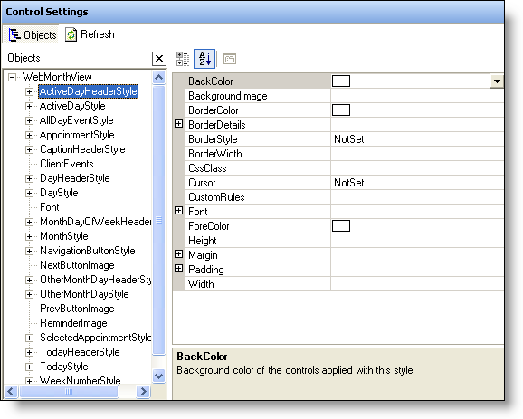

////

|metadata|
{
    "name": "webschedule-using-webmonthviews-designer",
    "controlName": ["WebSchedule"],
    "tags": ["Design Environment","How Do I","Scheduling"],
    "guid": "{4F97483A-22A7-4E54-83E2-0DD601F0E0F2}",  
    "buildFlags": [],
    "createdOn": "0001-01-01T00:00:00Z"
}
|metadata|
////

= Using WebMonthView's Designer

== Before You Begin:

The WebSchedule™ controls are provided with user-friendly Quick Designers to help you easily set up the look and functionality of a control. Each control has layout options similar to those of the Feature Picker, Presets, Manage Presets, and Control Settings. These options are unavailable only if the control does not have the corresponding functionality.

In this topic, we will show you how to use the WebMonthView's Quick Designer. This will include showing you how to use the designer to apply presets to the control, as well as how to set up standard functionality using the Feature Picker.

== Follow These Steps:

[start=1]
. *Create a new ASP.NET project* .
[start=2]
. *Add the control to the form.*

With the web form open in design view, drag a WebMonthView™ control from the toolbox onto the form.
[start=3]
. *Open the WebMonthView's designer.*

Right-click on the control, and select click Quick Design. This will activate the WebMonthView's designer.

.Note:
[NOTE]
====
The screen captures below are smaller than the actual size, and may be cropped to allow for the screen captures to be displayed in the topic without having to horizontally scroll the window.
====

[start=4]
. *The Feature Picker is loaded.* The WebMonthView Designer loads with the Feature Picker selected. The Feature Picker is designed to allow you to quickly and easily set some of the standard functional properties of the control in a convenient location, without making you scroll though the entire properties listing of the control. Some of the many features that you can set include  pick:[asp-net="link:infragistics4.webui.webschedule.v{ProductVersion}~infragistics.webui.webschedule.webmonthview~weeknumbersvisible.html[WeekNumbersVisible]"] ,  pick:[asp-net="link:infragistics4.webui.webschedule.v{ProductVersion}~infragistics.webui.webschedule.webmonthview~dayofweekheadersvisible.html[DayOfWeekHeadersVisible]"] , and  pick:[asp-net="link:infragistics4.webui.webschedule.v{ProductVersion}~infragistics.webui.webschedule.webmonthview~weekenddisplayformat.html[WeekendDisplayFormat]"] .
[start=5]
. *Select the Presets node.* The next node of interest is the Presets node. Selecting this node will change the Designer to display the following.

image::images/WebSchedule_Walk_Through_Using_the_WebMonthView_Designers_02.png[]

[start=6]
. *Choose an existing preset or select your own.*

The Presets page gives you the option of choosing one of Infragistics ASP.NET's existing presets, or your own preset if you have styled the control yourself.

Clicking on the Choose A Preset button will take you to the Manage Presets node. Alternatively, you can expanding the Presets node and selecting the Manage Presets node.
[start=7]
. *Manage the presets.* The Manage Presets area allows you to choose one of Infragistics ASP.NET's predefined presets. By selecting one of the presets from the Available presets box, the Preset Preview will change to show the WebMonthView with the selected preset applied to it.

Select the Onyx preset and see how the Preset Preview changes.

[start=8]
. *Choose whether you want to apply the preset.* If you want to use this preset, click the Apply Preset button. If you apply the preset, a dialog box opens asking if you want to reset all preset properties related to the look and behavior back to the default before applying the preset. This can be useful if you have made some styling changes that you don't want to keep. After you click Yes or No, before closing the WebMonthView designer, make sure that you click the Apply button in the lower-left corner of the dialog box.

.Note:
[NOTE]
====
You may find it useful to apply your Preset before defining any other settings on the control.
====

[start=9]
. *Review the Control Settings area.* The Control Settings area displays on the right-hand area of the WebMonthView's properties dialog box exactly as it would appear in Visual Studio .NET's Properties dialog box.

[start=10]
. *Work with some of the key styling objects.*

One advantage that the Control Settings area has over the Visual Studio .NET's Properties dialog box is that in the middle of the area, it conveniently pulls out some of the key styling objects that you may want to use. If you select  pick:[asp-net="link:infragistics4.webui.webschedule.v{ProductVersion}~infragistics.webui.webschedule.dayorientedscheduleview~activedayheaderstyle.html[ActiveDayHeaderStyle]"] , you will notice that the Properties area in the right-hand area of the window will change to show that particular style's properties.

[start=11]
. *Apply your changes.*

When you make changes in any area of the WebMonthView designer, make sure you click the Apply button in the lower-left corner before closing the designer so that they are actually applied to the control. Otherwise, a dialog box will appear asking if you want to save the changes you made before exiting the designer. You may want to click No, if you are simply browsing through some of the various properties available.

== What You Accomplished:

This walk-through was designed to help you become more familiar with the WebMonthView's Quick Designer, and the benefits that it offers you.