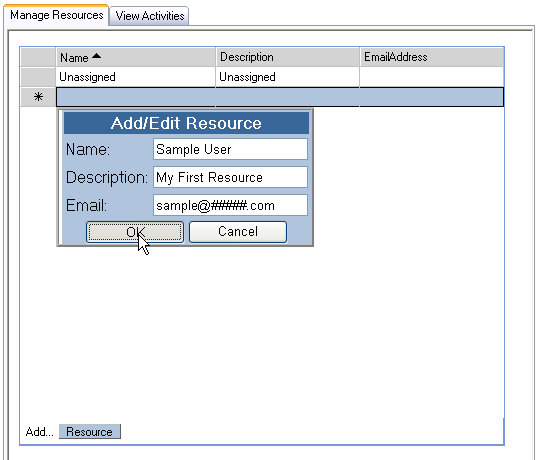

////

|metadata|
{
    "name": "webschedule-working-with-resources-and-activities",
    "controlName": ["WebSchedule"],
    "tags": ["How Do I","Scheduling"],
    "guid": "{CFF0E2FB-F79A-441D-A587-BD422222E764}",  
    "buildFlags": [],
    "createdOn": "0001-01-01T00:00:00Z"
}
|metadata|
////

= Working with Resources and Activities

== Before You Begin:

The purpose of this walk-through is to familiarize you with the concepts of  pick:[asp-net="link:{ApiPlatform}webui.webschedule{ApiVersion}~infragistics.webui.webschedule.resource.html[Resources]"]  and  pick:[asp-net="link:{ApiPlatform}webui.webschedule{ApiVersion}~infragistics.webui.webschedule.activity.html[Activities]"]  in WebSchedule™.

This walk-through assumes that you have completed one of the following WebSchedule quick-start walk-throughs:

* link:webschedule-using-the-webschedule-controls-quick-design.html[WebSchedule Quick Start Using the Designers]
* link:webschedule-creating-webschedule-controls-using-code.html[WebSchedule Quick Start Using Code]

== Follow these Steps:

[start=1]
. Before you start writing any code, you should place using/imports directives in your code-behind so you don't need to always type out a member's fully qualified name.

*In Visual Basic:*

----
Imports Infragistics.WebUI.Shared
Imports Infragistics.WebUI.WebSchedule
----

*In C#:*

----
using Infragistics.WebUI.Shared;
using Infragistics.WebUI.WebSchedule;
----

[start=2]
. *Add a Resource to the WebSchedule database.*

By default, the WebSchedule sample database contains only one resource, "Unassigned". WebSchedule is designed for applications with many users. Resources can be added through the WebSchedule API using the DataProvider's  pick:[asp-net="link:{ApiPlatform}webui.webscheduledataprovider{ApiVersion}~infragistics.webui.data.webscheduledbprovider~addresource.html[AddResource]"]  method.

To add a resource to use in this sample, browse to the WebSchedule Admin Sample in the ASP.NET Samples Browser. On the "Manage Resources" tab, click the Add Resource button and enter values in the dialog box to create a new resource.

Here is the code used by the admin sample to add a new Resource:

*In Visual Basic:*

----
' create a new resource and set its properties
Dim resourceToAdd As New Resource()
resourceToAdd.Name = row.Cells.FromKey("Name").Text
resourceToAdd.Description = row.Cells.FromKey("Description").Text
resourceToAdd.EmailAddress = row.Cells.FromKey("EmailAddress").Text
' use the WebScheduleDataProvider's AddResource method to add a resource
Me.WebScheduleOleDbProvider1.AddResource(resourceToAdd)
----

*In C#:*

----
// create a new resource and set its properties
Resource resourceToAdd = new Resource();
resourceToAdd.Name = row.Cells.FromKey("Name").Text;
resourceToAdd.Description = row.Cells.FromKey("Description").Text;
resourceToAdd.EmailAddress = row.Cells.FromKey("EmailAddress").Text;
// use the WebScheduleDataProvider's AddResource method to add a resource
this.WebScheduleOleDbProvider1.AddResource(resourceToAdd);
----

[start=3]
. *Set the ActiveResourceName property of the WebScheduleInfo object.*

Back in the project created in the WebSchedule Quick-Start Walk-Through, add the following lines of code to the Page.Load event:

*In Visual Basic:*

----
Private Sub Page_Load(ByVal sender As Object, _
  ByVal e As EventArgs) Handles MyBase.Load
        Me.WebScheduleInfo1.ActiveResourceName = "Sample User"
End Sub
----

*In C#:*

----
private void Page_Load(object sender, System.EventArgs e)
{
        this.WebScheduleInfo1.ActiveResourceName = "Sample User";
}
----

[start=4]
. *Run the project.*

The result doesn't look any different from the Quick-Start Walk-Through when the  pick:[asp-net="link:{ApiPlatform}webui.webschedule{ApiVersion}~infragistics.webui.webschedule.fetchresourcescontext~activeresourcename.html[ActiveResource]"]  was "Unassigned". However, now only the activities for "Sample User" can be seen and edited in the WebSchedule controls.

At this time, you can repeat the steps of this walk-through to add another resource.

In a typical WebSchedule application, resources would be added through an Administration interface such as the WebSchedule Admin Sample, or users would have the ability to input their own information and create resources for themselves. A login screen or even Windows authentication could then be used to allow users to log in and view or edit their own activities using the WebSchedule controls.

== What You Accomplished:

You used the WebSchedule Admin sample to create a new Resource and configured your sample project to use that as the active resource.

You should now be familiar with the concepts of Resources and Activities in WebSchedule, how Resources can be added using the API, and how the WebSchedule controls are used to view or edit Activities for a given resource.