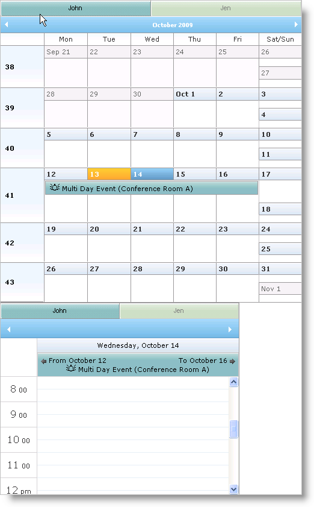

////

|metadata|
{
    "name": "webschedulegenericdataprovider-about-multi-day-event-banner",
    "controlName": [],
    "tags": ["How Do I"],
    "guid": "{F80ED2D8-D2CA-4496-B501-9E3BB145A047}",  
    "buildFlags": [],
    "createdOn": "0001-01-01T00:00:00Z"
}
|metadata|
////

= About Multi Day Event Banner

The WebDayView™ and WebMonthView™ WebSchedule™ controls can display a continuous banner for events that span multiple days, weeks, months, or years. The WebScheduleInfo™ component's link:{ApiPlatform}webui.webschedule{ApiVersion}~infragistics.webui.webschedule.webscheduleinfo~enablemultidayeventbanner.html[EnableMultiDayEventBanner] property controls this feature, which is True by default. If EnableMultiDayEventBanner is set to false, a multiple day event displays as single blocks across multiple days.

You can also display arrows indicating the start and end dates that the event spans, by setting the link:{ApiPlatform}webui.webschedule{ApiVersion}~infragistics.webui.webschedule.webscheduleinfo~enablemultidayeventarrows.html[EnableMultiDayEventArrows] property, which is True by default.

The following code shows you how to disable multi-day event banner if you don't need it.

*In HTML:*

----
<igsch:webscheduleinfo runat="server" ID="WebScheduleInfo1" 
    EnableSmartCallbacks="True" 
    EnableMultiDayEventBanner=" EnableMultiDayEventArrows=">
</igsch:webscheduleinfo>
----

*In Visual Basic:*

----
Protected Sub Page_Init(ByVal sender As Object, ByVal e As EventArgs)
    If Not Page.IsPostBack Then
        Me.WebScheduleInfo1.EnableMultiDayEventBanner = False
    End If
End Sub
----

*In C#:*

----
protected void Page_Init(object sender, EventArgs e)
{
    if (!Page.IsPostBack)
    {
        this.WebScheduleInfo1.EnableMultiDayEventBanner = false;
    }
}
----

== Related Topics

link:webschedulegenericdataprovider-localize-multi-day-event-banner-caption.html[Localize Multi Day Event Banner Caption]

link:webschedulegenericdataprovider-style-multi-day-event-banner.html[Style Multi Day Event Banner]