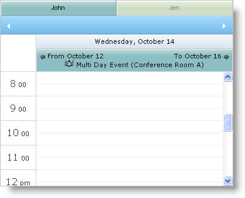
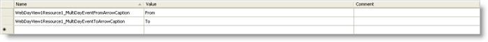
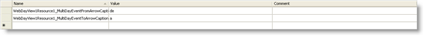

////

|metadata|
{
    "name": "webschedulegenericdataprovider-localize-multi-day-event-banner-caption",
    "controlName": [],
    "tags": ["How Do I"],
    "guid": "{D5DBA8FE-3F1D-4C04-8BBB-D5B16B0AC3C4}",  
    "buildFlags": [],
    "createdOn": "0001-01-01T00:00:00Z"
}
|metadata|
////

= Localize Multi Day Event Banner Caption

== Before You Begin

The WebScheduleInfo™ component's link:{ApiPlatform}webui.webschedule{ApiVersion}~infragistics.webui.webschedule.webscheduleinfo~enablemultidayeventarrows.html[EnableMultiDayEventArrows] property allows you to display arrows labeling date an event occurs "from" and the date it occurs "to".

These labels are available for the WebDayView™ and WebMonthView™ controls. If you need to localize these labels, you can use the following two properties:

* link:{ApiPlatform}webui.webschedule{ApiVersion}~infragistics.webui.webschedule.webdayview~multidayeventfromarrowcaption.html[MultiDayEventFromArrowCaption]
* link:{ApiPlatform}webui.webschedule{ApiVersion}~infragistics.webui.webschedule.webdayview~multidayeventtoarrowcaption.html[MultiDayEventToArrowCaption]

You should be familiar with how to set up the WebSchedule controls and components on your webpage.

== What You Will Accomplish

You will learn how to localize WebDayView's multiday event labels for Spanish-speaking locales.

== Follow these Steps

[start=1]
. Create an ASP.NET WebSite.
[start=2]
. Set up WebDayView on the page. For more information on this, see link:webschedule-using-the-webschedule-controls-quick-design.html[Using WebSchedule Controls Quick Design]
[start=3]
. Right-click the project in the Solution Explorer and select Add New Item.
[start=4]
. Select Resource File in the dialog box that appears.
[start=5]
. Click Add.
[start=6]
. Accept the prompt to add the Resource file to the App_GlobalResources folder.
[start=7]
. Open the Resource file.
[start=8]
. Define the resource names and values for the multiday event arrows, with the names being WebDayView1Resource1_MultiDayEventFromArrowCaption and WebDayView1Resource1_MultiDayEventToArrowCaption, and the values being From and To, respectively.

[start=9]
. Make a copy of the Resource file and rename it to Resource.es-Es.resx to define the resource file for Spanish-speaking locales.
[start=10]
. Define the values in Spanish with the values being de and a.

[start=11]
. Set UICulture and Culture to "auto" in the page directive.

*In HTML:*

----
<%@ Page Language="C#" AutoEventWireup="true" CodeFile="BindingtoDataSourceControl.aspx.cs" Inherits="BindingtoDataSourceControl" UICulture="Auto" Culture="Auto" %>
----

[start=12]
. In the page load event, set WebDayView to use the definition from the Resource file for the From and To labels.

*In Visual Basic:*

----
Me.WebDayView1.MultiDayEventFromArrowCaption = GetGlobalResourceObject("Resource", "WebDayView1Resource1_MultiDayEventFromArrowCaption").ToString()
Me.WebDayView1.MultiDayEventToArrowCaption = GetGlobalResourceObject("Resource", "WebDayView1Resource1_MultiDayEventToArrowCaption").ToString()
----

*In C#:*

----
this.WebDayView1.MultiDayEventFromArrowCaption = GetGlobalResourceObject("Resource", "WebDayView1Resource1_MultiDayEventFromArrowCaption").ToString();
this.WebDayView1.MultiDayEventToArrowCaption = GetGlobalResourceObject("Resource", "WebDayView1Resource1_MultiDayEventToArrowCaption").ToString();
----

[start=13]
. Run the application. In browsers that are set up to use the Spanish language, the multiday event arrows will be displayed in Spanish.

image::images/WebScheduleGenericDataProvider_Localize_Multi_Day_Event_Banner_Caption_04.png[]

== Related Topics

link:webschedulegenericdataprovider-about-multi-day-event-banner.html[About Multi Day Event Banner]

link:webschedulegenericdataprovider-style-multi-day-event-banner.html[Style Multi Day Event Banner]