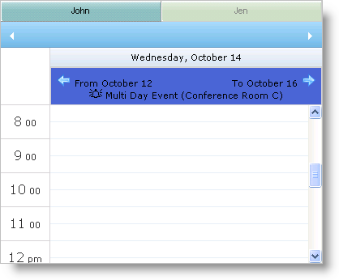

////

|metadata|
{
    "name": "webschedulegenericdataprovider-style-multi-day-event-banner",
    "controlName": [],
    "tags": ["Events","How Do I","Styling"],
    "guid": "{E563D5DE-9205-4BFE-9A40-8C54A7E6FA95}",  
    "buildFlags": [],
    "createdOn": "0001-01-01T00:00:00Z"
}
|metadata|
////

= Style Multi Day Event Banner

You can customize the look of the multiday event arrows when displaying events spanning multiple days. The WebMonthView™ and WebDayView™ WebSchedule™ controls expose the link:infragistics4.webui.webschedule.v{ProductVersion}~infragistics.webui.webschedule.webdayview~multidayeventarrowleftstyle.html[MultiDayEventArrowLeftStyle] and link:infragistics4.webui.webschedule.v{ProductVersion}~infragistics.webui.webschedule.webdayview~multidayeventarrowrightstyle.html[MultiDayEventArrowRightStyle] properties to allow you to set custom styles.

To change the style of the banner itself, use the link:infragistics4.webui.webschedule.v{ProductVersion}~infragistics.webui.webschedule.webdayview~alldayeventstyle.html[AllDayEventStyle] property.

The following code shows you how to set custom multiday event arrow images and change the banner's background color for WebDayView.

*In HTML:*

----

…
<igsch:WebDayView ID="WebDayView1" runat="server" WebScheduleInfoID="WebScheduleInfo1">
    <MultiDayEventArrowLeftStyle CssClass="leftArrow">
    </MultiDayEventArrowLeftStyle>
    <MultiDayEventArrowRightStyle CssClass="rightArrow">
    </MultiDayEventArrowRightStyle>
    <AllDayEventStyle CssClass="banner">
    </AllDayEventStyle>
</igsch:WebDayView>
----

== Related Topics

link:webschedulegenericdataprovider-about-multi-day-event-banner.html[About Multi Day Event Banner]

link:webschedulegenericdataprovider-localize-multi-day-event-banner-caption.html[Localize Multi Day Event Banner Caption]