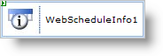

////

|metadata|
{
    "name": "webscheduleinfo-about-webscheduleinfo",
    "controlName": ["WebScheduleInfo"],
    "tags": [],
    "guid": "{4B9EC408-D0BC-4A66-AFBF-EABAD8C31A37}",  
    "buildFlags": [],
    "createdOn": "0001-01-01T00:00:00Z"
}
|metadata|
////

= About WebScheduleInfo

== The WebScheduleInfo

The WebScheduleInfo™ component manages and exposes all scheduling information and control state synchronized across one or more WebSchedule views. It centralizes data management of classes and collections important within the WebSchedule object model including the collection of  pick:[asp-net="link:{ApiPlatform}webui.webschedule{ApiVersion}~infragistics.webui.webschedule.activitiescollection.html[Activities]"]  and the  pick:[asp-net="link:{ApiPlatform}webui.webschedule{ApiVersion}~infragistics.webui.webschedule.webscheduleinfo~visibleresources.html[VisibleResource]"] .

Within the context of a Model-View-Controller paradigm the WebScheduleInfo acts as the Controller of all WebDayViews, WebWeekViews, WebMonthViews, and WebCalendarViews that use it. For these controls to function properly, you must assign them a WebScheduleInfo. When one or more WebSchedule views connect to a WebScheduleInfo that you place on the page they reflect the same active day and share certain common functionality (for example, whether all views should enable activities to be added.)

The WebScheduleInfo ties together data bound from the WebSchedule data providers during data binding to make it available to the WebSchedule views through the WebSchedule object model.

End users cannot see the WebScheduleInfo (it is a nonvisual element) but they feel it's effects when your application takes advantage of the client-side object model it maintains through client-side scripting. Examples of default behavior furnished by the WebScheduleInfo client-side object model include serving as the hub for raising the Web dialog forms to add or edit an  pick:[asp-net="link:{ApiPlatform}webui.webschedule{ApiVersion}~infragistics.webui.webschedule.activity.html[Activity]"]  (regardless of the WebSchedule view from which the action originated), mediating active day synchronization, and popping up reminder notifications.