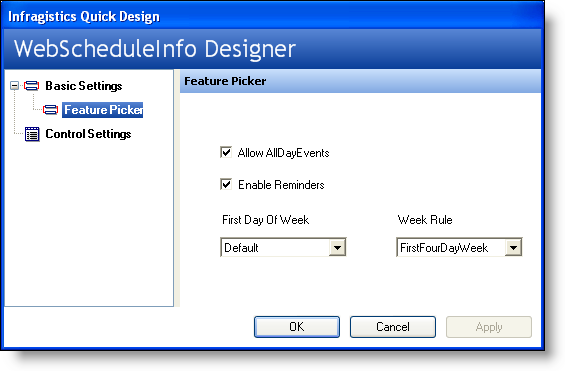
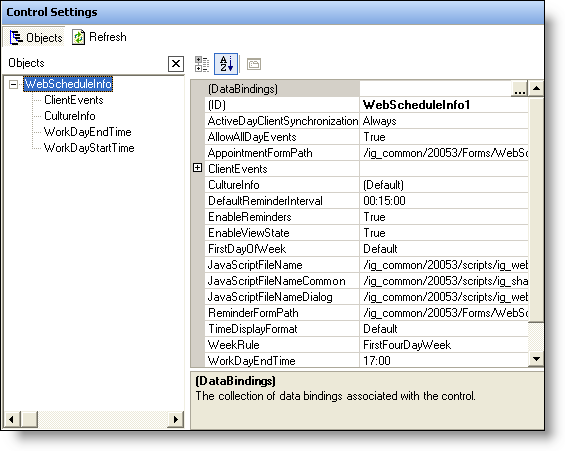
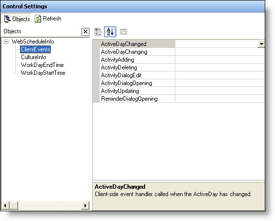

////

|metadata|
{
    "name": "webscheduleinfo-using-webscheduleinfos-designer",
    "controlName": ["WebScheduleInfo"],
    "tags": [],
    "guid": "{2F7964C5-76AA-45B9-ABDE-7B950D9E1F31}",  
    "buildFlags": [],
    "createdOn": "0001-01-01T00:00:00Z"
}
|metadata|
////

= Using WebScheduleInfo's Designer

== Before You Begin:

The WebSchedule™ controls are provided with user-friendly Quick Designers to help you easily set up the look and functionality of a control. Each control has layout options similar to those of the Feature Picker, Presets, Manage Presets, and Control Settings. These options are unavailable only if the control does not have the corresponding functionality.

In this topic, we will show you how to use the WebScheduleInfo's Quick Designer. This will include showing you how to use the designer to apply presets to the control, as well as how to set up some of the standard functionality using the Feature Picker.

== Follow these Steps:

[start=1]
. *Create a new ASP.NET project* .
[start=2]
. *Add the control from the Visual Studio .NET toolbox.*

With the web form open in design view, drag a WebScheduleInfo™ control from the toolbox onto the form.
[start=3]
. *Open the WebScheduleInfo's designer.*

Right-click on the control, and select click Quick Design. This will activate the WebScheduleInfo's designer.

[start=4]
. *The Feature Picker is loaded.* The WebScheduleInfo designer loads with the Feature Picker selected. The Feature Picker is designed to allow you to quickly and easily set some of the standard functional properties of the control in a convenient location, without making you scroll though the entire properties listing of the control. Some of the features that you can set are  pick:[asp-net="link:infragistics4.webui.webschedule.v{ProductVersion}~infragistics.webui.webschedule.webscheduleinfo~allowalldayevents.html[AllowAllDayEvents]"] ,  pick:[asp-net="link:infragistics4.webui.webschedule.v{ProductVersion}~infragistics.webui.webschedule.webscheduleinfo~weekrule.html[WeekRule]"] , and  pick:[asp-net="link:infragistics4.webui.webschedule.v{ProductVersion}~infragistics.webui.webschedule.webscheduleinfo~enablereminders.html[EnableReminders]"] .
[start=5]
. *Review the Control Settings area.* The Control Settings area displays on the right-hand area of the WebScheduleInfo's properties dialog box exactly as it would appear in Visual Studio .NET's Properties dialog box.

[start=6]
. *Work with some of the key styling objects.*

One advantage that the Control Settings area has over the Visual Studio .NET's Properties dialog box is that in the middle of the area, it conveniently pulls out some of the key styling objects that you may want to use. If you select  pick:[asp-net="link:infragistics4.webui.webschedule.v{ProductVersion}~infragistics.webui.webschedule.webscheduleinfo~clientevents.html[ClientEvents]"] , you will notice that the Properties area in the right-hand area of the window will change to show that particular style's properties.

[start=7]
. *Apply your changes.*

When you make changes in any area of the WebScheduleInfo designer, make sure you click the Apply button in the lower-left corner before closing the designer so that they are actually applied to the control. Otherwise, a dialog box will appear asking if you want to save the changes you made before exiting the designer. You may want to click No, if you are simply browsing through some of the various properties available.

== What You Accomplished:

This walk-through was designed to help you become more familiar with the WebScheduleInfo's Quick Designer, and the benefits that it offers you.