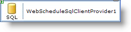

////

|metadata|
{
    "name": "webschedulesqlclientprovider-about-webschedulesqlclientprovider",
    "controlName": ["WebScheduleSqlProvider"],
    "tags": ["Data Presentation","Persistence"],
    "guid": "{B030B7C0-C18D-46BA-865A-99FCBF199FC5}",  
    "buildFlags": [],
    "createdOn": "2005-07-12T00:00:00Z"
}
|metadata|
////

= About WebScheduleSqlClientProvider

Situated in the data access layer, the WebSchedule™ data provider is responsible for binding  pick:[asp-net="link:{ApiPlatform}webui.webschedule{ApiVersion}~infragistics.webui.webschedule.activity.html[Activity]"]  and  pick:[asp-net="link:{ApiPlatform}webui.webschedule{ApiVersion}~infragistics.webui.webschedule.resource.html[Resource]"]  objects in the WebScheduleInfo™ to tables and rows in your data store.

The data provider class model was also created with extensibility in mind. You can extend the data provider to work with other data sources or enhanced object models.

