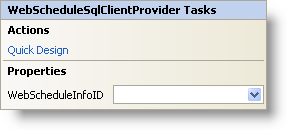

////

|metadata|
{
    "name": "webschedulesqlclientprovider-smart-tag",
    "controlName": ["WebScheduleSqlProvider"],
    "tags": ["Data Presentation","Persistence"],
    "guid": "{EFC3BC64-4385-4ACD-B098-C9E60F7CF847}",  
    "buildFlags": [],
    "createdOn": "2007-04-02T21:33:29Z"
}
|metadata|
////

= WebScheduleSqlClientProvider Smart Tag

In Visual Studio 2005 (.NET Framework 2.0), each Infragistics ASP.NET control/component is equipped with a Smart Tag. By simply selecting the control/component, a Smart Tag anchor appears. When you click this anchor, a pop-up panel appears, providing you with quick and easy access to the most common properties and settings of the control/component.

The WebScheduleSqlClientProvider™ Smart Tag contains the following sections:

* Actions -- Lets you perform common tasks (i.e., accessing the Quick Designer).
* Properties -- Provides easy access to common properties such as Display Mode.

See below for a description of the item (e.g., field, drop-down list, checkbox) in each section.

[options="header", cols="a,a,a"]
|====
|Actions|Description|CorrespondingProperty

|Quick Design
|Click Quick Design to access the WebScheduleSqlClientProvider Designer. This is the same functionality as if you right-clicked on the control and selected Quick Design from the context menu.
|n/a

|====

[options="header", cols="a,a,a"]
|====
|Properties|Description|CorrespondingProperty

|WebScheduleInfoID
|Use the drop-down box to select a WebScheduleInfo to associate with the WebScheduleSqlClientProvider.
| pick:[asp-net="link:infragistics4.webui.webscheduledataprovider.v{ProductVersion}~infragistics.webui.data.webscheduledataproviderbase~webscheduleinfoid.html[WebScheduleInfo]"] 

|====