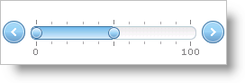

////

|metadata|
{
    "name": "webslider-about-webslider",
    "controlName": ["WebSlider"],
    "tags": ["Editing","Getting Started","Selection"],
    "guid": "{98D4FCDA-8C18-4430-9BD6-448777968049}",  
    "buildFlags": [],
    "createdOn": "2008-08-05T16:32:20Z"
}
|metadata|
////

= About WebSlider

The WebSlider™ control allows your end user to adjust settings for other controls and components by simply changing the value(s) on the slider. The WebSlider control consists of two buttons, one or two thumbs, and a track, all of which you can use to change the value of the slider. WebSlider’s track contains the editable range. The thumb can slide side to side or up and down, depending on WebSlider’s orientation, changing the value. WebSlider allows you to quickly manipulate any editable field.

For a custom look-and-feel, you can also apply CSS styles to various parts of the WebSlider control.

WebSlider supports the following features:

* Slide Movements – You can grab and move the slider's thumb, increasing or decreasing the slider's value.
* Data Manipulation – The slider exposes events and properties that you can use to change values of other controls/components based on its value and vice-versa.
* Customization – Using CSS, you can style several of the components that make up WebSlider. You can also customize WebSlider by setting certain properties for behaviors, making it possible for one WebSlider control to look and behave completely different from the next.
* Keyboard Support – Change WebSlider's value with built-in keyboard support.