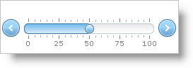

////

|metadata|
{
    "name": "webslider-customize-appearance-of-tick-marks",
    "controlName": ["WebSlider"],
    "tags": ["How Do I","Styling"],
    "guid": "{FC4D438A-617C-4B1D-8A2B-7305404A8612}",  
    "buildFlags": [],
    "createdOn": "0001-01-01T00:00:00Z"
}
|metadata|
////

= Customize Appearance of Tick Marks

You can customize the appearance of the WebSlider™ control’s tick marks according to your specifications. WebSlider exposes various properties allowing for a stylized look in the tick marks.

You can set several options for the appearance of WebSlider’s tick marks.

* Number of major tick marks - breaks the range of values into major sections.
* Number of minor tick marks - breaks the major tick marks into smaller sections.
* Number of Labels - displays sectional values on the track.
* Label location

.Note:
[NOTE]
====
The number of major tick marks includes the end points; therefore, the minimum number you can set is 2. Minor tick marks do not include the major tick marks they are within.
====

The following example code demonstrates how to divide WebSlider's track into four labeled sections with five major tickmarks. Each major tick mark is sub-divided into five minor parts.

*In Visual Basic:*

----
Me.WebSlider1.Tickmarks.NumberOfMajorTickmarks = 5
' Label each major tick mark with its associating value
Me.WebSlider1.Tickmarks.NumberOfLabels = 5
Me.WebSlider1.Tickmarks.NumberOfMinorTickmarks = 4
----

*In C#:*

----
this.WebSlider1.Tickmarks.NumberOfMajorTickmarks = 5;
// Label each major tick mark with its associating value
this.WebSlider1.Tickmarks.NumberOfLabels = 5;
this.WebSlider1.Tickmarks.NumberOfMinorTickmarks = 4;
----

== Related Topic

link:webslider-set-tick-mark-behavior.html[Set Tick Mark Behavior]