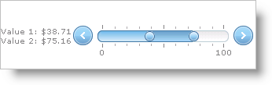

////

|metadata|
{
    "name": "webslider-display-custom-formatted-values",
    "controlName": ["WebSlider"],
    "tags": ["Editing","How Do I"],
    "guid": "{1327214E-17C4-4972-889E-01D4F7B1C9A6}",  
    "buildFlags": [],
    "createdOn": "0001-01-01T00:00:00Z"
}
|metadata|
////

= Display Custom Formatted Values

WebSlider™ displays its values as the primary value followed by the secondary value in a label. You can customize the way WebSlider displays its values by setting the  pick:[asp-net="link:{ApiPlatform}web{ApiVersion}~infragistics.web.ui.editorcontrols.slidervaluelabel~format.html[Format]"]  property of the  pick:[asp-net="link:{ApiPlatform}web{ApiVersion}~infragistics.web.ui.editorcontrols.slidervaluelabel.html[ValueLabel]"]  object. You can access the values using the strings {0} and {1} for the primary value and secondary value, respectively.

You must also resize the value label if you use custom values that may be longer than the default size of the label.

The following example code demonstrates how to display two dollar values, each on a separate line, resizing the value label as the values get larger.

*In Visual Basic:*

----
Me.WebSlider1.EnableSecondaryValue = True 
Me.WebSlider1.ValueLabel.Format = "Value 1: ${0}   Value 2: ${1}" 
Me.WebSlider1.ValueLabel.Location = Infragistics.Web.UI.EditorControls.SliderValueLabelLocation.LeftOrTop 
Me.WebSlider1.ValueLabel.CssClass = "LabelStyle"
----

*In C#:*

----
this.WebSlider1.EnableSecondaryValue = true;
this.WebSlider1.ValueLabel.Format = "Value 1: ${0}   Value 2: ${1}";
this.WebSlider1.ValueLabel.Location = Infragistics.Web.UI.EditorControls.SliderValueLabelLocation.LeftOrTop;
this.WebSlider1.ValueLabel.CssClass = "LabelStyle";
----

.Note:
[NOTE]
====
The LabelStyle used assumes you have a css style defined by that name with the style width:auto.
====

== Related Topics

link:webslider-change-websliders-increment-value.html[Change WebSlider's Increment Value]

link:webslider-edit-two-values.html[Edit Two Values]

link:webslider-set-min,-max,-and-starting-values.html[Set Min, Max, and Starting Values]

link:webslider-set-the-values-type.html[Set the Value's Type]