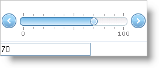

////

|metadata|
{
    "name": "webslider-getting-started-with-webslider",
    "controlName": ["WebSlider"],
    "tags": ["Editing","Getting Started","Selection"],
    "guid": "{4D2A8076-D7D6-4A1A-B2EF-38733D2CBE0A}",  
    "buildFlags": [],
    "createdOn": "2008-12-05T11:03:43Z"
}
|metadata|
////

= Getting Started with WebSlider

== Before You Begin

The WebSlider™ control allows for easy, user-friendly data manipulation.

== What You Will Accomplish

You will learn how to set up WebSlider to change the value of a textbox. Essentially, the WebSlider is used as an editor for the value in a TextBox.

[start=1]
. Create a new ASP.NET AJAX-Enabled Web Site.
[start=2]
. Drag an ASP.NET Ajax ScriptManager instance onto the WebForm.
[start=3]
. Drag the WebSlider control from the Microsoft® Visual Studio® toolbox onto the WebForm.
[start=4]
. Accept the prompt to add the default AppStylist style.
[start=5]
. Drag an ASP.NET TextBox control from the Visual Studio toolbox onto the WebForm.
[start=6]
. Set the TextBox control’s Text property to 50\.
[start=7]
. Double-click the WebForm to add an event handler for the page’s load event.
[start=8]
. In the load event, add the following code to set up the editable range and starting value for the WebSlider control.

*In Visual Basic:*

----
' Set up the editable range 
Me.WebSlider1.MaxValue = 100 
Me.WebSlider1.MinValue = 0 
' Set the starting value of the WebSlider as the starting TextBox value 
Me.WebSlider1.Value = Int32.Parse(Me.TextBox1.Text)
----

*In C#:*

----
// Set up the editable range      
this.WebSlider1.MaxValue = 100;
this.WebSlider1.MinValue = 0;
// Set the starting value of the WebSlider as the starting TextBox value
this.WebSlider1.Value = Int32.Parse(this.TextBox1.Text);
----

[start=9]
. Create an event handler for WebSlider’s ValueChanged event to change the value of the text box.

*In JavaScript:*

----
function WebSlider1_ValueChanged(sender, e)
{
    var textBox = document.getElementById("TextBox1");
    textBox.value = e.get_newValue();
}
----

[start=10]
. Be sure to hook up the event handler to WebSlider's client-side event. You can do this by inputting the name of the JavaScript funtion as the value for the  pick:[asp-net="link:{ApiPlatform}web{ApiVersion}~infragistics.web.ui.editorcontrols.sliderclientevents~valuechanged.html[ValueChanged]"]  field under  pick:[asp-net="link:{ApiPlatform}web{ApiVersion}~infragistics.web.ui.editorcontrols.sliderclientevents.html[ClientEvents]"]  in WebSlider’s property window.
[start=11]
. Run the application. You can use the WebSlider control to change the value of the text box.

