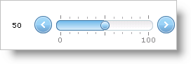

////

|metadata|
{
    "name": "webslider-set-min,-max,-and-starting-values",
    "controlName": ["WebSlider"],
    "tags": ["Editing","How Do I","Selection"],
    "guid": "{F362D6B0-7CA9-40E3-9987-3B793620A187}",  
    "buildFlags": [],
    "createdOn": "2008-12-05T12:43:34Z"
}
|metadata|
////

= Set Min, Max, and Starting Values

There are several WebSlider™ properties that you need to set to have the appropriate minimum, maximum, and starting values for your application.

*  pick:[asp-net="link:infragistics4.web.v{ProductVersion}~infragistics.web.ui.editorcontrols.webslider~minvalue.html[MinValue]"]  – the minimum value.
*  pick:[asp-net="link:infragistics4.web.v{ProductVersion}~infragistics.web.ui.editorcontrols.webslider~maxvalue.html[MaxValue]"]  – the maximum value.
*  pick:[asp-net="link:infragistics4.web.v{ProductVersion}~infragistics.web.ui.editorcontrols.webslider~value.html[Value]"]  – the current value.
*  pick:[asp-net="link:infragistics4.web.v{ProductVersion}~infragistics.web.ui.editorcontrols.webslider~valuelabel.html[ValueLabel]"]  – displays the current value when the  pick:[asp-net="link:infragistics4.web.v{ProductVersion}~infragistics.web.ui.editorcontrols.slidervaluelabel~location.html[Location]"]  is set.

The following example code shows you how to set the min, max, and starting value for WebSlider.

*In Visual Basic:*

----
' Set primary value's default value 
Me.WebSlider1.Value = 50 
' Set up the editable range 
Me.WebSlider1.MaxValue = 100 
Me.WebSlider1.MinValue = 0 
Me.WebSlider1.ValueLabel.Location = _
Infragistics.Web.UI.EditorControls.SliderValueLabelLocation.LeftOrTop
----

*In C#:*

----
// Set primary value's default value
this.WebSlider1.Value = 50;
// Set up the editable range 	
this.WebSlider1.MaxValue = 100;
this.WebSlider1.MinValue = 0;
this.WebSlider1.ValueLabel.Location = Infragistics.Web.UI.EditorControls.SliderValueLabelLocation.LeftOrTop;
----

== Related Topics

link:webslider-change-websliders-increment-value.html[Change WebSlider's Increment Value]

link:webslider-display-custom-formatted-values.html[Display Custom Formatted Values]

link:webslider-edit-two-values.html[Edit Two Values]

link:webslider-set-the-values-type.html[Set the Value's Type]