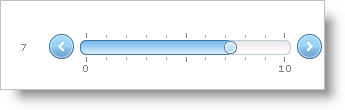

////

|metadata|
{
    "name": "webslider-set-the-values-type",
    "controlName": ["WebSlider"],
    "tags": ["Editing","How Do I"],
    "guid": "{90EDBE61-72E3-497F-9FC4-02FA97E5E163}",  
    "buildFlags": [],
    "createdOn": "0001-01-01T00:00:00Z"
}
|metadata|
////

= Set the Value's Type

The WebSlider™ control’s default value type is a double. You can change this to a type that fits your application. To change the WebSlider control’s value type, set the  pick:[asp-net="link:{ApiPlatform}web{ApiVersion}~infragistics.web.ui.editorcontrols.webslider~valuetype.html[ValueType]"]  property.

The following example code demonstrates how to set the type of WebSlider's  pick:[asp-net="link:{ApiPlatform}web{ApiVersion}~infragistics.web.ui.editorcontrols.webslider~value.html[Value]"]  to an integer so that dragging the thumb will increase the value by whole amounts.

*In Visual Basic:*

----
Me.WebSlider1.MaxValue = 10 
Me.WebSlider1.MinValue = 0 
Me.WebSlider1.ValueLabel.Location = Infragistics.Web.UI.EditorControls.SliderValueLabelLocation.LeftOrTop 
Me.WebSlider1.ValueType = Infragistics.Web.UI.EditorControls.SliderValueType.Int
----

*In C#:*

----
this.WebSlider1.MaxValue = 10;
this.WebSlider1.MinValue = 0;
this.WebSlider1.ValueLabel.Location = Infragistics.Web.UI.EditorControls.SliderValueLabelLocation.LeftOrTop;
this.WebSlider1.ValueType = Infragistics.Web.UI.EditorControls.SliderValueType.Int;
----

== Related Topics

link:webslider-change-websliders-increment-value.html[Change WebSlider's Increment Value]

link:webslider-display-custom-formatted-values.html[Display Custom Formatted Values]

link:webslider-edit-two-values.html[Edit Two Values]

link:webslider-set-min,-max,-and-starting-values.html[Set Min, Max, and Starting Values]