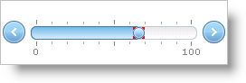

////

|metadata|
{
    "name": "webslider-set-thumb-appearance",
    "controlName": ["WebSlider"],
    "tags": ["Editing","How Do I"],
    "guid": "{DD3C7B3F-2A66-4A76-A89E-E19D5E5B44EF}",  
    "buildFlags": [],
    "createdOn": "2008-12-05T15:28:58Z"
}
|metadata|
////

= Set Thumb Appearance

You can adjust the appearance of the WebSlider™ control's thumbs as needed. Since you can use CSS, you can customize every aspect of a thumb’s appearance. You can style a thumb by defining a CSS style and setting the CssClass property of a thumb to the name of the CSS style.

Assuming you've defined a CSS style called ThumbStyle, use the following example code to style the WebSlider control’s thumb with the ThumbStyle style.

*In Visual Basic:*

----
Me.WebSlider1.Thumb.CssClass = "ThumbStyle"
----

*In C#:*

----
this.WebSlider1.Thumb.CssClass = "ThumbStyle";
----

== Related Topic

link:webslider-set-thumb-interaction.html[Set Thumb Interaction]