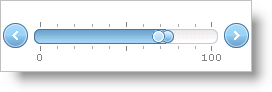

////

|metadata|
{
    "name": "webslider-set-thumb-interaction",
    "controlName": ["WebSlider"],
    "tags": [],
    "guid": "{3ED9B6E4-9214-4B51-B335-4EE1DFEDE363}",  
    "buildFlags": [],
    "createdOn": "2008-12-05T15:56:28Z"
}
|metadata|
////

= Set Thumb Interaction

When you enable two thumbs WebSlider™, you can adjust the way each thumb interacts with each other. The ThumbsInteractionMode enumeration provides you with a range of options to handle the behavior of WebSlider’s thumbs in various scenarios.

Thumbs interact in several different ways:

* Free – thumbs are free to slide past each other.
* Push – thumbs will push each other when they slide next to one another.
* Lock – thumbs cannot slide past or push each other.

The following example code demonstrates how to set WebSlider’s thumb interaction mode to Push.

*In Visual Basic:*

----
Me.WebSlider1.ThumbsInteractionMode = _
Infragistics.Web.UI.EditorControls.SliderThumbsInteractionMode.Push
----

*In C#:*

----
this.WebSlider1.ThumbsInteractionMode = Infragistics.Web.UI.EditorControls.SliderThumbsInteractionMode.Push;
----

== Related Topic

link:webslider-set-thumb-appearance.html[Set Thumb Appearance]