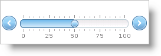

////

|metadata|
{
    "name": "webslider-set-tick-mark-behavior",
    "controlName": ["WebSlider"],
    "tags": ["Editing","How Do I"],
    "guid": "{CDEF42F6-F1A1-4A0C-8F47-E770A6BA8E3F}",  
    "buildFlags": [],
    "createdOn": "0001-01-01T00:00:00Z"
}
|metadata|
////

= Set Tick Mark Behavior

You can control what happens when your end user clicks or double-clicks tick marks and labels of WebSlider™.

You can set several properties exposed by the Tickmarks object to define tick mark and label click actions.

*  pick:[asp-net="link:infragistics4.web.v{ProductVersion}~infragistics.web.ui.editorcontrols.slidertickmarks~labelclickaction.html[LabelClickAction]"]  – Defines the behavior when your end user clicks a label.
*  pick:[asp-net="link:infragistics4.web.v{ProductVersion}~infragistics.web.ui.editorcontrols.slidertickmarks~labeldoubleclickaction.html[LabelDoubleClickAction]"]  – Defines the behavior when your end user double-clicks a label.
*  pick:[asp-net="link:infragistics4.web.v{ProductVersion}~infragistics.web.ui.editorcontrols.slidertickmarks~tickmarkclickaction.html[TickmarkClickAction]"]  – Defines the behavior when your end user clicks a tick mark.
*  pick:[asp-net="link:infragistics4.web.v{ProductVersion}~infragistics.web.ui.editorcontrols.slidertickmarks~tickmarkdoubleclickaction.html[TickmarkDoubleClickAction]"]  – Defines the behavior when your end user double-clicks a tick mark.

The following example code demonstrates how move the thumb to a tick mark when double-clicked.

*In Visual Basic:*

----
Me.WebSlider1.Tickmarks.TickmarkClickAction = _
Infragistics.Web.UI.EditorControls.SliderTickmarkClickAction.MoveToTick
----

*In C#:*

----
this.WebSlider1.Tickmarks.TickmarkClickAction = Infragistics.Web.UI.EditorControls.SliderTickmarkClickAction.MoveToTick;
----

== Related Topic

link:webslider-customize-appearance-of-tick-marks.html[Customize Appearance of Tick Marks]