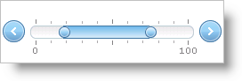

////

|metadata|
{
    "name": "webslider-set-websliders-track-appearance",
    "controlName": ["WebSlider"],
    "tags": [],
    "guid": "{9CF22204-5E13-4CE7-82F9-A8710B5308BF}",  
    "buildFlags": [],
    "createdOn": "2008-12-05T17:01:44Z"
}
|metadata|
////

= Set WebSlider's Track Appearance

You can customize the WebSlider™ control's track appearance when you enable two values. For more information on using two values, see link:webslider-edit-two-values.html[Edit Two Values].

The  pick:[asp-net="link:infragistics4.web.v{ProductVersion}~infragistics.web.ui.editorcontrols.slidertrack~fillvaluemode.html[FillValueMode]"]  property allows you to customize how the track appears when you are using two values:

* Range – Show only the range between the primary value and the secondary value, when the secondary value is greater.
* Main Value – Show only the range of the main value.
* None – Will not show any values.
* All – Shows all ranges.

The following example code demonstrates how to display only the range between the primary value and secondary value.

*In Visual Basic:*

----
Me.WebSlider1.Track.FillValueMode = _
Infragistics.Web.UI.EditorControls.SliderTrackFillValueMode.Range
----

*In C#:*

----
this.WebSlider1.Track.FillValueMode = Infragistics.Web.UI.EditorControls.SliderTrackFillValueMode.Range;
----

== Related Topic

link:webslider-set-websliders-track-behavior.html[Set WebSlider's Track Behavior]