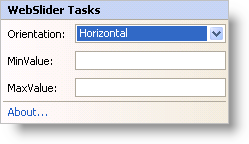

////

|metadata|
{
    "name": "webslider-webslider-smart-tag",
    "controlName": ["WebSlider"],
    "tags": ["How Do I"],
    "guid": "{FF9D4E0A-E583-469F-8299-16F2D62105A7}",  
    "buildFlags": [],
    "createdOn": "0001-01-01T00:00:00Z"
}
|metadata|
////

= WebSlider Smart Tag

In Visual Studio 2005/2008 (.NET Framework 2.0/3.5), each Infragistics ASP.NET control/component is equipped with a Smart Tag. By simply selecting the control/component, a Smart Tag anchor appears. When you click this anchor, a pop-up panel appears, providing you with quick and easy access to the most common properties and settings of the control/component.

The WebSlider™ Smart Tag contains the following items:

* Orientation -- Allows you to choose the orientation, either horizontal or vertical, for WebSlider.
* MinValue -- The minimum value of WebSlider.
* MaxValue -- The maximum value of WebSlider.

See the table below for a description of the items (e.g., field, drop-down list, checkbox), as well as the items' corresponding property in the properties grid.

The WebSlider Smart Tag contains the following links:

* About -- Clicking this opens the WebSlider product information. It contains information such as Status, Version, Expiration and Product Key.

[options="header", cols="a,a,a"]
|====
|Items|Description|CorrespondingProperty

|Orientation
|The drop-down box enables you to select which orientation you want WebSlider to have: horizontal or vertical.
|*Orientation*

|MinValue
|Allows you to specify the minimum value for the editable range of WebSlider.
|*MinValue*

|MaxValue
|Allows you to specify the maximum value for the editable range of WebSlider.
|*MaxValue*

|====