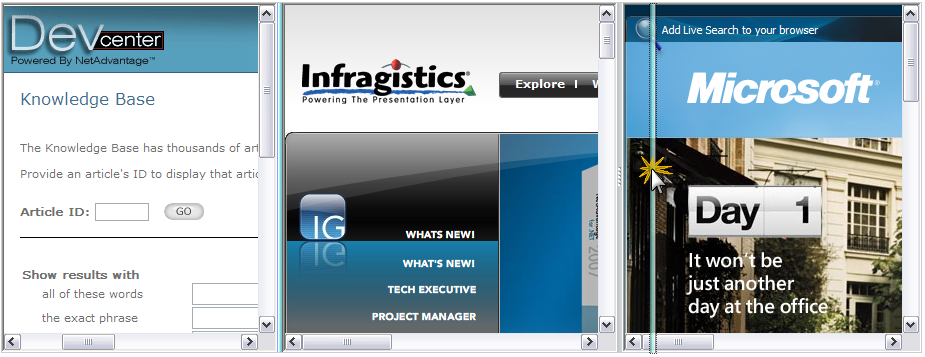

////

|metadata|
{
    "name": "websplitter-about-websplitter",
    "controlName": ["WebSplitter"],
    "tags": ["How Do I"],
    "guid": "{A8B93C58-92BE-410E-A322-F7A91932E66D}",  
    "buildFlags": [],
    "createdOn": "0001-01-01T00:00:00Z"
}
|metadata|
////

= About WebSplitter

The WebSplitter™ control provides a neat and elegant way to separate and organize content within your Web Application. WebSplitter provides the end user with the ability to resize, expand, and collapse the content contained with in the content panes. Depending on how you design your Web Application, you can change the orientation of WebSplitter to Horizontal or Vertical. When vertically oriented, the content panes will be positioned side to side and next to one another. The split bars will be located in between the panes running from top to bottom. Clicking and dragging the split bars from side to side will cause the width of the panes to be adjusted. When horizontally oriented, the panes will be positioned from top to bottom. The split bars will also be located in between the panes and they will run from left to right.

The following image shows the WebSplitter control configured with three Panes. In this particular example, each Pane is linked to a URL. The end user can click and drag the Split Bars in order to resize the content:

WebSplitter supports the following features:

* Orientation - Split Bars can be oriented horizontally or vertically
* Resizing Behavior - WebSplitter can be configured so that as the end user clicks and drags the Split Bars, their content panes can resize in real time as the mouse is dragged, or, the resizing can be deferred until after the drag is complete and the end user releases the mouse.
* Expand / Collapse Content - Split Bars can show buttons, which when clicked can expand or collapse the content panes that they represent.
* Content Panes - You can place any content inside of the content pane templates. This means User Controls, Web Server Controls or anything else you need for you user interface. The Content Pane also accepts a URL which allows you to show content from various web resources.