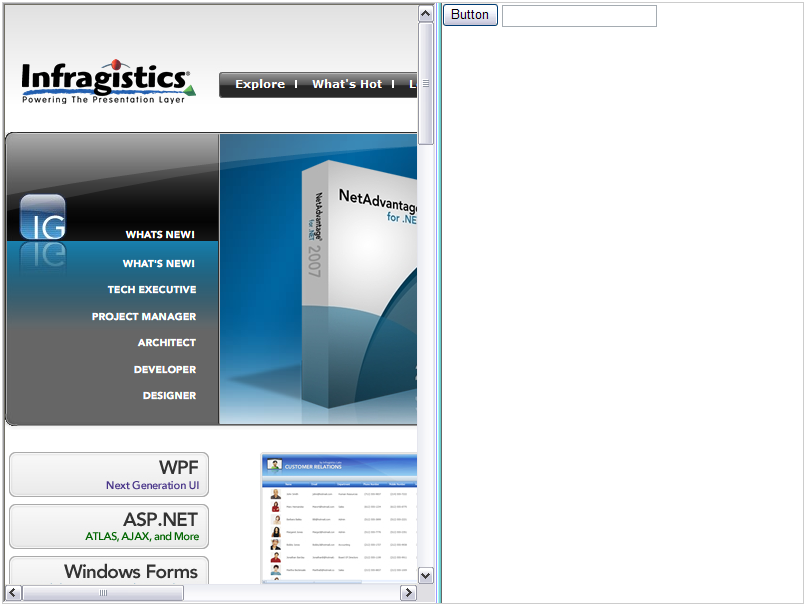

////

|metadata|
{
    "name": "websplitter-getting-started-with-the-websplitter",
    "controlName": ["WebSplitter"],
    "tags": ["Getting Started"],
    "guid": "{529307D7-9646-4631-9B8C-D9BC07BFB52A}",  
    "buildFlags": [],
    "createdOn": "2008-12-01T21:08:16Z"
}
|metadata|
////

= Getting Started with the WebSplitter

== Before You Begin

The following steps will show you how to get started with WebSplitter™.

*Assumptions for the following steps:*

* You have already created a new ASP.NET AJAX-Enabled Web Site named Getting_Started_with_the_WebSplitter.
* You have an ASP.NET Ajax ScriptManager instance on the WebForm.
* You have enabled the Infragistics Application Styling for this application and you are using the Default Style. For information on how to do this, see link:web-enabling-application-styling-using-the-web-config-file.html[Enabling Application Styling Using the web.config File].

== What You Will Accomplish

When you finish reading, you will have a WebForm with an instance of the WebSplitter control that will contain three content panes, each of which will contain various content.

== Follow these Steps:

[start=1]
. In the Visual Studio toolbox, locate the WebSplitter and double click it. This will place an instance of the WebSplitter control onto your WebForm.
[start=2]
. Click on the WebSplitter control and in the Property Window, locate and set the Height property to 600px. Locate and set the Width property to 800px.
[start=3]
. In the Property Window, locate the  pick:[asp-net="link:{ApiPlatform}web{ApiVersion}~infragistics.web.ui.layoutcontrols.websplitter~orientation.html[Orientation]"]  property and set it to Vertical.
[start=4]
. Next we will add several Content Panes to the WebSplitter control. In the Property Window, locate the  pick:[asp-net="link:{ApiPlatform}web{ApiVersion}~infragistics.web.ui.layoutcontrols.websplitter~panes.html[Panes]"]  property and click the ellipsis button (...) to launch the SplitterPane Collection Editor.
[start=5]
. In the SplitterPane Collection Editor, click the Add button two times. This will add SplitterPane1 and SplitterPane2 to the collection.
[start=6]
. Click on SplitterPane1 and in the Property Window, locate the  pick:[asp-net="link:{ApiPlatform}web{ApiVersion}~infragistics.web.ui.layoutcontrols.contentpane~contenturl.html[ContentURL]"]  property and set it to http://www.infragistics.com. Click the OK button to close the dialog. The first SplitterPane will load the Infragistics web site as its content.
[start=7]
. Next we will use the second SplitterPane to host some controls. We will do this by adding a  pick:[asp-net="link:{ApiPlatform}web{ApiVersion}~infragistics.web.ui.layoutcontrols.contentpane~template.html[Template]"]  to the SplitterPane. In order to do this, on Default.aspx, click on the Source button to show the page markup.

Locate the Panes collection underneath the WebSplitter definition. From the steps we have taken so far, the markup should look like this:

*In HTML:*

----
<igweb:WebSplitter id="WebSplitter1" runat="server" height="600px" Orientation="Vertical"
  Width="800px">
	<panes>
		<igweb:SplitterPane runat="server" ContentUrl="http://www.infragistics.com">
		</igweb:SplitterPane>
		<igweb:SplitterPane runat="server">
		</igweb:SplitterPane>
	</Panes>
</igweb:WebSplitter>
----

We will add a Template element to the second SplitterPane. On the second SplitterPane, add a Template element by typing it in. When complete, it should look like this:

*In HTML:*

----
<panes>
	<igweb:SplitterPane runat="server" ContentUrl="http://www.infragistics.com">
	</igweb:SplitterPane>
	<igweb:SplitterPane runat="server">
		<Template/>
	</igweb:SplitterPane>
</Panes>
----

[start=1]
. Now that we have added a Template to the second SplitterPane, on Default.aspx, click on the Design button to bring back the designer.
[start=2]
. Click within the content area of the second SplitterPane so that the cursor is within this area.
[start=3]
. Go to the Visual Studio Toolbox and locate the Standard toolbox. Locate the Button control and double click it to add an instance to the second SplitterPane. You can experiment by adding other additional controls to this pane.
[start=4]
. Save and run the application.

The application should look similar to the following image.

You can resize the content panes by clicking and dragging the SplitterBars. You can also try experimenting by setting the Orientation property to Horizontal to see what the end result looks like. You can also try setting the DynamicResize property to True and then notice the behavior when you run the application and resize the SplitterPanes.