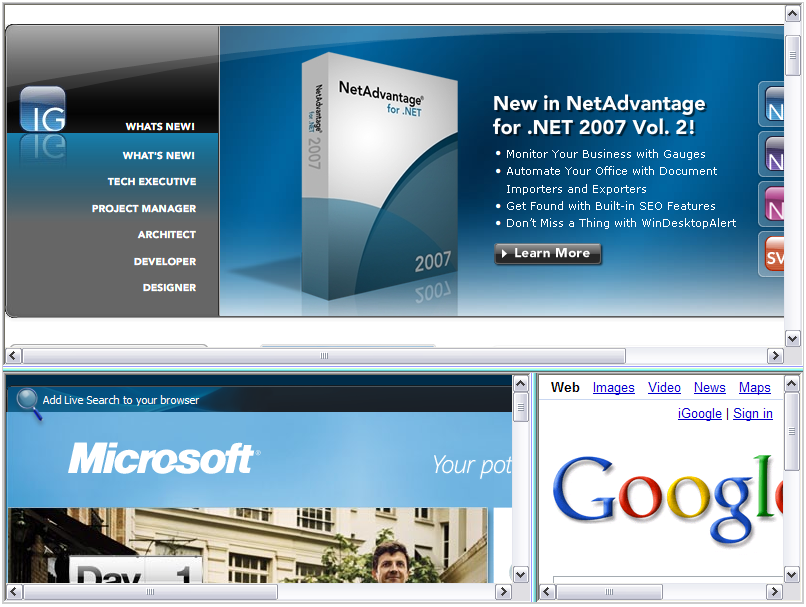

////

|metadata|
{
    "name": "websplitter-nesting-the-splitter-bars-inside-panes",
    "controlName": ["WebSplitter"],
    "tags": ["How Do I"],
    "guid": "{BB42A859-57A1-4863-B177-2F9831847206}",  
    "buildFlags": [],
    "createdOn": "0001-01-01T00:00:00Z"
}
|metadata|
////

= Nesting the Splitter Bars inside Panes

== Before You Begin

To create a user interface which has nested WebSplitter™ Panes, you will have to create a parent WebSplitter that will have another WebSplitter within one of its content templates.

*Assumptions for the following steps:*

* You have already created a new ASP.NET AJAX-Enabled Web Site with a blank WebForm.
* You have an ASP.NET Ajax ScriptManager instance on the WebForm.
* You have enabled the Infragistics Application Styling for this application and you are using the Default Style

== What You Will Accomplish

When you finish reading, you will be able to create nested WebSplitter panes in a running sample.

== Follow these Steps:

[start=1]
. In the Visual Studio Toolbox, locate the WebSplitter control and double click it. This will place an instance on your WebForm.
[start=2]
. Click the WebSplitter control and in the Property Window, locate the Height property and set it to 600px.
[start=3]
. Locate the Width property and set it to 800px.
[start=4]
. Locate the  pick:[asp-net="link:infragistics4.web.v{ProductVersion}~infragistics.web.ui.layoutcontrols.websplitter~panes.html[Panes]"]  property and click the ellipse (...) button to launch the SplitterPane collection editor.
[start=5]
. Click the Add button twice in order to add two separate  pick:[asp-net="link:infragistics4.web.v{ProductVersion}~infragistics.web.ui.layoutcontrols.splitterpane.html[SplitterPanes]"] .
[start=6]
. Click on the first SplitterPane and in the Property Window, locate the  pick:[asp-net="link:infragistics4.web.v{ProductVersion}~infragistics.web.ui.layoutcontrols.contentpane~contenturl.html[ContentUrl]"]  property and set its value to http://www.infragistics.com
[start=7]
. Click the OK button to close the SplitterPane collection editor.
[start=8]
. Next we will add a single line to our HTML Markup. On Default.aspx, click the Source button to show the markup view.
[start=9]
. Locate the WebSplitter element and then locate the Panes element. This will contain the two SplitterPanes that we created.
[start=10]
. In between the second SplitterPane, insert a  pick:[asp-net="link:infragistics4.web.v{ProductVersion}~infragistics.web.ui.layoutcontrols.contentpane~template.html[Template]"]  element. The code should look similar to this:

*In HTML:*

----
<igweb:WebSplitter ID="WebSplitter1" runat="server" 
  Height="600px" Width="800px">
	<Panes>
		<igweb:SplitterPane runat="server" ContentUrl="http://www.infragistics.com">
		</igweb:SplitterPane>
		<igweb:SplitterPane runat="server">
			<Template/>
		</igweb:SplitterPane>
	</Panes>
</igweb:WebSplitter>
----

[start=11]
. Click the Design button to return to design mode.
[start=12]
. Click the bottom SplitterPane to bring input focus here.
[start=13]
. Go back to the Visual Studio Toolbox and double click on the WebSplitter in order to add another WebSplitter control to the content template of the second SplitterPane.
[start=14]
. Next click on the new WebSplitter control that is in the bottom SplitterPane and in the Property Window, delete the value that is contained within the Height and Width property. This will cause the SplitterPanes to resize themselves according to the size of the content contained within.
[start=15]
. Locate the  pick:[asp-net="link:infragistics4.web.v{ProductVersion}~infragistics.web.ui.layoutcontrols.websplitter~orientation.html[Orientation]"]  property and set it to Vertical.
[start=16]
. Locate the Panes collection for the second WebSplitter and click the ellipse button (...) to launch the SplitterPane collection editor.
[start=17]
. Click the Add button twice in order to add two SplitterPanes.
[start=18]
. Click on the first SplitterPane and in the Property Window, set the ContentUrl property to http://www.microsoft.com
[start=19]
. Click on the second SplitterPane and in the property window, set the ContentUrl property to http://www.google.com
[start=20]
. Click the OK button to close the SplitterPane collection editor.
[start=21]
. Save and run the application. The application should look similar to the following image:

The top SplitterPane is linked to the Infragistics™ web site and the bottom SplitterPane contains another WebSplitter control. The two SplitterPanes within the nested WebSplitter contain two SplitterPanes as well; one is linked to Microsoft's™ web site and the other one is linked to Google's™ web site. It is good practice to alternate the orientation of nested WebSplitters so that the Orientation of a parent WebSplitter is not the same as an immediate child WebSplitter. If you do not wish to change and alternate the orientation of a child WebSplitter control then you can skip adding a child WebSplitter altogether and just add more SplitterPanes as you will not incur the overhead of having extra controls if they are not needed.