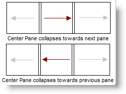
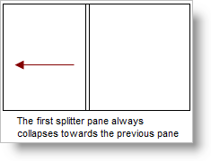
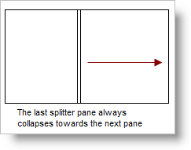
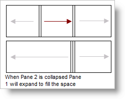
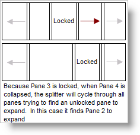

////

|metadata|
{
    "name": "websplitter-pane-collapsing",
    "controlName": ["WebSplitter"],
    "tags": ["How Do I"],
    "guid": "{A75F3692-7243-4A21-B3BA-61C88719842B}",  
    "buildFlags": [],
    "createdOn": "0001-01-01T00:00:00Z"
}
|metadata|
////

= Pane Collapsing

The WebSplitter™ can collapse its panes, thereby hiding the pane's content, freeing its occupied space. By default, all panes are not collapsible, but still display a splitter bar. When a pane can collapse, a collapse icon appears in the splitter bar. The user can use the collapse icon to collapse the pane.

You can define a Pane's collapse direction by setting the Pane's  pick:[asp-net="link:infragistics4.web.v{ProductVersion}~infragistics.web.ui.layoutcontrols.splitterpane~collapseddirection.html[CollapseDirection]"]  property. Panes collapse either towards the next pane, or the previous pane.

== Exceptions to the collapse rule

* The first Pane in the collection always collapses towards the previous Pane.

* The last Pane in the collection always collapses towards the next Pane.

== What Happens to the Freed Space

Collapsing a Pane in WebSplitter will free space by automatically expanding a neighboring pane.

If the immediate neighboring Pane is locked, WebSplitter will iterate through the  pick:[asp-net="link:infragistics4.web.v{ProductVersion}~infragistics.web.ui.layoutcontrols.websplitter~panes.html[Panes]"]  collection until it locates an unlocked pane it can enlarge.

