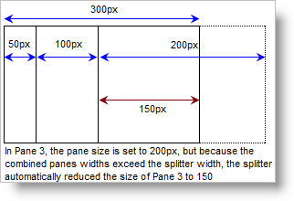
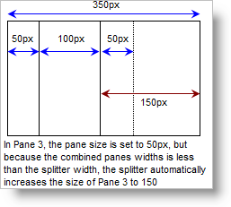
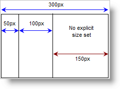
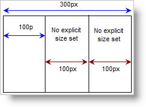

////

|metadata|
{
    "name": "websplitter-pane-resizing",
    "controlName": ["WebSplitter"],
    "tags": ["How Do I"],
    "guid": "{CE843FF4-F185-47F2-9EED-5D248257C56E}",  
    "buildFlags": [],
    "createdOn": "0001-01-01T00:00:00Z"
}
|metadata|
////

= Pane Resizing

You can manually define the size of a WebSplitter™ pane, or you can let WebSplitter size its panes for you.

== Common pane sizing questions:

* If the  pick:[asp-net="link:{ApiPlatform}web{ApiVersion}~infragistics.web.ui.layoutcontrols.websplitter~orientation.html[Orientation]"]  property is Horizontal, how do panes resize when the total width of all panes is greater than the control's set width? Conversely, if the Orientation property is set to Vertical how do panes resize when the total height of all panes is greater than the control's set height?
* How do panes resize if the total width of the panes is less than the control's defined width? How do panes resize if the total height of the panes is less than the control's defined height?
* If I don't set a width or height on a single pane, how does the pane size itself when other pane's sizes are set?
* If I don't set a width or height on any pane, how will they size themselves?
* How do panes size themselves if I don't set WebSplitter's size?

The following sections answer the questions above.

== The Total Pane Size is Greater than the Control's Size

If WebSplitter's Orientation is set to Horizontal, and you've set the width of the control, all panes are constrained by its width. In contrast, if you set WebSplitter's Orientation property to Vertical, and you've also set the control's height, then all panes are constrained by its height. If the total width or height of all panes is greater than the width or height of the control, WebSplitter will reduce the size of the last pane in the  pick:[asp-net="link:{ApiPlatform}web{ApiVersion}~infragistics.web.ui.layoutcontrols.websplitter~panes.html[Panes]"]  collection until it fits in the allowed space.

== The Total Pane Size is Less than the Control's Size

If WebSplitter's Orientation property is set to Horizontal, and the total width of all panes is less than the control's width, WebSplitter will automatically extend the last pane's width to fill the remaining space. If WebSplitter's Orientation property is set to Vertical, and the total height of all panes is less than the control's height, WebSplitter will automatically extend the last Pane's height to fill the remaining space.

== The Size is Not Set on a Single Pane

If a single pane's size is undefined, it will automatically use all available space.

== The Size is Not Set on Multiple Panes

If multiple pane's sizes are undefined, WebSplitter divides the available space evenly between each unsized pane.

== WebSplitter's Size is Undefined

If WebSplitter's size is undefined, it will automatically size itself to the combined sizes of all panes in the Panes collection.