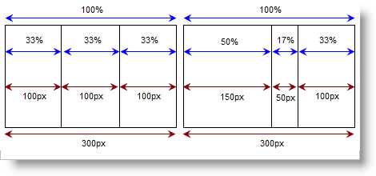

////

|metadata|
{
    "name": "websplitter-set-a-panes-size",
    "controlName": ["WebSplitter"],
    "tags": ["How Do I"],
    "guid": "{1E43C999-6B0A-404C-A66E-C672389B7A5E}",  
    "buildFlags": [],
    "createdOn": "0001-01-01T00:00:00Z"
}
|metadata|
////

= Set a Pane's Size

The WebSplitter™ control sizes all panes by pixels. If you specify a percentage amount for a pane, WebSplitter converts the percentage to pixels at run time and exposes that number to you. If you specify percentage values at design time, and the end user resizes a pane, WebSplitter will recalculate the percentage width based on the known width of the browser window and the surrounding panels. WebSplitter will expose the updated percentage value to you

