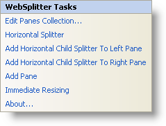

////

|metadata|
{
    "name": "websplitter-websplitter-smart-tag",
    "controlName": ["WebSplitter"],
    "tags": ["How Do I"],
    "guid": "{47B09561-B831-46D9-9F05-106A2BCB2EC2}",  
    "buildFlags": [],
    "createdOn": "0001-01-01T00:00:00Z"
}
|metadata|
////

= WebSplitter Smart Tag

In Visual Studio 2005/2008 (.NET Framework 2.0/3.5), each Infragistics ASP.NET control/component is equipped with a Smart Tag. By simply selecting the control/component, a Smart Tag anchor appears. When you click this anchor, a pop-up panel appears, providing you with quick and easy access to the most common properties and settings of the control/component.

The WebSplitter™ Smart Tag contains the following links:

* Edit Panes Collection -- Selecting this opens the WebSplitter Quick Designer. This allows you to add a pane or edit existing panes.
* Horizontal Splitter -- Selecting this allows you to toggle the orientation of the splitter from horizontal to vertical.
* Add Horizontal Child Splitter To Left Pane -- Selecting this adds a horizontal child splitter to the left pane of your WebSplitter.
* Add Horizontal Child Splitter To Right Pane -- Selecting this adds a horizontal child splitter to the right pane of your WebSplitter.
* Add Pane -- Selecting this adds a new pane to the right of your WebSplitter.
* Immediate Resizing --
* About... -- Selecting this opens the WebSplitter's product information. It contains information such as Status, Version, Expiration and Product Key.

