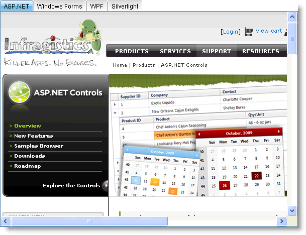

////

|metadata|
{
    "name": "webtab-about-webtab",
    "controlName": ["WebTab"],
    "tags": ["How Do I"],
    "guid": "{B55E0307-A205-4243-AA94-44123EC3FF8E}",  
    "buildFlags": [],
    "createdOn": "0001-01-01T00:00:00Z"
}
|metadata|
////

= About WebTab

WebTab™ is a control that provides a multi-row tabbed layout with various appearance and behavior-based properties. WebTab is built using the Infragistics ASP.NET AJAX Framework to leverage a proven code base that promotes a high performance and responsive end-user experience. You can find WebTab in the  pick:[asp-net="link:infragistics4.web.v{ProductVersion}~infragistics.web.ui.layoutcontrols_namespace.html[Infragistics.Web.UI.LayoutControls]"]  namespace.

Like all Infragistics ASP.NET AJAX controls, WebTab seamlessly integrates into the Infragistics® Application Styling Framework. With CSS-based properties you can manually customize the WebTab by leveraging your existing style sheets.

WebTab also exposes a robust model within the client-side Javascript programming environment. The client-side object model (CSOM) consists of full-fledged properties and methods that enable developers to program significant units of functionality without the need for server-side postbacks.

Some of the WebTab control’s features include :

* *High Performance* -- Lightweight markup and optimized code improve performance.
* *Content Pane* -- Supports content panes as template areas or target URLs.
* *Display Mode* -- Can display single-row or multi-row tabs.
* *Load-on-Demand* -- Not all content is fetched during the initial load , only the content of the selected tab. Ajax features (using Update panels) can be combined with load-on-demand feature.
* *Tab Orientation* -- can be oriented either horizontally or vertically.
* *Animations* -- Supports animations when opening and closing a tab.
* *Scroll Buttons* -- Ability to have scrollable tabs using scroll buttons.
* *Tab Moving* --Allows moving of tabs in a single row.
* *Auto Size* -- Ability to resize WebTab to fit content of the pane.
* *Tab Location* -- Tabs can be located on the top or bottom, with the option to align the tabs either to the left or to the right.
* *AddingTabs* -- Allows you to add tabs on the client without postback.

== Related Topics

link:webtab-webtab-smart-tag.html[WebTab Smart Tag]

link:webtab-getting-started-with-webtab.html[Getting Started with WebTab]

link:webtab-using-webtab.html[Using WebTab]