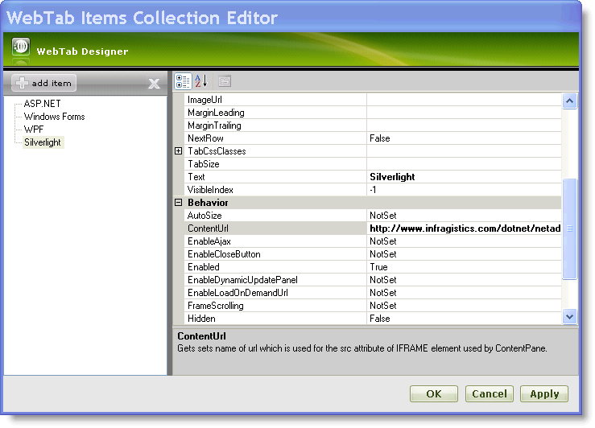
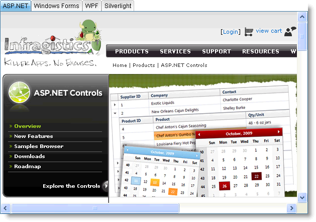

////

|metadata|
{
    "name": "webtab-getting-started-with-webtab",
    "controlName": ["WebTab"],
    "tags": ["How Do I"],
    "guid": "{A8FC4BFA-3826-43E7-8DEF-E6AF4DB826C2}",  
    "buildFlags": [],
    "createdOn": "0001-01-01T00:00:00Z"
}
|metadata|
////

= Getting Started with WebTab

WebTab™ allows you to manually add tabs using its rich user interface designer. You can customize each tab item using the WebTab Designer where you set the appearance, behavior and various other properties.

=== To add tabs to WebTab using the Designer :

[start=1]
. From the Visual Studio™ Toolbox, drag and drop a ScriptManager Component and a WebTab control onto your WebForm.
[start=2]
. In the property window, locate the WebTab control’s Tabs property and click the ellipsis (…) button to launch the WebTab Designer. You can also launch the designer by clicking Edit Tabs in the WebTab smart tag.
[start=3]
. In the Edit WebTab dialog, click the add item button. This will add a new tab to the tabs collection. Set the following properties :

[options="header", cols="a,a"]
|====
|Text|ContentUrl

|ASP.NET
| link:http://www.infragistics.com/products/aspnet[http://www.infragistics.com/products/aspnet]

|====

.Note:
[NOTE]
====
The  pick:[asp-net="link:infragistics4.web.v{ProductVersion}~infragistics.web.ui.layoutcontrols.contentpane~contenturl.html[ContentUrl]"]  property has priority over the  pick:[asp-net="link:infragistics4.web.v{ProductVersion}~infragistics.web.ui.layoutcontrols.contentpane~usercontrolurl.html[UserControlUrl]"]  property and the template(explicit child controls) meaning that the user control and the template are ignored and not rendered if content url is set. Also if the UserControlUrl property is set then the user control renders itself as a template on the client replacing any existing templates.
====

[start=4]
. Repeat to add the following tabs :

[options="header", cols="a,a"]
|====
|Text|ContentUrl

|Windows Forms
| link:http://www.infragistics.com/products/windows-forms[http://www.infragistics.com/products/windows-forms]

|WPF
| link:http://www.infragistics.com/products/wpf[http://www.infragistics.com/products/wpf]

|Silverlight
| link:http://www.infragistics.com/products/silverlight[http://www.infragistics.com/products/silverlight]

|====

[start=5]
. At this point, the Edit WebTab dialog should look like this:

[start=6]
. Click Apply and OK to close the WebTab Designer.
[start=7]
. Save and run your application. Your WebTab should look similar to the following image : 

.Note:
[NOTE]
====
If you see javascript errors, it is recommended to set the  pick:[asp-net="link:infragistics4.web.v{ProductVersion}~infragistics.web.ui.layoutcontrols.tabpostbackoptions~enableloadondemandurl.html[EnableLoadOnDemandUrl]"]  property to True. However, this property prevents loading ContentUrl until the respective tab is selected. For more information see link:webtab-using-load-on-demand-for-tabs-with-content-url-set.html[Using Load on Demand for Tabs with Content Url Set].
====

=== Adding Tabs Programatically :

The above steps can also be achieved through the following code:

*In HTML:*
[source]

----
        <ig:WebTab ID="WebTab1" runat="server" Height="165px" Width="631px">
          <tabs>
            <ig:ContentTabItem runat="server" 
                ContentUrl=http://www.infragistics.com/products/aspnet 
                Text="ASP.NET">
            </ig:ContentTabItem>
            <ig:ContentTabItem runat="server" 
                ContentUrl=http://www.infragistics.com/products/windows-forms 
                Text="Windows Forms">
            </ig:ContentTabItem>
            <ig:ContentTabItem runat="server" 
                ContentUrl=http://www.infragistics.com/products/wpf 
                Text="WPF">
            </ig:ContentTabItem>
            <ig:ContentTabItem runat="server" 
                ContentUrl=http://www.infragistics.com/products/silverlight 
                Text="Silverlight">
            </ig:ContentTabItem>
           </tabs>
        </ig:WebTab>
----
*In Visual Basic:*
[source,docX-root]

----
        Dim Tab1 As New ContentTabItem() 
        Tab1.Text = "ASP.NET" 
        Tab1.ContentUrl = http://www.infragistics.com/products/aspnet 
        Dim Tab2 As New ContentTabItem() 
        Tab2.Text = "Windows Forms" 
        Tab2.ContentUrl = http://www.infragistics.com/products/windows-forms 
        Dim Tab3 As New ContentTabItem() 
        Tab3.Text = "WPF" 
        Tab3.ContentUrl = http://www.infragistics.com/products/wpf 
        Dim Tab4 As New ContentTabItem() 
        Tab4.Text = "Silverlight" 
        Tab4.ContentUrl = http://www.infragistics.com/products/silverlight 
        WebTab1.Tabs.Add(Tab1) 
        WebTab1.Tabs.Add(Tab2) 
        WebTab1.Tabs.Add(Tab3) 
        WebTab1.Tabs.Add(Tab4)
----
*In C#:*
[source,docX-root]

----
        ContentTabItem Tab1 = new ContentTabItem();
        Tab1.Text = "ASP.NET";
        Tab1.ContentUrl = http://www.infragistics.com/products/aspnet;
        ContentTabItem Tab2 = new ContentTabItem();
        Tab2.Text = "Windows Forms";
        Tab2.ContentUrl = http://www.infragistics.com/products/windows-forms;
        ContentTabItem Tab3 = new ContentTabItem();
        Tab3.Text = "WPF";
        Tab3.ContentUrl = http://www.infragistics.com/products/wpf;
        ContentTabItem Tab4 = new ContentTabItem();
        Tab4.Text = "Silverlight";
        Tab4.ContentUrl = "http://www.infragistics.com/products/silverlight";
        WebTab1.Tabs.Add(Tab1);
        WebTab1.Tabs.Add(Tab2);
        WebTab1.Tabs.Add(Tab3);
        WebTab1.Tabs.Add(Tab4);
----

== Related Topics

link:webtab-keyboard-navigation.html[Keyboard Navigation]

link:webtab-using-webtab.html[Using WebTab]