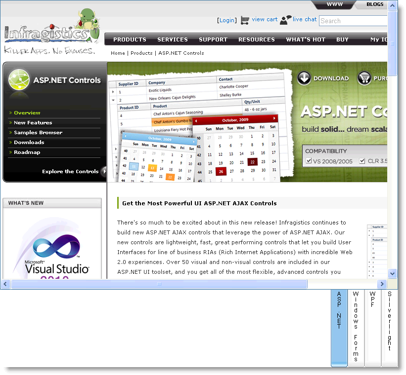

////

|metadata|
{
    "name": "webtab-orientation-and-alignment",
    "controlName": ["WebTab"],
    "tags": ["How Do I","Performance"],
    "guid": "{9B95C0A9-7B77-41CA-8092-6927F9222F2F}",  
    "buildFlags": [],
    "createdOn": "0001-01-01T00:00:00Z"
}
|metadata|
////

= Orientation and Alignment

WebTab™ supports different types of orientation and alignment of the tabs. The tabs can be oriented either horizontally or vertically by simply setting the control’s  pick:[asp-net="link:{ApiPlatform}web{ApiVersion}~infragistics.web.ui.layoutcontrols.webtab~taborientation.html[TabOrientation]"]  property to Horizontal or Vertical respectively. The tabs can be aligned in eight different positions with respect to the content pane by setting the control’s  pick:[asp-net="link:{ApiPlatform}web{ApiVersion}~infragistics.web.ui.layoutcontrols.webtab~tablocation.html[TabLocation]"]  property to one of the members of the  pick:[asp-net="link:{ApiPlatform}web{ApiVersion}~infragistics.web.ui.layoutcontrols.tablocation.html[TabLocation]"]  enumeration.

*In HTML:*

----
<ig:WebTab ID="WebTab1" runat="server"  
        TabOrientation="Vertical" TabLocation="BottomRight" >
 …               
</ig:WebTab>
----

*In Visual Basic:*

----
WebTab1.TabOrientation = Orientation.Vertical
WebTab1.TabLocation = TabLocation.BottomRight
----

*In C#:*

----
WebTab1.TabOrientation = Orientation.Vertical;
WebTab1.TabLocation = TabLocation.BottomRight;
----

== Related Topics

link:webtab-about-webtab.html[Understanding WebTab]

link:webtab-getting-started-with-webtab.html[Getting Started with WebTab]

link:webtab-header-and-content-panes.html[Header and Content Panes]

link:webtab-tab-states.html[Tab States]

link:webtab-ajax-indicator-support-for-webtab.html[Ajax Indicator Support for WebTab]

link:webtab-display-modes.html[Display Modes]

link:webtab-animations.html[Animations]

link:webtab-handling-overflow-in-webtab.html[Handling Overflow in WebTab]

link:webtab-load-on-demand.html[Load on Demand]

link:webtab-overlapping-tabs.html[Overlapping Tabs]

link:webtab-tab-moving.html[Tab Moving]

link:webtab-scrolling.html[Scrolling]

link:webtab-validation-in-webtab.html[Validation in WebTab]

link:webtab-api-overview.html[API Overview]

link:webtab-client-side-object-model.html[Client-Side Object Model(CSOM) Overview]