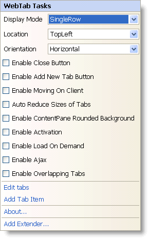

////

|metadata|
{
    "name": "webtab-webtab-smart-tag",
    "controlName": ["WebTab"],
    "tags": ["How Do I"],
    "guid": "{58213E55-5D49-451C-989B-2B28C1A3FB73}",  
    "buildFlags": [],
    "createdOn": "0001-01-01T00:00:00Z"
}
|metadata|
////

= WebTab Smart Tag

In Visual Studio 2005/2008 (.NET Framework 2.0/3.5), each Infragistics ASP.NET control/component is equipped with a Smart Tag. By selecting the control/component, a Smart Tag anchor appears. When you click this anchor, a pop-up panel appears, providing you with quick and easy access to the most common properties and settings of the control/component.

*The WebTab™ Smart Tag contains the following items:*

* Display Mode – Allows you to set the display mode of tabs, such as single row or scrollable single row or multi row.
* Location – Allows you to set the location of the tabs relative to the content pane.
* Orientation – Allows you to set the horizontal or vertical orientation of the text and images of the tabs.
* Enable Close Button – Allows you to enable the close button on the tabs.
* Enable Add New Tab Button – Allows you to enable the button to add new tabs.
* Enable Moving On Client – Allows your end users to move the tabs.
* Auto Reduce Sizes of Tabs – Allows you to reduce the size of the tabs if all the tabs do not fit in the size of the control.

.Note:
[NOTE]
====
This property has effect only when  pick:[asp-net="link:{ApiPlatform}web{ApiVersion}~infragistics.web.ui.layoutcontrols.webtab~taborientation.html[TabOrientation]"]  is horizontal and  pick:[asp-net="link:{ApiPlatform}web{ApiVersion}~infragistics.web.ui.layoutcontrols.webtab~displaymode.html[DisplayMode]"]  is single row or multi row, with width set on the tab.
====

* Enable ContentPane Rounded Background – Allows you to show the content pane of the WebTab with rounded background.
* Enable Activation – Allows you to set focus and respond on keys in order to change active tab and select it.
* Enable Load On Demand – Allows you to enable load-on-demand in WebTab.
* Enable Ajax – Allows you to enable asynchronous postback of WebTab.

.Note:
[NOTE]
====
Asynchronous functionality can be achieved by wrapping the content of the tabs into UpdatePanels.
====

* Enable Overlapping Tabs – Allows a tab header to be overlapped with the concurrent tab header.

*The WebTab Smart Tag contains the following links:*

* Edit Tabs – Brings up the Edit WebTab dialog for adding or removing tabs, and setting their properties.
* Add Tab Item – Adds a new tab to the tabs collection.
* About -- Clicking this opens the WebTab product information. It contains information such as Status, Version, Expiration and Product Key.
* Add Extender – Clicking this will bring up a dialog that shows all of the control extenders that can be used with the WebTab.

*See the table below for a description of the item, as well as the item's corresponding property in the properties grid.*

[options="header", cols="a,a,a"]
|====
|Items|Description|CorrespondingProperty

|Display Mode
|Gets sets the display mode of the WebTab.
|*DisplayMode*

|Location
|Gets sets location of tabs relative to content pane.
|*TabLocation*

|Orientation
|Gets sets horizontal or vertical orientation of text and images in tabs.
|*TabOrientation*

|Enable Close Button
|Shows or hides close buttons on tabs.
|*CloseButton.Enabled*

|Enable Add New Tab Button
|Gets sets visibility of a button item which allows to add new TabItem on client.
|*AddNewTabItem.Enabled*

|Enable Moving On Client
|Gets sets ability to move TabItem by mouse drag.
|*TabMoving.Enabled*

|Auto Reduce Size of Tabs
|Gets sets option to reduce sizes of tabs if their overall size does not fit in size of control.
|*TabsOverflow*

|Enable ContentPane Rounded Background
|Gets sets option to draw rounded background under content pane.
|*ContentPane.RoundedBackground.Enabled*

|====