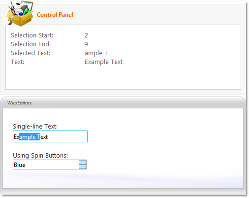

////

|metadata|
{
    "name": "webtexteditor-about-webtexteditor",
    "controlName": ["WebTextEditor"],
    "tags": ["Editing","Getting Started"],
    "guid": "{69A10705-3E8D-4E4E-AEB9-62D43DA98DA7}",  
    "buildFlags": [],
    "createdOn": "0001-01-01T00:00:00Z"
}
|metadata|
////

= About WebTextEditor

WebTextEditor™ is an editor control which allows editing a single line of text or multiline text and provides various appearance and behavior based properties. WebTextEditor is built using the Infragistics ASP.NET AJAX Framework to leverage a proven code base that promotes a high performance and responsive end-user experience. You can find WebTextEditor in the  pick:[asp-net="link:infragistics4.web.v{ProductVersion}~infragistics.web.ui.editorcontrols_namespace.html[Infragistics.Web.UI.EditorControls]"]  namespace.

Like all Infragistics ASP.NET AJAX controls, WebTextEditor seamlessly integrates into the Infragistics® Application Styling Framework. With CSS based properties you can manually customize the WebTextEditor by leveraging your existing style sheets.

WebTextEditor also exposes a robust model within the client-side Javascript programming environment. The client-side object model (CSOM) consists of full-fledged properties and methods that enable developers to program significant units of functionality without the need for server-side postbacks.

Some of the WebTextEditor control’s features include:

* *High-Performance* -- Lightweight markup and optimized code improve performance.
* *Multiline Text* -- Allows editing of multiline text in the display.
* *Spin Buttons* -- Can easily spin through a list of values using the spin buttons.
* *CustomButtonHotKeys* -- Allows using hot keys to trigger custom button clicks.
* *Password mode* -- Mask your input characters by setting a single property.
* *Standard Validators support* -- Supports ASP.NET validator controls.
* *MaxLength* -- Allows you to set the maximum length of a text string that can be entered into the control.
* *SelectionOnFocus* -- You can set different selection types for whenever entering edit mode.