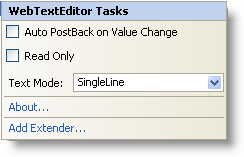

////

|metadata|
{
    "name": "webtexteditor-webtexteditor-smart-tag",
    "controlName": ["WebTextEditor"],
    "tags": ["Design Environment"],
    "guid": "{A349AD4B-BE7B-4CC2-B19A-D8B6C56B7C42}",  
    "buildFlags": [],
    "createdOn": "0001-01-01T00:00:00Z"
}
|metadata|
////

= WebTextEditor Smart Tag

In Visual Studio 2005/2008 (.NET Framework 2.0/3.5), each Infragistics ASP.NET control/component is equipped with a Smart Tag. By selecting the control/component, a Smart Tag anchor appears. When you click this anchor, a pop-up panel appears, providing you with quick and easy access to the most common properties and settings of the control/component.

The WebTextEditor™ Smart Tag contains the following items:

* Auto PostBack on Value Change -- Allows you to set auto postback options applied to ValueChanged event.
* Read Only -- Allows you to configure whether the end-user can edit the text of the control.
* Text Mode -- Allows you to set the text mode to single, multiline or password.

The WebTextEditor Smart Tag contains the following links:

* About -- Clicking this opens the WebTextEditor product information. It contains information such as Status, Version, Expiration and Product Key.
* Add Extender -- Clicking this will bring up a dialog that shows all of the control extenders that can be used with the WebTextEditor.

See the table below for a description of the item, as well as the item's corresponding property in the properties grid.

[options="header", cols="a,a,a"]
|====
|Items|Description|CorrespondingProperty

|Auto PostBack On Value Change
|Gets/Sets auto postback options applied to the ValueChanged event.
|*ValueChanged (AutoPostBackFlags)*

|Read Only
|Gets/Sets the ability for the end-user to edit the text of the control.
|*ReadOnly*

|Text Mode
|Gets/Sets the text mode of the editor such as SingleLine, MultiLine or Password.
|*TextMode*

|====