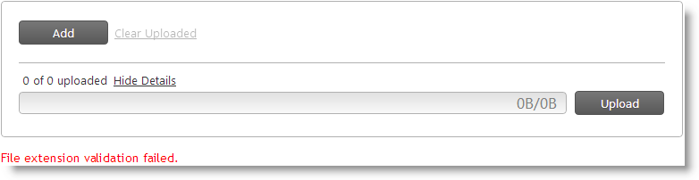
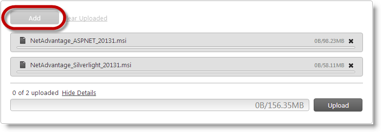
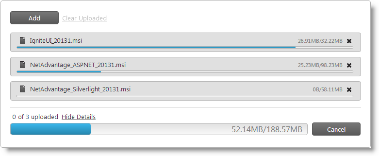
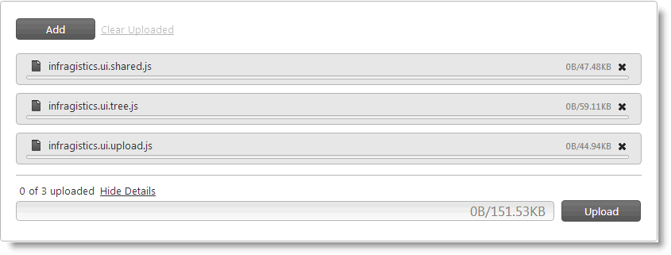

////
|metadata|
{
    "name": "webupload-configuring-webupload",
    "controlName": ["WebUpload"],
    "tags": [],
    "guid": "0c592204-e37b-4de0-8578-3ada0d792288","buildFlags": [],
    "createdOn": "2013-03-21T12:06:23.9727899Z"
}
|metadata|
////

= Configuring WebUpload

== Topic Overview

=== Purpose

This topic explains, with code examples, how to configure the  _WebUpload_™ control.

=== Required background

The following topics are prerequisites to understanding this topic:

[options="header", cols="a,a"]
|====

|Topic|Purpose 

| link:webupload-overview.html[WebUpload Overview] 

|This topic explains conceptually the _WebUpload_ control and its features. It also demonstrates how to add the control to an ASPX page. 

| link:webupload-http-module-and-handler.html[Using HTTP Handler and Module] 

|This topic demonstrates how to configure the HTTP Module and HTTP Handler to process the server events necessary to accept the data uploaded with the _WebUpload_ control. 

|====

=== External Resources

link:http://www.w3.org/TR/html-markup/input.file.html#input.file[HTML: The Markup Language (an HTML language reference)]

=== In this topic

This topic contains the following sections:

* <<_Ref350640800, _WebUpload_   Configuration Overview>>

** <<_Ref350640814, _WebUpload_   Configuration summary>>
** <<_Ref348004504, _WebUpload_   Configuration summary chart>>

* <<_Ref350640827,Configuring the File Selection Mode (Single/Multiple)>>

** <<_Ref341791598,Overview>>
** <<_Ref350629718,Requirements>>
** <<_Ref341791602,Property settings>>
** <<_Ref341791605,Example>>

* <<_Ref348004537,Configuring the Upload Trigger (Manual/Auto)>>

** <<_Ref341791611,Overview>>
** <<_Ref341791614,Property settings>>
** <<_Ref341791617,Example>>

* <<_Ref350640910,Configuring the Allowed File Types>>

** <<_Ref341791623,Overview>>
** <<_Ref341791628,Property settings>>
** <<_Ref341791631,Example>>

* <<_Ref334453966,Configuring the Maximum Number of Files to Upload>>

** <<_Ref348004568,Overview>>
** <<_Ref348004571,Property settings>>
** <<_Ref348004575,Example>>

* <<_Ref350640978,Configuring the Maximum Number of Simultaneously Uploading Files>>

** <<_Ref348004582,Overview>>
** <<_Ref348004585,Property settings>>
** <<_Ref348004588,Example>>

* <<_Ref350641009,Configuring the File Display Mode>>

** <<_Ref341791587,Overview>>
** <<_Ref341791589,Property settings>>
** <<_Ref341791592,Example>>

* <<_Ref350641041,Related Content>>

** <<_Ref341791637,Topics>>
** <<_Ref341791642,Samples>>

[[_Ref350640800]]
== _WebUpload_   Configuration Overview

[[_Ref350640814]]

=== WebUpload Configuration summary

The  _WebUpload_   control has a large set of options which allow you to customize it for your specific needs. You can control the allowed file types, specify the number of files that can upload simultaneously, configure the user interactions in the file panel (how many files they can select for upload in one pass and how this is displayed in the  _WebUpload_    __panel__ ), and choose whether the upload will start automatically or after some explicit user action. For further details, refer to <<_Ref348004504,WebUpload Configuration summary chart>> and the sections that follow it.

[[_Ref348004504]]

=== WebUpload Configuration summary chart

The following table lists the configurable aspects of  _WebUpload_  . Additional details are available after the table.

[options="header", cols="a,a,a"]
|====
|Configurable aspects|Details|Properties

|<<_Ref350640827,File selection mode (Single/Multiple)>>
|You can configure whether users, when selecting the files to upload, will be able to select multiple files or only one file at a time.
|
* link:{ApiPlatform}web.jquery{ApiVersion}~infragistics.web.ui.editorcontrols.webupload~mode.html[Mode] 

* link:{ApiPlatform}web.jquery{ApiVersion}~infragistics.web.ui.editorcontrols.webupload~multiplefiles.html[MultipleFiles] 

|<<_Ref348004537,Upload trigger(Manual/Auto)>>
|You can configure whether the upload will start automatically once the user has added the file(s) to the _WebUpload_ panel or manually (on user’s pressing the Upload button).
|
* link:{ApiPlatform}web.jquery{ApiVersion}~infragistics.web.ui.editorcontrols.webupload~autostartupload.html[AutoStartUpload] 

|<<_Ref350640910,The Allowed File Types>>
|You can configure which types of files will be allowed for users to upload.
|
* link:{ApiPlatform}web.jquery{ApiVersion}~infragistics.web.ui.editorcontrols.webupload~allowedextensions.html[AllowedExtensions] 

|<<_Ref334453966,Maximum number of files to upload>>
|You can configure the maximum number of files that can be uploaded per page refresh.
|
* link:{ApiPlatform}web.jquery{ApiVersion}~infragistics.web.ui.editorcontrols.webupload~maxuploadedfiles.html[MaxUploadedFiles] 

|<<_Ref350640978,Maximum number of simultaneously uploading files>>
|This setting configures the threshold on the number of simultaneous file uploads.
|
* link:{ApiPlatform}web.jquery{ApiVersion}~infragistics.web.ui.editorcontrols.webupload~maxsimultaneousfilesuploads.html[MaxSimultaneousFilesUploads] 

|<<_Ref350641009,File display mode>>
|You can configure how many files to be displayed in the panel of the _WebUpload_ control.
|
* link:{ApiPlatform}web.jquery{ApiVersion}~infragistics.web.ui.editorcontrols.webupload~mode.html[Mode] 

|====

[[_Ref350640827]]
== Configuring the File Selection Mode (Single/Multiple)

[[_Ref341791598]]

=== Overview

You can configure whether users, when selecting the files to upload, will be able to select multiple files or only one file at a time. This functionality is managed by the file selection mode of  _WebUpload_  . The file selection mode can be either Single File (users can select only one file at one pass) or Multiple Files (users can select multiple files at one pass).

In Multiple Files file selection mode, users can:

* Select multiple files at once from the file Open dialog
* Drag-and-drop the files from Windows® Explorer onto the  _WebUpload_   control

In Single File selection mode, users can select only one file in the file Open dialog and cannot drag-and-drop files. If they want to upload multiple files, they will have to add the files to the  _WebUpload_   control panel repeating the adding procedure for each file.

The following pictures illustrate the two alternative file selection approaches: selecting multiple files in the file Open dialog (left) or dragging and dropping them from Windows Explorer onto the  _WebUpload_   control panel (right).

[options="header", cols="a,a"]
|====
|Multiple files selection in the file Open dialog|Dropping selected files from Windows Explorer onto  _WebUpload_

|image::images/Configuring_WebUpload_1.png[]
|image::images/Configuring_WebUpload_2.png[]

|====

The default file selection mode is Single File.

The file selection mode is managed by the link:{ApiPlatform}web.jquery{ApiVersion}~infragistics.web.ui.editorcontrols.webupload~mode.html[Mode] and link:{ApiPlatform}web.jquery{ApiVersion}~infragistics.web.ui.editorcontrols.webupload~multiplefiles.html[MultipleFiles] options. Setting link:{ApiPlatform}web.jquery{ApiVersion}~infragistics.web.ui.editorcontrols.webupload~multiplefiles.html[MultipleFiles] to  _true_   makes sense only when link:{ApiPlatform}web.jquery{ApiVersion}~infragistics.web.ui.editorcontrols.webupload~mode.html[Mode] is  _Multiple_  . When link:{ApiPlatform}web.jquery{ApiVersion}~infragistics.web.ui.editorcontrols.webupload~mode.html[Mode] is  _Single_  , link:{ApiPlatform}web.jquery{ApiVersion}~infragistics.web.ui.editorcontrols.webupload~multiplefiles.html[MultipleFiles] has no effect.

The File Selection Mode feature employs the link:http://www.w3.org/TR/html-markup/input.file.html#input.file[HTML 5 multiple attribute] of the `input` element. This makes the feature browser-dependent. If an unsupported browser is used, then setting the feature’s properties has no effect, meaning that users will not be able to select multiple files from the file Open dialog or drag-and-drop them onto the  _WebUpload_   control. For the list of the supported browsers, see <<_Ref350629718,Requirements>>.

[[_Ref350629718]]

=== Requirements

Following are the requirements for configuring the file selection type:

* A browser supporting HTML 5 `multiple` attribute of the `input` element

This functionality is available only in the following browsers:

[options="header", cols="a,a,a,a,a"]
|====
|Chrome|Firefox|Internet Explorer|Opera|Safari

|1.0 or higher
|3.6 or higher
|10 or higher
|10.62 or higher
|5 or higher

|====

[[_Ref341791602]]

=== Property settings

The following table maps the desired configuration to its respective property settings.

[options="header", cols="a,a,a"]
|====
|In order to:|Use this property:|And set it to:

|Set the file selection mode to Multiple Files
|
* link:{ApiPlatform}web.jquery{ApiVersion}~infragistics.web.ui.editorcontrols.webupload~mode.html[Mode] 

* link:{ApiPlatform}web.jquery{ApiVersion}~infragistics.web.ui.editorcontrols.webupload~multiplefiles.html[MultipleFiles] 

|
* _“Multiple”_ 

* _True_ 

|Set the file selection mode to Single File
|
* link:{ApiPlatform}web.jquery{ApiVersion}~infragistics.web.ui.editorcontrols.webupload~mode.html[Mode] 

|
* _“Single”_ 

|====

[[_Ref341791605]]

=== Example

This example demonstrates how to enable multiple files selection as a result of the following settings:

[options="header", cols="a,a"]
|====
|Property|Value

|Mode
| _"Multiple"_ 

|MultipleFiles
| _True_ 

|====

image::images/Configuring_WebUpload_1.png[]

Following is the code that implements this example.

*In ASPX:*

[source,html]
----
<ig:WebUpload ID="WebUpload1" runat="server" Mode="Multiple" MultipleFiles="True">
</ig:WebUpload>
----

[[_Ref348004537]]
== Configuring the Upload Trigger (Manual/Auto)

[[_Ref341791611]]

=== Overview

You can configure whether the upload will start automatically once the user has added the file(s) to the  _WebUpload_   panel or manually (on user’s pressing the Upload button). This functionality of the  _WebUpload_   control is called “upload trigger”. The upload trigger enables or disables the automatic start of the file upload.

The default upload trigger is Manual.

The upload trigger is managed by the link:{ApiPlatform}web.jquery{ApiVersion}~infragistics.web.ui.editorcontrols.webupload~autostartupload.html[AutoStartUpload] option of the  _WebUpload_   control.

[[_Ref341791614]]

=== Property settings

The following table maps the desired configuration to its respective property settings.

[options="header", cols="a,a,a"]
|====
|In order to:|Use this property:|And set it to:

|Enable automatic upload
| link:{ApiPlatform}web.jquery{ApiVersion}~infragistics.web.ui.editorcontrols.webupload~autostartupload.html[AutoStartUpload]
|_True_

|Disable automatic upload
| link:{ApiPlatform}web.jquery{ApiVersion}~infragistics.web.ui.editorcontrols.webupload~autostartupload.html[AutoStartUpload]
| _False_ 

|====

[[_Ref341791617]]

=== Example

This example demonstrates how to enable automatic upload for users a result of the following settings:

[options="header", cols="a,a"]
|====
|Property|Value

| link:{ApiPlatform}web.jquery{ApiVersion}~infragistics.web.ui.editorcontrols.webupload~autostartupload.html[AutoStartUpload]
|_True_

|====

Following is the code that implements this example.

*In ASPX:*

[source,html]
----
<ig:WebUpload ID="WebUpload1" runat="server" AutoStartUpload="True">
</ig:WebUpload>
----

[[_Ref350640910]]
== Configuring the Allowed File Types

[[_Ref341791623]]

=== Overview

You can configure which types of files will be allowed for users to upload. This functionality is handled by explicitly listing the file name extensions of the allowed file types in a list of permissible file types. This list is a collection of `FileUploadExtension` objects representing the allowed file extensions as the value of the link:{ApiPlatform}web.jquery{ApiVersion}~infragistics.web.ui.editorcontrols.webupload~allowedextensions.html[AllowedExtensions] property.

By default, all file types can be uploaded.

The file extension validation compares the selected file extension against the list of extensions declared in `AllowedExtenstions` property. When the file extension validation fails, the  _WebUpload_   ‘s  _onError_   event is raised. The second parameter of the  _onError_   handler contains an object with property `errorCode` `= 2` and the `errorMessage` `= “File extension validation failed.”` It is up to you to decide how to present the error to the user.

[[_Ref341791628]]

=== Property settings

The following table maps the desired configuration to its respective property settings.

[options="header", cols="a,a,a"]
|====
|In order to:|Use this property:|And set it to:

|Define allowed extensions
| link:{ApiPlatform}web.jquery{ApiVersion}~infragistics.web.ui.editorcontrols.webupload~allowedextensions.html[AllowedExtensions]
|Collection of `FileUploadExtension` objects

|====

[[_Ref341791631]]

=== Example

This example demonstrates how to set allowed users to upload .xls and .doc files:

[options="header", cols="a,a"]
|====
|Property|Value

| link:{ApiPlatform}web.jquery{ApiVersion}~infragistics.web.ui.editorcontrols.webupload~allowedextensions.html[AllowedExtensions]
|Collection of `FileUploadExtension` objects

|====

Following is the code that implements this example.

*In ASPX:*

[source,html]
----
<ig:WebUpload ID="WebUpload1" runat="server">
    <AllowedExtensions>
        <ig:FileUploadExtension Extension="doc" />
        <ig:FileUploadExtension Extension="xls" />
    </AllowedExtensions>
</ig:WebUpload>
----

[[_Configure_Maximum_Uploaded]]
[[_Ref348004565]]
[[_Ref350640937]]
[[_Ref334453966]]
== Configuring the Maximum Number of Files to Upload

[[_Ref348004568]]

=== Overview

You can configure the maximum number of files that can be uploaded per page refresh. Once this limit is reached, the Add button in the  _WebUpload_   control’s panel is disabled. When File Selection mode is Multiple, an error is thrown when the number of selected files exceeds the limit.

By default, there is no restriction on the number of files to upload.

When you have `MultipleFiles` `= True` users can select files exceeding this threshold raising an  _WebUpload_    _onError_   event. The second parameter of the  _onError_   handler contains object with property `errorCode` `= 1` and the `errorMessage` `= “Maximum count of uploading files exceeded.”` It is up to you to decide how to present the error to the user.

[[_Ref348004571]]

=== Property settings

The following table maps the desired configuration to its respective property settings.

[options="header", cols="a,a,a"]
|====
|In order to:|Use this property:|And set it to:

|Set maximum uploaded files
| link:{ApiPlatform}web.jquery{ApiVersion}~infragistics.web.ui.editorcontrols.webupload~maxuploadedfiles.html[MaxUploadedFiles]
|The desired integer value

|====

[[_Ref348004575]]

=== Example

This example demonstrates how to set the maximum number of files to upload to 2:

[options="header", cols="a,a"]
|====
|Property|Value

| link:{ApiPlatform}web.jquery{ApiVersion}~infragistics.web.ui.editorcontrols.webupload~maxuploadedfiles.html[MaxUploadedFiles]
| _2_ 

|====

The following picture demonstrates the Add button disabled as a result of reaching the maximum number of allowed files for upload.

Following is the code that implements this example.

*In ASPX:*

[source,html]
----
<ig:WebUpload ID="WebUpload1" runat="server" MaxUploadedFiles="2">
</ig:WebUpload>
----

[[_Ref350640978]]
== Configuring the Maximum Number of Simultaneously Uploading Files

[[_Ref348004582]]

=== Overview

You can limit the number of files that can be simultaneously uploaded. Selecting files in excess of this threshold, limits the number of simultaneously uploaded files to this threshold, on a first come first serve basis, holding the excess files in abeyance until the number of files being uploaded falls below this threshold. This process continues with each of the remaining files being added to the simultaneous upload as other files complete their upload.

The maximum number of files that can be uploading simultaneously is managed by the link:{ApiPlatform}web.jquery{ApiVersion}~infragistics.web.ui.editorcontrols.webupload~maxsimultaneousfilesuploads.html[MaxSimultaneousFilesUploads] property.

[[_Ref348004585]]

=== Property settings

The following table maps the desired configuration to its respective property settings.

[options="header", cols="a,a,a"]
|====
|In order to:|Use this property:|And set it to:

|Set the maximum number of simultaneous file uploads
| link:{ApiPlatform}web.jquery{ApiVersion}~infragistics.web.ui.editorcontrols.webupload~maxsimultaneousfilesuploads.html[MaxSimultaneousFilesUploads]
|The desired integer value

|====

[[_Ref348004588]]

=== Example

The code samples below demonstrate how to set maximum simultaneous files uploads:

[options="header", cols="a,a"]
|====
|Property|Value

| link:{ApiPlatform}web.jquery{ApiVersion}~infragistics.web.ui.editorcontrols.webupload~maxsimultaneousfilesuploads.html[MaxSimultaneousFilesUploads]
|2

|====

Following is the code that implements this example.

*In ASPX:*

[source,html]
----
<ig:WebUpload ID="WebUpload1" runat="server" MaxSimultaneousFilesUploads="2">
</ig:WebUpload>
----

[[_Ref350641009]]
== Configuring the File Display Mode

[[_Ref341791587]]

=== Overview

You can configure how many files can be displayed in the panel of the  _WebUpload_   control. This functionality is managed by the file display mode of  _WebUpload_  . The file selection mode can be either Single File (only one file is shown in the panel) or Multiple Files (multiple files shown in the panel).

In Multiple Files mode, the panel displays several files (arranged vertically).

In Single File mode, only one file at a time can be displayed.

The following pictures compare Single File mode and Multiple Files mode.

[options="header", cols="a,a"]
|====
|Single File mode|Multiple Files mode

|image::images/Configuring_WebUpload_7.png[]
|image::images/Configuring_WebUpload_8.png[]

|====

The default file mode setting is Single File.

The number of displayed files in Multiple Files mode cannot exceed the link:{ApiPlatform}web.jquery{ApiVersion}~infragistics.web.ui.editorcontrols.webupload~maxuploadedfiles.html[MaxUploadedFiles] setting. Depending on the situation, exceeding the link:{ApiPlatform}web.jquery{ApiVersion}~infragistics.web.ui.editorcontrols.webupload~maxuploadedfiles.html[MaxUploadedFiles] setting result with the following:

* When MultipleFiles = False, disables the Add button when the number of files equals the link:{ApiPlatform}web.jquery{ApiVersion}~infragistics.web.ui.editorcontrols.webupload~maxuploadedfiles.html[MaxUploadedFiles] setting.
* When MultipleFiles = True, throws an error if the number of selected files exceeds the link:{ApiPlatform}web.jquery{ApiVersion}~infragistics.web.ui.editorcontrols.webupload~maxuploadedfiles.html[MaxUploadedFiles] setting.

[[_Ref341791589]]

=== Property settings

The following table maps the desired configuration to its respective property settings.

[options="header", cols="a,a,a"]
|====
|In order to:|Use this property:|And set it to:

|Set the display mode to Single File
| link:{ApiPlatform}web.jquery{ApiVersion}~infragistics.web.ui.editorcontrols.webupload~mode.html[Mode]
| _“single”_ 

|Set the display mode to Multiple Files
| link:{ApiPlatform}web.jquery{ApiVersion}~infragistics.web.ui.editorcontrols.webupload~mode.html[Mode]
| _"multiple"_ 

|====

[[_Ref341791592]]

=== Example

This example demonstrates setting the display mode to Multiple Files. This is a result of the following settings:

[options="header", cols="a,a"]
|====
|Property|Value

| link:{ApiPlatform}web.jquery{ApiVersion}~infragistics.web.ui.editorcontrols.webupload~mode.html[Mode]
|" _Multiple_ "

|====

Following is the code that implements this example.

*In ASPX:*

[source,html]
----
<ig:WebUpload ID="WebUpload1" runat="server" Mode="Multiple">
</ig:WebUpload>
----

[[_Ref350641041]]
== Related Content

[[_Ref341791637]]

=== Topics

The following topics provide additional information related to this topic.

[options="header", cols="a,a"]
|====
|Topic|Purpose

| link:webupload-saving-files-as-stream.html[Saving Files as Stream (WebUpload)]
|This topic explains how to process and save upload files as either file or memory streams. A detailed procedure is provided on saving files as memory stream by individual processing of each uploaded file chunk.

|====

[[_Ref341791642]]

=== Samples

The following samples provide additional information related to this topic.

[options="header", cols="a,a"]
|====
|Sample|Purpose

| link:{SamplesUrl}/web-upload/single-upload[Single Upload]
|This sample demonstrates setting up _WebUpload_ ’s auto-start upload option.

| link:{SamplesUrl}/web-upload/multiple-upload[Multiple Upload]
|This sample demonstrates configuring _WebUpload_ to upload multiple files.

| link:{SamplesUrl}/web-upload/progress-information[Progress Information]
|This sample demonstrates setting up the maximum number of uploaded files and the maximum simultaneous file uploads for the _WebUpload_ control.

|====