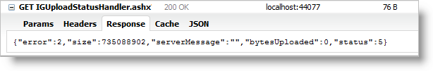

////

|metadata|
{
    "name": "webupload-http-module-and-handler",
    "controlName": ["WebUpload"],
    "tags": ["API","Selection"],
    "guid": "6423ea36-dac6-41f6-be9a-b77c191e0446",  
    "buildFlags": [],
    "createdOn": "2011-05-26T14:52:39.7661472Z"
}
|metadata|
////

= WebUpload HTTP Module and Handler

The WebUpload control is ASP.NET wrapper for the client-side only jQuery Upload. That’s why it has the rich API that the client control has. This topic will expose you some details about the main classes on the sever side as well as information about the Server Events.

== HTTP Module

An HttpModule may be configured to manage the file upload process. It implements the .NET IHttpModule interface so that it plugs into the HTTP Request process. . Therefore all the requests, even those that are not coming from the upload control, pass through HttpModule. That’s why HttpModule filters the requests that are relevant only to the upload control.

The examples below demonstrate how to configure an pick:[asp-net="* link:infragistics4.web.jquery.v{ProductVersion}~infragistics.web.ui.editorcontrols.uploadmodule.html[HttpModule]*"] for IIS6 (or development server) or for deploying on an IIS7 server.

== For IIS6 (development Environment)

[cols="a"]
|====
|*In web.config:*

|---- 
<system.web> 
 <httpModules> 
 <add name="IGUploadModule" 
 type="Infragistics.Web.UI.EditorControls.UploadModule" /> 
 </httpModules> 
</system.web>
----

|====

== For IIS7

[cols="a"]
|====
|*In web.config:*

|---- 
<system.webServer> 
 <modules runAllManagedModulesForAllRequests="true"> 
 <add name="IGUploadModule" 
 type="Infragistics.Web.UI.EditorControls.UploadModule" 
 preCondition="managedHandler" /> 
 </modules> 
</system.webServer>
----

|====

== HTTP Handler

An pick:[asp-net="* link:infragistics4.web.jquery.v{ProductVersion}~infragistics.web.ui.editorcontrols.uploadstatushandler.html[HttpHandler]*"] implements the .NET IHttpHandler interface and is used to communicate with the client widget. The handler has two main functions – to receive commands from the client and to return status back to the client.

All the requests between the upload control and the handler are sent via Ajax. Using Ajax as a communication mechanism is a natural choice as the handler returns status messages in JSON.

As contrasted from the HttpModule, the HttpHandler is accessible via a URL. Commands for every file sent become parameters in the URL. Commands can be one of the following three types:

* *Status* : Returns the current the file status. The JSON response contains information for total bytes, uploaded bytes and current file error status. JSON format is:

* *Cancel* : When this command is requested the file upload process is canceled
* *fileSize*: This command is called in two special cases when the size of the file to be uploaded is needed from the handler to display in the control. The first is when pick:[asp-net="* link:infragistics4.web.jquery.v{ProductVersion}~infragistics.web.ui.editorcontrols.webupload~autostartupload.html[autostartupload]*"] property is set to false. The size information is required as the file is not processing until the user starts the upload. The second case is when *autostartupload* property is set to true but there are files placed in the uploading queue and their uploading process is not started.

To enable the handler you need to add the appropriate sections in Web.config file – either for development server or for IIS7:

== For IIS6 (development Environment)

[cols="a"]
|====
|*In web.config:*

|---- 
<system.web> 
 <httpHandlers> 
 <add path="*.html" verb="GET,POST" type="System.Web.StaticFileHandler" /> 
 <add verb="GET" type="Infragistics.Web.UI.EditorControls.UploadStatusHandler" 
 path="IGUploadStatusHandler.ashx" /> 
 </httpHandlers> 
</system.web>
----

|====

== For IIS7

[cols="a"]
|====
|*In web.config:*

|---- 
<system.webServer> 
 <handlers> 
 <add name="IGUploadStatusHandler" path="IGUploadStatusHandler.ashx" 
 verb="*" type="Infragistics.Web.UI.EditorControls.UploadStatusHandler" 
 preCondition="integratedMode" /> 
 </handlers> 
</system.webServer>
----

|====

.Note:
[NOTE]
====
This example is uses IGUploadStatusHandler.ashx as a default name for the handler. The name as well the path to the handler are only recommended values.
====

== UploadProgressManager and Server Events

The server architecture designed so that the handler and module communicate using proxy class called –  pick:[asp-net="link:infragistics4.web.jquery.v{ProductVersion}~infragistics.web.ui.editorcontrols.uploadprogressmanager.html[*UploadProgressManager* ]"] . This class is also responsible for triggering the server events. The events are the place where you can handle the file uploading process to perform actions like deleting and moving uploaded files, to cancel uploading, to modify status information.

All the three server events have two arguments – one is sender the other is the event argument. The sender is a containing the *UploadProgressManager* , which fires the events. Event argument is specific for every one of the three events below and each event arg implements the IUploadEventArgs interface.

The following code listing demonstrates how to attach to the server events. Each of the events below implements individual handlers.

First you need to add the assembly file that contains the ASP.NET wrappers - Infragistics.Web.jQuery.dll, and then register the prefix for the WebUpload.

[cols="a"]
|====
|*In web.config:*

|---- 
<system.web> 
 <pages> 
 <add tagPrefix="igjq" namespace="Infragistics.Web.UI.EditorControls" 
 assembly="Infragistics.Web.jQuery"/> 
 </pages> 
</system.web>
----

|====

Then you can add the WebUpload to your ASPX page and attach handlers for the control’s events.

[cols="a"]
|====
|*In web.config:*

|---- 
<igjq:WebUpload ID="webUpload1" runat="server" 
 OnUploadFinishing="webUpload1_OnUploadFinishing" 
 OnUploadFinished="webUpload1_OnUploadFinished" 
 OnUploadStarting="webUpload1_OnUploadStarting"> 
</igjq:WebUpload>
----

|====

[start=1]
. *FileStarting*: When the file starts to upload all the information from the request header is available in the event argument of type *UploadingStartEventArgs*. Having this information available at this time which means that in the event handler you can implement validation rules and decide whether or not to cancel the upload. The other important property of the event argument is *TemporaryFileName* – the name of the file during uploading. Only inside *FileStarting* you can set the *serverMessage* property, which than is send to the client.

[cols="a"]
|====
|*In C#:*

|---- 
protected void webUpload1_OnUploadStarting(object sender, UploadStartingEventArgs e){}
----

|====

[start=2]
. *FileFinishing* : At this stage the file is already uploaded but it’s still has the temporary name. The WebUpload has released the file and it can be freely modified.

[cols="a"]
|====
|*In C#:*

|---- 
protected void webUpload1_OnUploadFinishing(object sender, UploadFinishingEventArgs e){}
----

|====

[start=3]
. *FileFinished* : At this stage the file is uploaded and it is renamed with its original name. If there is already a file with the same name the old one is overwritten, only the last one will be available.

[cols="a"]
|====
|*In C#:*

|---- 
protected void webUpload1_OnUploadFinished(object sender, UploadFinishedEventArgs e){}
----

|====

The following code shows how to handle FileFinishing event and to delete the uploaded file, which is at that step of the cycle, with temporary name.

[cols="a"]
|====
|*In ASPX:*

|---- 
<igjq:WebUpload ID="webUpload1" runat="server" 
 OnUploadFinishing="webUpload1_OnUploadFinishing"> 
</igjq:WebUpload>
----

|====

[cols="a"]
|====
|*In C#:*

|---- 
protected void webUpload1_OnUploadFinishing(object sender, UploadFinishingEventArgs e) 
{ 
 string filePath = String.Format("{0}{1}", e.FolderPath, e.TemporaryFileName); 
 if (File.Exists(filePath)) 
 { 
 try 
 { 
 File.Delete(filePath); 
 } 
 catch (Exception ex) 
 { 
 } 
 } 
}
----

|====

== Server Enumerations for File Status and Error

When upload information is transferred from server to the client, it contains status data for the current upload. Response data includes:

* Uploaded bytes
* File status information
* Error info about any exceptions that may occur

*Table 1* describes details found in the response for the upload status and Table 2 describes file error codes.

An example of a JSON response that includes the described data is depicted in Figure 2.

.Note:
[NOTE]
====
The other JSON properties – size, serverMessage and bytesUploaded, are not needed to be created as enumeration types on the server, like error and status, because they are either dynamically changed strings or numbers.
====

*Table 1*: Enumeration of type  pick:[asp-net="link:infragistics4.web.jquery.v{ProductVersion}~infragistics.web.ui.editorcontrols.uploadstatus.html[*UploadStatus* ]"]

[options="header", cols="a,a"]
|====
|Value|Description

|0
|File is not started

|1
|File Uploading is started

|2
|File Upload is finished

|3
|File not found - this status is used when it is not found such key in the dictionary

|4
|Cancel file uploading by client command

|5
|Size of the file exceeded

|6
|Error while file is uploading

|7
|File upload is cancelled from server-side event handler

|8
|File uploading is cancelled by dropping client connection

|9
|Status of file when the whole content is uploaded but the file is with temporary filename

|====

*Table 2*: Enumeration of type  pick:[asp-net="link:infragistics4.web.jquery.v{ProductVersion}~infragistics.web.ui.editorcontrols.fileerror.html[*FileError* ]"]

[options="header", cols="a,a"]
|====
|Value|Description

|-1
|No error

|0
|File error occurs when getting file name from the request

|1
|MIME type validation failed

|2
|File size exceeded

|3
|Temporary folder where file should be uploaded could not be found

|4
|Error while parsing request header

|5
|File does not exist with the specified key in the request

|6
|Error occurs when file saving fails

|7
|Error occurs when trying to write file content

|8
|Error occurred when trying to write file content for the first time

|9
|Error occurred when trying to delete file

|10
|Error set when file upload is cancelled on start uploading in event handler

|====

== Related Links

link:webupload-overview.html[WebUpload Overview]