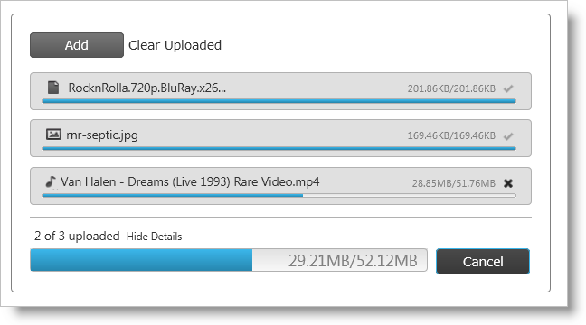
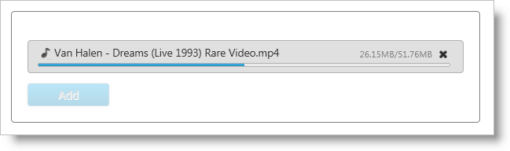

////
|metadata|
{
    "name": "webupload-overview",
    "controlName": ["WebUpload"],
    "tags": ["Getting Started","Selection"],
    "guid": "6e05f08c-f39d-4b88-af97-20d20eb35447",
    "buildFlags": [],
    "createdOn": "2011-04-01T19:43:46.2598843Z"
}
|metadata|
////

= WebUpload Overview

== About WebUpload

The Infragistics ASP.NET upload control, or WebUpload, is a control that allows you to upload any types of files, sending them from the client browser to the server. The size of the uploaded files can be restricted only by server limitations, so you can upload large files with size more than default 10MB.

The upload control is able to handle single uploads (default) or simultaneous multiple file upload operations. To facilitate multiple uploads, the control uses an HTML  _iframe_  element to upload files in the background. When the file is uploaded then  _iframe_  is removed as HTML DOM element.There are a number of UI elements that support the upload control as depicted in *Figure 1* . Visual elements include:

* Progress bar that shows upload progress of an individual file
* Information like total size, uploaded size and file name
* Icon that changes according to file type
* Cancel button

** Once the file is uploaded the cancel button disappears and in its place a success indicator is revealed to the user
** If the upload is canceled the file information is hidden

During multiple uploads visual elements include:

* Each file has its own progress bar and cancel button

** When Cancel is clicked, that individual file is removed from the upload queue

* A summary progress bar displays the upload progress of all files

** The entire upload may be canceled when the overall cancel button is clicked

== Architecture

Use of the WebUpload control consists of two required parts - client-side jQuery widget and server-side logic which is responsible for handling and processing each upload request. The server is also responsible for processing the upload itself. The example in this document implements server code using ASP.NET Framework, but the WebUpload control is independent of server technology.

The upload control exposes a rich jQuery API, so that the controls can be easily configured on the client-side. Also, developers using the Microsoft® ASP.NET MVC framework can leverage the upload control’s server-ide wrapper to configure the control with their .NET™ language of choice.

The WebUpload control may be extensively styled giving you an opportunity to provide a completely different look and feel for the control as opposed to the default style. Styling options include using your own styles as well as styles from jQuery UI’s ThemeRoller.

*Figure 1: The WebUpload control as presented to the user*

== Features

* Single/Multiple Mode
* Upload more than default 10MB’s
* Automatic Upload
* Multiple Simultaneous Upload
* Cancel Uploading process
* Set maximum upload files
* Client-side and Server-side events
* Show/Hide progress information
* Client-Side and Server-Side validation
* Restrict uploaded types
* Theme support
* Modify progress information and file upload status
* Show appropriate icon according to file extension
* Modify the text of the control’s labels

== Adding WebUpload to a Web Page

This example demonstrates how to include and implement the client-side logic of the control and how to configure the server-side so that it receives and saves the uploaded files.

.Note:
[NOTE]
====
For more information about the server-side architecture and implementation is available in: link:webupload-http-module-and-handler.html[HTTP Handler and Module]
====

This sample demonstrates a basic upload scenario in Single Mode, which will start the upload automatically.

*Figure 2*

link:{SamplesUrl}/web-upload/single-upload[Single WebUpload Sample]

[start=1]
. To get started, include the required and localized resources for your application.
[start=2]
. On your ASPX page, reference the required JavaScript files, CSS files.

[cols="a"]
|====
|*In ASPX:*

|

[source]
---- 
<link type="text/css" href="/Styles/css/themes/infragistics/infragistics.theme.css" rel="stylesheet" />
---- 

[source]
---- 
<link type="text/css" href="/Styles/css/structure/infragistics.css" rel="stylesheet" />
---- 

[source]
---- 

---- 

[source]
---- 
 
 
---- 
|====

[start=3]
. Once the above setup is complete, begin to set options including *ID*, pick:[asp-net="link:infragistics4.web.jquery.v{ProductVersion}~infragistics.web.ui.editorcontrols.webupload~autostartupload.html[autostartupload]"] and pick:[asp-net="link:infragistics4.web.jquery.v{ProductVersion}~infragistics.web.ui.editorcontrols.webupload~progressurl.html[progressUrl]"] . The last property defines the URL of the HTTP handler that returns file status progress and file size information and handles cancel upload command. That’s all you need on the client-side widget to connect with server-side and get the upload control to work. The remaining options have their default values. For example for the upload mode is single.

[cols="a"]
|====
|*In ASPX:*

|---- 
<igjq:WebUpload ID="WebUpload1" runat="server" 
 AutoStartUpload="true" ProgressUrl="/WebUploadStatusHandler.ashx"> 
</igjq:WebUpload >
----

|====

[start=4]
. Next you must configure the server-side HTTP Handler and Module.

== Configuring the HTTP Handler and Module

The required HTTP handler and Module are part of the Infragistics.Web.UI dll as well as the ASP.NET upload wrapper. Follow the steps below to register them in the Web.config file.

[start=1]
. To get started, first you must create folder with write permissions, where the uploaded files will be saved. Then you have to register that folder in the Web.config (see the code below), so that the WebUpload knows where to save the files. For the current example the folder is called  _Uploads_ .
[start=2]
. You can restrict the size of the uploaded files by setting the  _maxFileSizeLimit_  setting. In this sample this size is about 100 MB.

[cols="a"]
|====
|*In web.config:*

|---- 
<appSettings>  <add key="fileUploadPath" value="~/Uploads" /> 
 <add key="maxFileSizeLimit" value="100000000" /> 
</appSettings>
----

|====

.Note:
[NOTE]
====
The value of maxFileSizeLimit is in bytes.
====

[start=3]
. Then you need to register the modules and handlers. Depending on your server you should configure Web.config file.

== For IIS6(and Development Environment)

[cols="a"]
|====
|*In web.config:*

|---- 
<system.web>  <httpHandlers>  <add verb="GET" type="Infragistics.Web.UI.EditorControls.UploadStatusHandler" 
 path="WebUploadStatusHandler.ashx" /> 
 </httpHandlers> 
 <httpModules> 
 <add name="IGUploadModule" type="Infragistics.Web.UI.EditorControls.UploadModule" /> 
 </httpModules> 
</system.web>
----

|====

== For IIS7

[cols="a"]
|====
|*In web.config:*

|---- 
<system.webServer>  <modules runAllManagedModulesForAllRequests="true"> 
 <add name="IGUploadModule" type="Infragistics.Web.UI.EditorControls.UploadModule" 
 preCondition="managedHandler" /> 
 </modules> 
 <handlers> 
 <add name="IGUploadStatusHandler" path="WebUploadStatusHandler.ashx" verb="$$*$$" 
 type="Infragistics.Web.UI.EditorControls.UploadStatusHandler" preCondition="integratedMode" /> 
 </handlers> 
</system.webServer>
----

|====

[start=4]
. Run the web page and you will get the basic WebUpload control. Then you can select a file from the file picker window that your browser displays and monitor the progress information that WebUpload exposes as seen in *Figure 2* .

.Note:
[NOTE]
====
If you are still not able to run the upload control, please follow this link to explore possible errors link:{SamplesUrl}/web-upload/client-side-events[WebUpload Client-side Events Samples]. The client-side events topic explains how to attach to a client-side event onError and investigate the problem.
====

== Related Links

link:{SamplesUrl}/web-upload/single-upload[Single WebUpload Sample]

link:{SamplesUrl}/web-upload/client-side-events[WebUpload Client-side Events Samples]

link:webupload-http-module-and-handler.html[HTTP Handler and Module]

link:webupload-using-client-side-events.html[Using client-side events]