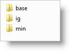
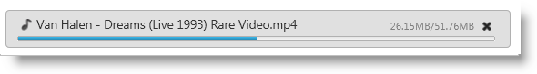
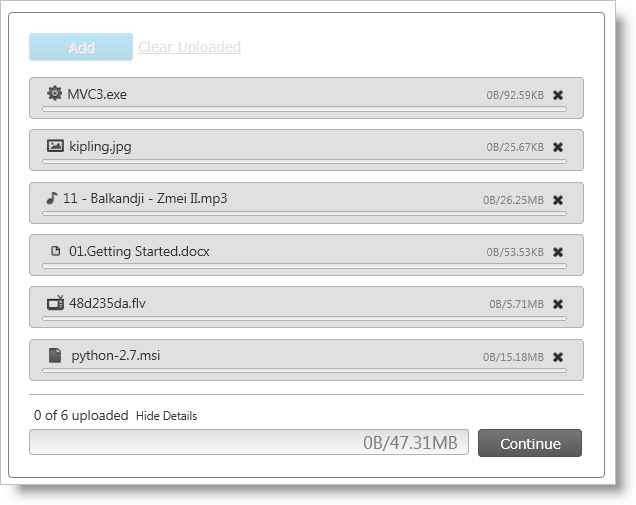

////
|metadata|
{
    "name": "webupload-styling-and-theming",
    "controlName": ["WebUpload"],
    "tags": ["Selection","Styling","Theming"],
    "guid": "48db107f-a5a7-46b7-88ef-dad17f32500d",
    "buildFlags": [],
    "createdOn": "2011-05-26T14:54:03.1194817Z"
}
|metadata|
////

= Styling WebUpload

This topic demonstrates how to customize the WebUpload control to achieve a custom look and feel. You’ll also learn about the required scripts and styles needed to style the control.

== Required CSS and Themes

The Infragistics ASP.NET upload control (or WebUpload), like other jQuery widgets, utilizes the jQuery UI CSS Framework for styling. Included in Infragistics ASP.NET is a custom jQuery UI theme called ‘IG Theme’. This theme provides a professional and attractive design to all Infragistics and standard jQuery UI widgets.

In addition to the ‘IG Theme’, a second theme, ‘Base Theme’, is required for the basic CSS layout of the Infragistics widgets.

== Adding Required Themes to a Website

The IG and Base themes are located in the installed directory within the ‘themes’ folder. To add the themes to your application, copy the ‘ig’ and ‘base’ directories from the ‘themes’ directory to a directory in your site designated for jQuery UI themes or CSS.

.Note:
[NOTE]
====
The remainder of this document assumes a directory named ‘themes’ as the destination for the copied themes.
====

*Figure 1: Included theme folders upon product install*

*Figure 2: Theme folders copied into destination application*

image::images/WebUpload_Styling_and_Theming_02.png[]

== IG Theme

The IG Theme is a custom theme which includes all of the styles typically found in a jQuery UI theme. This theme could be replaced by a different theme. When using a theme other than IG theme, the Upload has some additional styling points that may need customization to achieve a complete design.

The Upload requires having a link to the stylesheet of a standard jQuery UI theme. For the IG Theme, include the theme’s stylesheet on the webpage:

* *themes/ig/jquery.ui.custom.css*

== Base Theme

The Base Theme should be included after the jQuery Theme. The following stylesheets should be included when using the Upload:

* *themes/base/ig.ui.shared.css*

* *themes/base/ig.ui.upload.css*

== CSS Property

The upload CSS property is the member where all the styles for the control are applied. Table 1 shows all the properties of the CSS object property and all the rules applied to them. This gives you the freedom to create your own theme by overwriting specific classes.

.Note:
[NOTE]
====
The Theme Roller theming the control by simply overwriting the listed classes presented in the table. For more information you can see the running sample with link:{SamplesUrl}/web-upload/theme-roller[WebUpload Theme Roller sample].
====

== Table 1: List of CSS classes

[options="header", cols="a,a,a"]
|====
|CSS object properties|List of CSS classes applied to the property|Area where CSS classes are applied

|clearClass
|ui-helper-clearfix
|Applies float wrapping properties to parent elements

|hiddenClass
|ui-helper-hidden
|Hide element

|baseClassIE6
|ui-ie6
|Class for IE6

|baseClassIE7
|ui-ie7
|Class for IE7

|baseClassMoz
|ui-moz
|Class for FF

|baseClassOpera
|ui-opera
|Class for Opera

|startupBrowseButtonClasses
|ui-igstartupbrowsebutton
|Class for startup browse button

|baseClass
|ui-widget 

ui-widget-content 

ui-corner-all 

ui-igupload
|Class for the container

|baseMainContainerClass
|ui-igupload-basemaincontainer
|Classes applied to main container in single/multiple mode

|multipleDialogClasses
|ui-iguploadmultiple
|Classes applied to main container when multiple file upload mode is selected

|singleDialogClass
|ui-iguploadsingle
|Classes applied to main container when multiple file upload mode is selected

|browseButtonClass
|ui-igupload-browsebutton
|Classes applied on browse button - button in main container

|containerClass
|ui-igupload-container 

ui-widget-content
|Classes applied to DOM element containing all file upload progress bars

|uploadProgressClass
|ui-igupload-uploadprogress
|div containing separate individual file upload

|fileInfoMainContainer
|ui-igupload-fimaincontainer
|Class applied on div which contains add button, clear button and progress details of the files

|progressContainer
|ui-helper-clearfix
|Class container for each file

|progressBarUploadClass
|ui-igupload-progressbar-upload 

ui-helper-clearfix
|Class applied on single progressbar

|progressBarFileNameClass
|ui-igupload-progressbar-filename
|Classes applied to file name DOM element in the summary progress bar

|progressBarFileSizeClass
|ui-igupload-progressbar-filesize
|Classes applied to file size DOM element in the summary progress bar

|progressBarInnerHTMLContainerClass
|ui-igupload-progressbar-container ui-helper-clearfix
|Classes of the container of the filename DOM element and file size DOM element inside each of the progressbar

|containerButtonCancelClass
|ui-container-button-cancel-class ui-helper-clearfix
|Classes for container of the cancel/done button near the progress bar

|summaryProgressBarClass
|ui-igupload-summaryprogressbar
|Classes applied to summary progressbar

|summaryProgressContainerClass
|ui-igupload-summaryprogresscontainer
|Classes applied to container of summary progress bar

|summaryProgressbarLabelClass
|ui-igupload-summaryprogress-label
|Classes of label of the summary progress bar

|summaryInformationContainerClass
|ui-igupload-summaryinformation-container 

ui-helper-clearfix
|Classes of container in summary progress area - contains label for summary progress and show/hide details button

|summaryUploadedFilesLabelClass
|ui-igupload-summaryuploadedfiles-label
|Classes applied to DOM element showing status of summary progress

|summaryShowHideDetailsButtonClass
|ui-igupload-showhidedetails-button
|Classes of show/hide details button in summary progress area

|summaryButtonClass
|ui-igupload-summary-button
|Classes which are set to the cancel button

|summaryProgressBarInnerProgress
|ui-igupload-summaryprogres_summpbar_progress
|Classes set inside progress DIV

|summaryProgressBarSecondaryLabel
|ui-igupload-summaryprogress-label 

ui-igupload-summaryprogress-secondary-label
|Class for the second label in summary progress bar

|containerFUS
|ui-widget-content 

ui-igupload-progress-container 

ui-corner-all 

ui-helper-clearfix
|Class for container of each individual file - including progress bar, file info, cancel button, etc.

|====

.Note:
[NOTE]
====
Not all of the classes are custom for the upload control. Some of them are reused from the jQuery UI CSS Framework.
====

== File Extensions Icons

When the Upload property pick:[asp-net="link:infragistics4.web.jquery.v{ProductVersion}~infragistics.web.ui.editorcontrols.webupload~showfileextensionicon.html[showFileExtensionIcon]"] is set to true, the control displays an icon to the left of the file name indicating the type of the file being uploaded.

*Figure 3: File Extension icon during an upload*

By default most of the popular extensions has built-in icons. The types that are supported with icons are from the current categories:

[options="header", cols="a,a"]
|====
|File Type|File Extension

|Application
|exe, app

|Images
|gif, jpg, jpeg, png, bmp, uyv, tif, thm, psd

|Music
|mp3, wav, mp4, aac, mid, wma, ra, iff, aif, m3u, mpa

|Documents
|doc, docx, xls, xlsx, txt, ppt, pptx, pdf

|Video
|3pg, asf, asx, avi, flv, mov, mp4, mpg, rm, swf, vob, wmv

|====

*Figure 4* depicts how the default values of the icons look during a multiple file upload operation.

*Figure 4: The upload control during a multiple file upload process*

.Note:
[NOTE]
====
If the file type is outside the built-in ones, a default icon is applied.
====

== Modifying File Extensions Icons

If you want to customize the file extension icons, you can override the default values by providing new icons to the pick:[asp-net="link:infragistics4.web.jquery.v{ProductVersion}~infragistics.web.ui.editorcontrols.webupload~fileextensionicons.html[fileExtensionIcons]"] property.

The *fileExtensionIcons* property accepts an an array of objects that maps to each file type. Listing 1 demonstrates how to associate existing extension styles to a new CSS class.

Listing 1: Overriding default file extension icons

[cols="a"]
|====
|*In JavaScript:*

|---- 
fileExtensionIcons: [  {  ext: ['gif', 'jpg', 'jpeg', 'png', 'bmp', 'yuv', 'tif', 'thm', 'psd'], 
 css: 'image-class', 
 def: true 
 }, 
 { 
 ext: ['mp3', 'wav', 'mp4', 'aac', 'mid', 'wma', 'ra', 'iff', 'aif', 'm3u', 'mpa'], 
 css: 'audio-class', 
 def: false 
 } 
]
----

|====

Each mapping must account for the following three values:

* *ext* : Array of the file extensions to share an icon
* *css* : CSS class that is applied to each file that has the extension as defined in the ext property
* *def* : Designates if this is the default rule that is going to be applied to the types that have not been defined in any ext array.

If there are file extension icons with more than one set default property then the last definition takes precedence.

== External References

* link:http://jqueryui.com/[jQuery UI]
* link:http://jqueryui.com/themeroller/[jQuery Themeroller]

== Related Links

link:{SamplesUrl}/web-upload/theme-roller[WebUpload ThemeRoller Sample]

link:{SamplesUrl}/web-upload/multiple-upload[Multiple File Upload Sample]