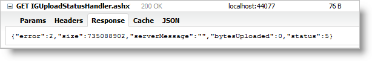

////
|metadata|
{
    "name": "webupload-using-server-side-events",
    "tags": ["How Do I","API","Events"],
    "controlName": ["WebUpload"],
    "guid": "f4d8aadd-5ccc-458d-9320-bd6a19c774a8",
    "buildFlags": [],
    "createdOn": "2015-03-30T09:02:59.8970025Z"
}
|metadata|
////

= WebUpload Using Server Side Events

== Topic Overview

This topic lists the different server-side events of the  _WebUpload_   control, describes their purpose and shows examples on how to handle the events. It also contains an example on how to handle the file uploading process to implement server-side validation.

== Required background

The following lists the concepts, topics, and articles required as a prerequisite to understanding this topic.

link:webupload-overview.html[WebUpload Overview]

link:webupload-http-module-and-handler.html[Using the HTTP Handler and Module (WebUpload)]

== In this topic

* <<serverEvents,UploadProgressManager and Server Events>>

* <<fileStatusEnum,Server Enumerations for File Status and Error>>

* <<sendingData,Sending additional data between the client and server>>

* <<serverValidation,Walkthrough: Server-side validation>>

[[serverEvents]]
== UploadProgressManager and Server Events

The WebUpload control includes a server-side implementation in Infragistics.Web.jQuery.dll to process and save the uploaded data using ASP.NET. This is achieved via a HTTP Module and HTTP Handler that process the server events necessary to accept the uploaded data. You can find more in-depth description and examples on how to configure them in the Using the link:webupload-http-module-and-handler.html[HTTP Handler and Module (WebUpload)] topic.

The server architecture designed so that the handler and module communicate using proxy class called –  pick:[asp-net="link:{ApiPlatform}web.jquery{ApiVersion}~infragistics.web.ui.editorcontrols.uploadprogressmanager.html[*UploadProgressManager* ]"] . This class is also responsible for triggering the server events. The events are the place where you can handle the file uploading process to perform actions like deleting and moving uploaded files, to cancel uploading, to modify status information.

All the three server events have two arguments – one is sender the other is the event argument. The sender is a containing the *UploadProgressManager* , which fires the events. Event argument is specific for every one of the three events below and each event arg implements the IUploadEventArgs interface.

The following code listing demonstrates how to attach to the server events. Each of the events below implements individual handlers.

First you need to add the assembly file that contains the ASP.NET wrappers - Infragistics.Web.jQuery.dll, and then register the prefix for the WebUpload.

[cols="a"]
|====
|*In web.config:*

|---- 
<system.web> 
 <pages> 
 <add tagPrefix="igjq" namespace="Infragistics.Web.UI.EditorControls" 
 assembly="Infragistics.Web.jQuery"/> 
 </pages> 
</system.web>
----

|====

Then you can add the WebUpload to your ASPX page and attach handlers for the control’s events.

[cols="a"]
|====
|*In web.config:*

|---- 
<igjq:WebUpload ID="webUpload1" runat="server" 
 OnUploadFinishing="webUpload1_OnUploadFinishing" 
 OnUploadFinished="webUpload1_OnUploadFinished" 
 OnUploadStarting="webUpload1_OnUploadStarting"> 
</igjq:WebUpload>
----

|====

[start=1]
. *FileStarting*: When the file starts to upload all the information from the request header is available in the event argument of type *UploadingStartEventArgs*. Having this information available at this time which means that in the event handler you can implement validation rules and decide whether or not to cancel the upload. The other important property of the event argument is *TemporaryFileName* – the name of the file during uploading. Only inside *FileStarting* you can set the *serverMessage* property, which than is send to the client.

[cols="a"]
|====
|*In C#:*

|---- 
protected void webUpload1_OnUploadStarting(object sender, UploadStartingEventArgs e){}
----

|====

[start=2]
. *FileFinishing* : At this stage the file is already uploaded but it’s still has the temporary name. The WebUpload has released the file and it can be freely modified.

[cols="a"]
|====
|*In C#:*

|---- 
protected void webUpload1_OnUploadFinishing(object sender, UploadFinishingEventArgs e){}
----

|====

[start=3]
. *FileFinished* : At this stage the file is uploaded and it is renamed with its original name. If there is already a file with the same name the old one is overwritten, only the last one will be available.

[cols="a"]
|====
|*In C#:*

|---- 
protected void webUpload1_OnUploadFinished(object sender, UploadFinishedEventArgs e){}
----

|====

The following code shows how to handle FileFinishing event and to delete the uploaded file, which is at that step of the cycle, with temporary name.

[cols="a"]
|====
|*In ASPX:*

|---- 
<igjq:WebUpload ID="webUpload1" runat="server" 
 OnUploadFinishing="webUpload1_OnUploadFinishing"> 
</igjq:WebUpload>
----

|====

[cols="a"]
|====
|*In C#:*

|---- 
protected void webUpload1_OnUploadFinishing(object sender, UploadFinishingEventArgs e) 
{ 
 string filePath = String.Format("{0}{1}", e.FolderPath, e.TemporaryFileName); 
 if (File.Exists(filePath)) 
 { 
 try 
 { 
 File.Delete(filePath); 
 } 
 catch (Exception ex) 
 { 
 } 
 } 
}
----

|====

[[fileStatusEnum]]
== Server Enumerations for File Status and Error

When upload information is transferred from server to the client, it contains status data for the current upload. Response data includes:

* Uploaded bytes
* File status information
* Error info about any exceptions that may occur

*Table 1* describes details found in the response for the upload status and Table 2 describes file error codes.

An example of a JSON response that includes the described data is depicted in Figure 2.

.Note:
[NOTE]
====
The other JSON properties – size, serverMessage and bytesUploaded, are not needed to be created as enumeration types on the server, like error and status, because they are either dynamically changed strings or numbers.
====

*Table 1*: Enumeration of type  pick:[asp-net="link:{ApiPlatform}web.jquery{ApiVersion}~infragistics.web.ui.editorcontrols.uploadstatus.html[*UploadStatus* ]"]

[options="header", cols="a,a"]
|====
|Value|Description

|0
|File is not started

|1
|File Uploading is started

|2
|File Upload is finished

|3
|File not found - this status is used when it is not found such key in the dictionary

|4
|Cancel file uploading by client command

|5
|Size of the file exceeded

|6
|Error while file is uploading

|7
|File upload is cancelled from server-side event handler

|8
|File uploading is cancelled by dropping client connection

|9
|Status of file when the whole content is uploaded but the file is with temporary filename

|====

*Table 2*: Enumeration of type  pick:[asp-net="link:{ApiPlatform}web.jquery{ApiVersion}~infragistics.web.ui.editorcontrols.fileerror.html[*FileError* ]"]

[options="header", cols="a,a"]
|====
|Value|Description

|-1
|No error

|0
|File error occurs when getting file name from the request

|1
|MIME type validation failed

|2
|File size exceeded

|3
|Temporary folder where file should be uploaded could not be found

|4
|Error while parsing request header

|5
|File does not exist with the specified key in the request

|6
|Error occurs when file saving fails

|7
|Error occurs when trying to write file content

|8
|Error occurred when trying to write file content for the first time

|9
|Error occurred when trying to delete file

|10
|Error set when file upload is cancelled on start uploading in event handler

|====

[[sendingData]]
== Sending additional data between the client and server

In some cases you may want to transfer additional custom data related to the uploaded file from the server to the client or vice versa. For instance you may want to apply some custom file validation on the server and display that result on the client or display some other custom message once the file uploading is completed. Or you may want to send some additional data from the client-side that is relevant to the file that’s being uploaded (security GUID, client-side input field, etc.) and would like to have access to that data on the related server-side events. The following sections will explain in details the way to achieve this in the WebUpload.

== Sending additional data from the server to the client

To add a custom message you can use the UploadStarting, UploadFinishing and UploadFinished's event argument ServerMessage.

*In C#:*

[source,csharp]
----
protected void WebUpload1_UploadStarting(object sender, Infragistics.Web.UI.EditorControls.UploadStartingEventArgs e){          
            e.ServerMessage =  "Upload of " + e.FileName +  " started.";
        }
protected void WebUpload1_UploadFinishing(object sender, Infragistics.Web.UI.EditorControls.UploadFinishingEventArgs e){          
            e.ServerMessage = "Upload of " + e.FileName + " is about to finish.";
        }
protected void WebUpload1_UploadFinished(object sender, Infragistics.Web.UI.EditorControls.UploadFinishedEventArgs e){          
            e.ServerMessage += "Upload of " + e.FileName + " is finished.";
        }
----

This value can then be retrieved on the client-side on the related client-side events-fileUploading and fileUploaded. The uploadInfo event argument contains the additional file information, including the serverMessage value send from the server.

*In JavaScript:*

[source,js]
----
function WebUpload1_FileUploading(eventArgs, args){
      alert(args.fileInfo.serverMessage);
}
function WebUpload1_FileUploaded(eventArgs, args){
      alert(args.fileInfo.serverMessage);
}
----

== Sending additional data from the client to the server

In order to add additional data to the request you can use the onFormDataSubmit client-side event to add additional data to the request. The addDataField and addDataFields methods can be used to add the additional parameters.

*In JavaScript:*

[source,js]
----
function WebUpload1_OnFormDataSubmit(eventArgs, args){
      $(e.target).igUpload("addDataField", args.formData, { "name": "paramName", "value": "paramValue" });
      $(e.target).igUpload("addDataFields", args.formData, [{ "name": "paramName", "value": "paramValue" }]);
}
----

To get the data on the server-side you can use the UploadStarting, UploadFinishing and UploadFinished’s AdditionalDataFields event argument, which will contain a collection of the field name and value passed from the server.

*In C#:*

[source,csharp]
----
protected void WebUpload1_UploadStarting(object sender, Infragistics.Web.UI.EditorControls.UploadStarting e){          
        foreach (var dataField in e.AdditionalDataFields)
       {
           string fieldName = dataField.Name;
           string fieldValue = dataField.Value;
       } 
}
----

.Note:
[NOTE]
====
If you wish to pass more complex data, you can pass it in JSON format as part of the e.ServerMessage string and deserialize it on the client-side.
====

[[serverValidation]]
== Walkthrough: Server-side validation

== Introduction

This procedure guides you through the process of implementing custom validation on the server-side for the  _WebUpload_  .

Requirements

To complete this procedure you need to follow the steps defined in the link:http://broken[WebUpload Overview] topic in the "Adding WebUpload to a Web Page" section.

After following those steps you’ll have a basic WebUpload control in your ASP.NET application.

== Steps

*Step 1.*  Attach a handler for the WebUpload’s UploadStarting event.

*Step 2.*  In the event handler add your custom validation logic and if the conditions are not met set a custom ServerMessage and cancel the event.

*In C#:*

[source,csharp]
----
protected void WebUpload1_UploadStarting(object sender, Infragistics.Web.UI.EditorControls.UploadStartingEventArgs e){
            //Custom Validation logic 
            e.ServerMessage = "Custom error";
            e.Cancel = true;
        }
----

*Step 3.*  Display the custom server message on the client using the OnError client-side event.

Add a client-side event handler for the OnError event. You can add it either via the designer or directly in code.

To add it via the designer:

While in design view select the WebUpload , open the Properties window, navigate to the ClientEvents option and Expand it. You’ll see a list of the available client-side events. Select the OnError event and from the drop-down select “Add new handler” to generate the event handler.

Observe that the WebUpload now contains a new client side event definition.

*In ASPX:*

[source,html]
----
<ig:WebUpload ID="WebUpload1" runat="server" OnUploadStarting="WebUpload1_UploadStarting">        <ClientEvents OnError="WebUpload1_OnError" />
</ig:WebUpload>
----

And a new javascript function with the same name is created in the head section:

*In JavaScript:*

[source,js]
----
function WebUpload1_OnError(eventArgs, infoObject)
{
      //Add code to handle your event here.
}
----

You can get the custom server message from the infoObject and display it:

*In JavaScript:*

[source,js]
----
function WebUpload1_OnError(eventArgs, infoObject){
      alert(infoObject.serverMessage);
}
----

*Step 4.*  Observe the result.

After uploading a file that does not meet the requirements, the custom error message is displayed.

== Related Links

link:webupload-overview.html[WebUpload Overview]