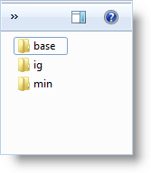
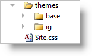

////

|metadata|
{
    "name": "webvideoplayer-styling-and-theming",
    "controlName": ["WebVideoPlayer"],
    "tags": ["Styling","Theming"],
    "guid": "9cf32701-8714-4766-8e52-d1a5f5b02cd2",  
    "buildFlags": [],
    "createdOn": "2011-06-01T08:12:34.6536089Z"
}
|metadata|
////

= WebVideoPlayer Styling and Theming

== Required CSS and Themes

When you decide to use the WebVideoPlayer™ control in your web application the most common issue you will face is making the Video Player control look and feel according to your application’s style. You can achieve this using the following information about styling and theming for the video player in particular and in broader terms for the jQuery controls available in the Infragistics ASP.NET package.

The WebVideoPlayer control, like other jQuery controls, utilizes the jQuery UI CSS Framework for styling. Included in Infragistics ASP.NET is a custom UI theme called ‘IG Theme’. This theme provides a professional and attractive design to all Infragistics jQuery controls and standard jQuery UI widgets.

== Adding Required Themes to a Website

The IG and Base themes are located in the installed directory within the ‘jQuery/themes’ folder. To add the themes to your application, copy the ‘ig’ and ‘base’ directories from the ‘themes’ directory to a directory in your site designated for jQuery UI themes or CSS.

.Note:
[NOTE]
====
The remainder of this document assumes a directory named ‘themes’ as the destination for the copied themes.
====

*Figure 1: Included theme folders upon product install*

*Figure 2: Theme folders copied into destination application*

== IG Theme

The IG Theme is a custom theme which includes all of the styles typically found in a jQuery UI theme. This theme is not required and may be replaced by a different theme. When using a theme other than IG theme, the video player has some additional styling points that may need customization to achieve a complete design.

WebVideoPlayer requires having a link to the stylesheet of a standard jQuery UI theme. For the IG Theme, you must include reference to the theme’s stylesheet in the page:

*In ASPX:*

----
<link href="<%= Url.Content("~/themes/ig/jquery.ui.custom.css") %>" rel="stylesheet" type="text/css" />
----

== Base Theme

The Base Theme is referenced after the jQuery Theme. The following stylesheet are required when using the WebVideoPlayer control:

*In ASPX:*

----
<link href="<%= Url.Content("~/themes/base/ig.ui.min.css") %>" rel="stylesheet" type="text/css" />
----

== Video Player CSS Classes

Below you can find the complete list of CSS classes used by the video player. You can get and set classes for the separate elements using the control’s properties shown the first column.

[options="header", cols="a,a,a"]
|====
|Property|CSS Classes Used|Description

|baseClasses
|ui-widget 

ui-igplayer
|Base CSS classes.

|controlsClass
|ui-widget-header 

ui-igplayer-controls 

ui-igplayer-grid 

ui-igplayer-autohide
|Controls CSS classes.

|controlsHideClass
|ui-igplayer-controls-hide
|Controls hide CSS class. Applied on controls auto hide.

|videoClass
|ui-igplayer-video
|A class applied on the main video element.

|unsupportedBrowserClass
|ui-igplayer-unsupported-browser-msg
|Applied on a span element, shown when the player is opened in a non-HTML5 compatible browser.

|activeVideoClass
|ui-igplayer-active-video
|A class applied on the main video when the control is activated.

|playButtonClass
|ui-igplayer-playbutton
|Applied on the play button of the playback controls.

|progressBarClass
|ui-igplayer-progressbar 

ui-corner-all
|Applied on the slider widget of the playback controls.

|fullScreenClass
|ui-igplayer-fullscreen-button
|A class applied on the full screen button of the playback controls.

|volumeControlClass
|ui-igplayer-volumecontrol
|A class applied on the volume control button of the playback controls.

|volumeSliderClass
|ui-igplayer-volumeslider
|Applied on the volume slider of the playback controls.

|progressLabelClass
|ui-igplayer-progresslabel
|Applied on the progress label of the playback controls.

|bookmarkContainerClass
|ui-widget 

ui-igplayer-bookmark-container
|A class applied on the bookmark container DIV.

|bookmarkContainerHeaderClass
|ui-widget-header 

ui-igplayer-bookmark-header
|Applied on the bookmark header container.

|bookmarkListClass
|ui-widget-content 

ui-igplayer-bookmark-list
|Applied on the bookmark list in the bookmark area.

|bookmarkItemTimeClass
|ui-igplayer-bookmark-item-time
|A class applied on the bookmark list item showing the time in the bookmark area.

|bookmarkItemTitleClass
|ui-igplayer-bookmark-item-title
|Applied on the bookmark list item showing the title in the bookmark area.

|bookmarkActiveItemClass
|ui-igplayer-bookmark-active-item
|A class showing the active bookmark item in the bookmark area.

|relatedVideosContainerClass
|ui-igplayer-related-video-container
|Applied on the related videos container class.

|relatedVideosOuterContainerClass
|ui-igplayer-related-video-outer-container
|A class applied on the related videos outermost container.

|relatedVideoClass
|ui-igplayer-related-video
|Applied on a related video element.

|relatedVideoHoverClass
|ui-igplayer-related-video-hover
|A class applied on a related video hover.

|relatedVideoScrollLeftClass
|ui-igplayer-related-scroller-left
|Applied on the left scroll button.

|relatedVideoScrollLeftIconClass
|ui-icon-triangle-1-w
|The left scroll button icon CSS class.

|relatedVideoScrollRightClass
|ui-igplayer-related-scroller-right
|A class applied on the right scroll button of the related videos.

|relatedVideoScrollRightIconClass
|ui-icon-triangle-1-e
|Applied on the right icon of the scroll button.

|relatedVideoScrollListClass
|ui-igplayer-related-list
|The related videos list CSS class.

|relatedVideosHeaderClass
|ui-igplayer-related-video-header
|Applied on the related videos header area.

|relatedVideoBarClass
|ui-igplayer-related-video-bar
|Applied on the related videos bottom area containing the replay and fullscreen buttons.

|relatedVideoReplayClass
|ui-igplayer-related-video-replay
|A CSS class applied on the replay button in the related videos area.

|relatedVideoReplayIconClass
|ui-icon-arrowrefresh-1-s
|Replay button icon CSS class.

|relatedVideoFullScreenClass
|ui-igplayer-related-video-full-screen
|Applied on the full screen button in the related videos area.

|relatedVideoFullScreenIconClass
|ui-icon-arrow-4-diag
|A class applied on the full screen button icon.

|bannerContainerClass
|ui-igplayer-banner ui-corner-all
|Applied on the banner container div.

|bannerCloseClass
|ui-igplayer-banner-close
|A class applied on the banner close button.

|bannerCloseIconClass
|ui-icon-close
|A class applied on the banner close icon.

|adMsgContainerClass
|ui-igplayer-ad-msg-container
|Applied on the resume video message container.

|adMsgClass
|ui-igplayer-ad-msg
|Applied on the resume video message span.

|adMsgCloseClass
|ui-igplayer-ad-msg-close
|Applied on the resume video message close button.

|adMsgCloseIconClass
|ui-icon-close
|A class applied on the resume video message close button icon.

|linkedBookmarkClass
|ui-igplayer-linked-bookmark
|Applied on the linked commercial bookmark.

|adBookmarkClass
|ui-igplayer-ad-bookmark
|A class applied on an embedded commercial bookmark.

|unsupportedVideoSourceClass
|ui-igplayer-not-supported-video-source
|Applied on the anchor element shown when video sources are unsupported.

|unsupportedVideoSourceIconClass
|ui-igplayer-not-supported-video-source-icon
|Applied on the anchor element showing the unsupported video source icon.

|centerPlayButtonClass
|ui-igplayer-centerplaybutton-play
|Applied on the center play button.

|centerPauseButtonClass
|ui-igplayer-centerplaybutton-pause
|A class applied on the center pause button.

|centerPlayButtonIconClass
|ui-igplayer-centerplaybutton-icon
|A class applied on the center play button icon.

|waitingIndicatorClass
|ui-igplayer-waiting
|Buffering indicator CSS class.

|waitingIndicatorIconClass
|ui-igplayer-waiting-icon
|Applied on the buffering indicator icon.

|seekTooltipClass
|ui-igplayer-seektooltip
|Applied on the seek tooltip.

|====

== External References

* link:http://jqueryui.com/[jQuery UI]
* link:http://jqueryui.com/themeroller/[jQuery Themeroller]