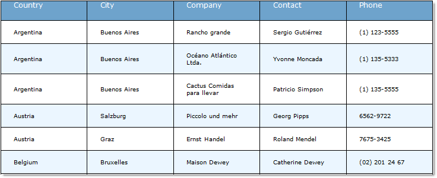

////

|metadata|
{
    "name": "webwordexporter-getting-started-with-webwordexporter",
    "controlName": ["WebWordExporter"],
    "tags": ["Exporting","Getting Started","Grids"],
    "guid": "9b99385f-9987-4aa7-a4d9-a51a67ea841a",  
    "buildFlags": [],
    "createdOn": "2011-10-26T12:55:02.0657202Z"
}
|metadata|
////

= Getting Started With WebWordExporter

This topic demonstrates how to set up the export of WebDataGrid™/WebHierarchicalDataGrid™ data to a Microsoft® Word® file.

== Introduction

Data export from the WebDataGrid/WebHierarchicalDataGrid to MS Word® file format is done with the WebWordExporter™ component. This component can export the data bound to a WebDataGrid/WebHierarchicalDataGrid control irrespective of its type. (For details, refer to the link:webdatagrid-supported-data-sources.html[Supported Data Sources] topic.)

The WebWordExporter can be configured to export either the entire data set available in the data source or just the data that is currently visible in the grid. In the example procedure bellow, the exporter is configured to export all the data in the data source.

The procedure exports customers availability data (County, City, Company, Contact and Phone). The needed information is retrieved from the Cutomers table of the Northwind sample database. The example uses the WebDataGrid, but exporting from the WebHierarchicalDataGrid works the same.

== Preview

Following is a preview of the final result.

== Requirements

* A web page (an ASP.NET web form) with a WebDataGrid bound to a data source. For details, refer to link:webdatagrid-getting-started-with-webdatagrid.html[Getting Started with WebDataGrid]. For the purpose of this particular example, use the following code:

*In HTML:*

----
<ig:WebDataGrid runat="server" ID="wdgCustomers" 
        DataSourceID="SqlDsCustomers" 
        DataKeyFields="CustomerID" 
        AutoGenerateColumns="
        >
            <Columns>
                <ig:BoundDataField Key="Country" DataFieldName="Country" Header-Text="Country" />
                <ig:BoundDataField Key="City" DataFieldName="City" Header-Text="City" />
                <ig:BoundDataField Key="CompanyName" DataFieldName="CompanyName" Header-Text="Company" />
                <ig:BoundDataField Key="ContactName" DataFieldName="ContactName" Header-Text="Contact" />
                <ig:BoundDataField Key="Phone" DataFieldName="Phone" Header-Text="Phone" />
            </Columns>
        </ig:WebDataGrid>
        <asp:SqlDataSource runat="server"ID="SqlDsCustomers"ConnectionString="<%$ ConnectionStrings:NorthwindConnectionString %>" SelectCommand="SELECT * FROM [Customers] ORDER BY [Country]">
        </asp:SqlDataSource>
----

== Overview

Following is a conceptual overview of the process:

[start=1]
. Adding and configuring the WebWordExporter component
[start=2]
. Adding and configuring a button to export data
[start=3]
. (Optional) Verifying the result

== Steps

[start=1]
. Adding and configuring the WebWordExporter component.

.. Drag a WebWordExporter control from the Visual Studio Toolbox onto your page.
.. Set the WebWordExporter’s property ExportMode to Download.
.. Set the control’s ID property to WordExporter.
.. Set the control’s DownloadName property to WebDataGridExport.
.. Set the control’s DataExportMode property to AllDataInDataSource.

*In HTML:*

----
<ig:WebWordExporter ID="WordExporter" ExportMode="Download" runat="server"    DownloadName="WebDataGridExport" DataExportMode="AllDataInDataSource"
 />
----

*In C#:*

----
        WebWordExporter wordExporter = new WebWordExporter();
        wordExporter.ExportMode = Infragistics.Web.UI.GridControls.ExportMode.Download;
        wordExporter.ID = "WordExporter";
        wordExporter.DownloadName = "WebDataGridExport";
        wordExporter.DataExportMode = Infragistics.Web.UI.GridControls.DataExportMode.AllDataInDataSource;
----

[start=2]
. Adding and configuring a button to export data.

.. Drag a Button control from Visual Studio Toolbox onto your page.
.. Set the button’s ID property to btnExport.
.. Set the control’s Text property to Export WebDataGrid.
.. Set the control’s OnClick to btnExport_Click.
.. Define the btnExport_Click handler in the code-behind and call one of the WebExcelExporter Export() method overloads.

*In HTML:*

----
<asp:Button runat="server" ID="btnExport" Text="Export Data" OnClick="btnExport_Click" />
----

*In C#:*

----
protected void btnExport_Click(object sender, EventArgs e)
{
    this.WordExporter.Export(this.wdgCustomers);
}
----

[start=3]
. (Optional) Verify the result.

.. Run the application.
.. Export the grid data.

To export the data, click the Export WebDataGrid button. The browser will ask you whether you want to open or save file named WebDataGridExport.doc.

.. Click the Open button to open the exported data into Word.

If you have implemented the steps correctly, the exported data should look as in the Preview above.

== Related Topics

Following are some other topics you may find useful.

* link:webwordexporter-about-webwordexporter.html[About WebWordExporter]
* link:webwordexporter-api-overview.html[API Overview]