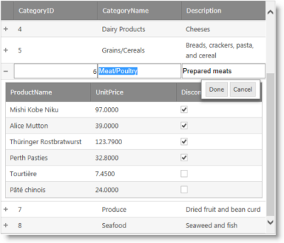
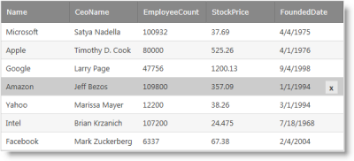

////

|metadata|
{
    "name": "whats-new-14-1",
    "controlName": [],
    "tags": [],
    "guid": "f839c73d-09f3-4924-a044-392e271ac3ae",  
    "buildFlags": [],
    "createdOn": "2014-03-11T14:46:22.5474277Z"
}
|metadata|
////

= What's New in 2014 Volume 1

== Topic Overview

=== Purpose

This topic provides an overview of the new things and new and enhanced features for the Infragistics® ASP.NET 2014 Volume 1 release.

== What’s New Summary

=== What’s new summary chart

The following table summarizes what’s new in 2014 Volume 1 release. Additional details follow the summary table.

==== <<_Ref367305754,General>>

[options="header", cols="a,a"]
|====
|Feature|Description

|<<_Ref382485996,New default look-and-feel>>
|There is a new, modern default theme for the Infragistics ASP.NET controls.

|<<_Ref382486066,New Visual Studio templates>>
|You can find a new set of Infragistics templates in the File - New Project dialog of Microsoft® Visual Studio®.

|====

==== _ _<<Ref382591305, WebDataGrid ,  WebHierarchicalDataGrid >>_ _

[options="header", cols="a,a"]
|====
|Feature|Description

|<<_Ref382213299,Row editing behavior>>
|The Row Editing behavior is an improved editing mode, designed to provide a better editing experience to the user.

|<<_Ref382213310,Delete button>>
|When enabled, the Delete button displays over a row providing a discoverable user interface to delete a row.

|====

[[_Ref367305754]]

== General

[[_Ref382485996]]

=== New default look-and-feel

In order to keep up with the modern look-and-feel of web applications, a new, modern default theme has been made available for all Infragistics ASP.NET controls. The old default theme has been renamed to IG2007.

[[_Ref382486066]]

=== New Visual Studio templates

You can find a new set of Infragistics templates in the File - New Project dialog of Visual Studio 2012 and later. These templates are designed to help you get started with a functional, well-designed, and fully-styled application.

Each template includes documentation and more templates will appear in the Infragistics Template Gallery over time to address a wide range of application scenarios.

image::images/Whats_New_Project_Dialog.png[]

[[_Ref367305775]]

[[_Ref382591305]]
== _WebDataGrid_,  _WebHierarchicalDataGrid_

[[_Ref382213299]]

=== Row editing behavior

The Row Editing behavior is an improved editing mode, designed to provide a better editing experience to the user. With Row Editing, the editable row displays all of the cell editors making it more apparent which row is editable. Also, there are new Done and Cancel buttons displayed in a dialog alongside the editable row. These buttons provide better control when committing or cancelling pending edits.

==== Related Topics:

* link:webdatagrid-row-editing-overview.html[Row Editing Overview (WebDataGrid)]
* link:whdg-row-editing-overview.html[Row Editing Overview (WebHierarchicalDataGrid)]

[[_Ref382213310]]

=== Delete button

When enabled, the Delete button displays over a row providing a discoverable user interface to delete a row. The button can be styled to fit the overall look-and-feel of your application.

==== Related Topics:

* link:webdatagrid-row-deleting-overview.html[Row Deleting Overview (WebDataGrid)]
* link:whdg-row-deleting-overview.html[Row Deleting Overview (WebHierarchicalDataGrid)]