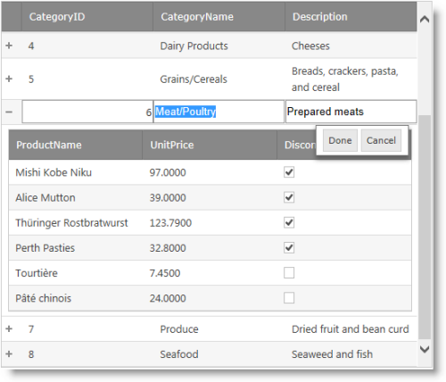
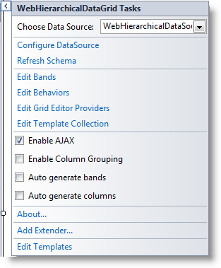
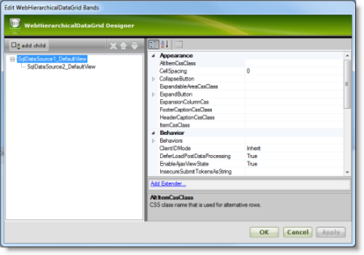
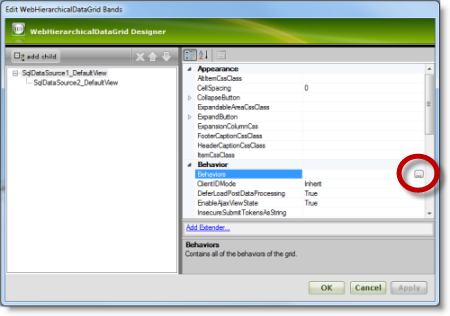
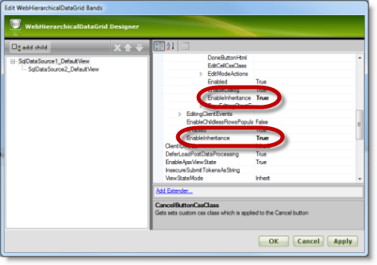

////
|metadata|
{
    "name": "whdg-enabling-row-editing",
    "controlName": [],
    "tags": [],
    "guid": "370935cb-08bd-4dcc-828b-5bdde8449c4b",
    "buildFlags": [],
    "createdOn": "2014-03-10T17:12:24.2498306Z"
}
|metadata|
////

= Enabling Row Editing (WebHierarchicalDataGrid)

== Topic Overview

=== Purpose

This topic details how to enable the Row Editing behavior in the  _WebHierarchicalDataGrid_   __™__ .

=== Required background

The following topics are prerequisites to understanding this topic:

[options="header", cols="a,a"]
|====
|Topic|Purpose

| link:whdg-row-editing-overview.html[Row Editing Overview (WebHierarchicalDataGrid)]
|This topic provides an overview of the Row Editing behavior’s features and functionality.

| link:webhierarchicaldatagrid-getting-started-with-webhierarchicaldatagrid.html[Getting Started with WebHierarchicalDataGrid]
|This topic demonstrates how to setup a basic _WebHierarchicalDataGrid_ bound to a SqlDataSource.

|====

=== In this topic

This topic contains the following sections:

* <<_Ref382256645, Introduction >>

** <<OLE_LINK236,Enabling row editing summary>>
** <<_Ref382246047,Enabling row editing summary chart>>

* <<_Ref382204188, Enabling Row Editing with the WebHierarchicalDataGrid Designer >>

** <<_Ref382256699,Introduction>>
** <<OLE_LINK77,Preview>>
** <<OLE_LINK41,Prerequisites>>
** <<_Ref382256737,Overview>>
** <<_Ref382256750,Steps>>

* <<_Ref382204208, Enabling Row Editing in ASPX Markup >>

** <<_Ref382256787,Introduction>>
** <<_Ref382256797,Preview>>
** <<_Ref382256808,Prerequisites>>
** <<_Ref382256817,Overview>>
** <<_Ref382256825,Steps>>

* <<_Ref382204226, Enabling Row Editing in the Code-Behind >>

** <<_Ref382256843,Introduction>>
** <<_Ref382256851,Preview>>
** <<_Ref382256862,Prerequisites>>
** <<_Ref382256872,Overview>>
** <<_Ref382256879,Steps>>

* <<_Ref382204244, Related Content >>

** <<_Ref382256939,Topics>>
** <<_Ref382256948,Samples>>

[[_Ref382246037]]
[[_Ref382256645]]
[[_Ref382204188]]
== Introduction

=== Enabling row editing summary

By default, row editing is disabled. You can enable it from the  _WebHierarchicalDataGrid_   Designer, from the ASPX markup, or in the code-behind. Each of these is explained in detail below.

[[_Ref382246047]]

=== Enabling row editing summary chart

The following table summarizes the ways to enable row editing for the  _WebHierarchicalDataGrid_  . The full procedures are available after this summary table.

[options="header", cols="a,a"]
|====
|Procedure|Details

|<<_Ref382204188,Enabling Row Editing with the Designer>>
|You enable the Row Editing and Editing Core behaviors by setting the respective options from _WebHierarchicalDataGrid_ ’s smart tag.

|<<_Ref382204208,Enabling Row Editing in ASPX Markup>>
|You enable the Row Editing and Editing Core behaviors by adding the respective ASPX markup to the web form.

|<<_Ref382204226,Enabling Row Editing in the Code-Behind>>
|You enable the Row Editing and Editing Core behaviors by creating them in the code-behind.

|====

[[_Ref382204188]]
== Enabling Row Editing with the  _WebHierarchicalDataGrid_  Designer

[[_Ref382256699]]

=== Introduction

This example shows how to enable the Row Editing and Editing Core behaviors of the  _WebHierarchicalDataGrid_   using the control’s designer.

=== Preview

The following screenshot is a preview of the final result.

=== Prerequisites

To complete the procedure, you need the following:

* An ASP.NET Visual Studio® web site or web application
* A ScriptManager or  _WebScriptManager_™ added to the web form
* A  _WebHierarchicalDataGrid_   bound to a hierarchical data source

[[_Ref382256737]]

=== Overview

Following is a conceptual overview of the process:

*1. Accessing a Band’s Behaviors options*

*2. Enabling row editing on an individual band*

*3.*   _(Optional)_    * Enabling row editing on all bands*

*4.*   _(Optional)_    * Verifying the result*

[[_Ref382256750]]

=== Steps

The following steps demonstrate how to enable row editing in the designer.

=== 1. Access a Band’s Behaviors options.

*Open the WebHierarchicalDataGrid smart tag.*

In the ASPX page designer, click the smart tag button to open the  _WebHierarchicalDataGrid_   designer.

 *2. Click the Edit Bands link.* 

This opens the Designer for editing the available bands.

=== 2. Enable row editing on an individual band.

*1. Open the Behaviors Designer.*

Select the parent band and expand the Behavior node of the tree. Select the `Behaviors` property and click the ellipsis […] button.

.Note:
[NOTE]
====
You can select any individual band to enable the row editing behavior on that band only.
====

 *2. Select the Row Editing Behavior.* 

Select the checkbox next to the Row Editing behavior. Enabling this checkbox also enables the Editing Core behavior.

=== 3. (Optional) Enable row editing on all bands

*1. Open the Bands Designer.*

In the ASPX Page Designer, click the smart tag button to open the  _WebHierarchicalDataGrid_   Designer and click Edit Bands.

 *2. Enable Inheritance on both the EditingCore and Row Editing behaviors.* 

Ensure the parent data view is selected. In this case, it is called  _SqlDataSource1_DefaultView_  . Set the `EnableInheritance` property of the EditingCore and RowEditing behavior in the property grid.

*3. Close the Designer.*

=== 4. (Optional) Verifying the result.

**To verify the result,**  *run the project. You will see that you can edit the rows of the parent band and all of the child bands.*

[[_Ref382204208]]
== Enabling Row Editing in ASPX Markup

[[_Ref382256787]]

=== Introduction

You enable the Row Editing and Editing Core behaviors by adding the respective ASPX markup to the web form. This is the same markup that is generated when using the designer (See <<_Ref382256486,Enabling Row Editing with the WebHierarchicalDataGrid Designer>>). Because the Row Editing behavior requires the EditingCore behavior, you will add that as well.

[[_Ref382256797]]

=== Preview

The following screenshot is a preview of the final result.

[[_Ref382256808]]

=== Prerequisites

To complete the procedure, you need the following:

* An ASP.NET Visual Studio web site or web application
* A  _WebHierarchicalDataGrid_   bound to a hierarchical data source
* The ig_res folder and styleset included in the project and configured in the  _web.config_   file
* The  _Infragistics.Web.UI_   and  _Infragistics.Web.UI.GridControls_   namespaces registered on the web form with the `ig` tag prefix

[[_Ref382256817]]

=== Overview

Following is a conceptual overview of the process:

*1. Enabling Row Editing in ASPX Markup on the parent grid.*

*2.*   *_(Optional)_*   *Enabling row editing in a child band.*

*3.*   *_(Optional)_*   *Enabling row editing on all bands.*

*4.*   *_(Optional)_*   * Verifying the result.*

[[_Ref382256825]]

=== Steps

The following steps demonstrate how to enable the Row Editing behavior in ASPX markup.

=== 1. Enable Row Editing in ASPX Markup on the parent grid.

*1. Add the EditingCore behavior to the*   *_WebHierarchicalDataGrid_*   *behaviors collection*

The `Behaviors` tag is nested within the `WebHierarchicalDataGrid` tags. If you already have other behaviors defined, the EditingCore behavior is added as a sibling of those behaviors within the `Behaviors` tag.

*In ASPX:*

[source,html]
----
<ig:WebHierarchicalDataGrid ID="WebHierarchicalDataGrid1" runat="server">
    <Behaviors>
        <ig:EditingCore>
        </ig:EditingCore>
    </Behaviors>
</ig:WebHierarchicalDataGrid>
----

 *2. Add the RowEditing behavior within the EditingCore’s behaviors collection.*  The EditingCore behavior has a `Behaviors` collection similar to the grid. The RowEditing behavior is defined within the `Behaviors` tag of the `EditingCore` tag.

*In ASPX:*

[source,html]
----
<ig:EditingCore>
    <Behaviors>
        <ig:RowEditing></ig:RowEditing>
    </Behaviors>
</ig:EditingCore>
----

*3. Save the ASPX of the page.*

At this point, the code and grid should have the following code elements and functionality.

*In ASPX:*

[source,html]
----
<ig:WebHierarchicalDataGrid ID="WebHierarchicalDataGrid1" runat="server">
    <Behaviors>
        <ig:EditingCore>
            <Behaviors>
                <ig:RowEditing></ig:RowEditing>
            </Behaviors>
        </ig:EditingCore>
    </Behaviors>
</ig:WebHierarchicalDataGrid>
----

=== 2. (Optional) Enable row editing in a child band.

*1. Add the EditingCore Behavior to the individual band’s behaviors collection*

Each band defined in ASPX has its own Behaviors collection. If you already have other behaviors defined, the EditingCore behavior is added as a sibling of those behaviors within the `Behaviors` tag.

*In ASPX:*

[source,html]
----
<ig:Band AutoGenerateColumns=" DataMember="SqlDataSource2_DefaultView" Key="SqlDataSource2_DefaultView">
    <Behaviors>
        <ig:EditingCore>
        </ig:EditingCore>
    </Behaviors>
</ig:Band>
----

 *2. Add the RowEditing behavior within the EditingCore’s behaviors collection* The EditingCore behavior has a `Behaviors` collection similar to the grid. The RowEditing behavior is defined within the `Behaviors` tag of the `EditingCore` tag.

*In ASPX:*

[source,html]
----
<ig:EditingCore>
    <Behaviors>
        <ig:RowEditing></ig:RowEditing>
    </Behaviors>
</ig:EditingCore>
----

*3. Save the ASPX for your page.*

At this point, the code and grid should have the following code elements and functionality.

*In ASPX:*

[source,html]
----
<ig:Band AutoGenerateColumns=" DataMember="SqlDataSource2_DefaultView" Key="SqlDataSource2_DefaultView" >
    <Behaviors>
        <ig:EditingCore>
            <Behaviors>
                <ig:RowEditing></ig:RowEditing>
            </Behaviors>
        </ig:EditingCore>
    </Behaviors>
</ig:Band>
----

=== 3. (Optional) Enable row editing on all bands.

*Set EnableInheritance to true on the EditingCore and RowEditing behaviors*

On the grid’s behaviors collection, set EnableInheritance to true for the EditingCore and RowEditing behaviors.

*In ASPX:*

[source,html]
----
<ig:WebHierarchicalDataGrid ID="WebHierarchicalDataGrid1" runat="server">
    <Behaviors>
        <ig:EditingCore EnableInheritance="true">
            <Behaviors>
                <ig:RowEditing EnableInheritance="true"></ig:RowEditing>
            </Behaviors>
        </ig:EditingCore>
    </Behaviors>
</ig:WebHierarchicalDataGrid>
----

=== 4. (Optional) Verify the result.

**To verify the result,**  *run the project. You will see the Row Editing behavior enabled for the desired bands.*

[[_Ref382204226]]
== Enabling Row Editing in the Code-Behind

[[_Ref382256843]]

=== Introduction

This procedure adds the RowEditing behavior to the  _WebHierarchicalDataGrid_   at runtime in the code-behind. This approach is useful when you want to add the behavior conditionally. The RowEditing behavior is added to the EditingCore behavior’s Behaviors collection so you will add the EditingCore behavior at runtime as well.

It is best to use the InitializeBand event to change the behaviors on each band, including the parent  _WebHierarchicalDataGrid_  . To determine the band initializing, use the DataMember property of the band which serves as a unique identifier. Whenever you change a band during this event, you should call the  _WebHierarchicalDataGrid_   `RefreshBehaviors` method to ensure the changes are applied. Finally, the behavior definitions are saved in ViewState by default so you only need to perform these changes on initial load and not on postback unless you make changes to the behaviors during a postback.

[[_Ref382256851]]

=== Preview

The following screenshot is a preview of the final result.

[[_Ref382256862]]

=== Prerequisites

To complete the procedure, you need the following:

* An ASP.NET Visual Studio web site or web application
* A  _WebHierarchicalDataGrid_   bound to a hierarchical data source
* The ig_res folder and styleset included in the project and configured in the  _web.config_   file
* A using statement for the  _Infragistics.Web.UI.GridControls_   namespace

[[_Ref382256872]]

=== Overview

Following is a conceptual overview of the process:

*1. Creating an event handler for the InitializeBand event*

*2. Enabling Row Editing in the code-behind in the InitializeBand event*

*3.*   _(Optional)_    *Enabling row editing on all bands in the code-behind*

*4.*   _(Optional)_    * Verifying the result*

[[_Ref382256879]]

=== Steps

The following steps demonstrate how to enable the Row Editing behavior in the code-behind.

=== 1. Create an event handler for the InitializeBand event.

*Create an event and event handler for the InitializeBand event.*

*In C#:*

[source,csharp]
----
using Infragistics.Web.UI.GridControls;
protected void Page_Init(object sender, EventArgs e)
{
    this.WebHierarchicalDataGrid1.InitializeBand += new InitializeBandEventHandler(WebHierarchicalDataGrid1_InitializeBand);
}
void WebHierarchicalDataGrid1_InitializeBand(object sender, BandEventArgs e)
{
}
----

=== 2. Enable Row Editing in the code-behind in the InitializeBand event.

 *1. Add the EditingCore and RowEditing behaviors to the desired band(s).* Because the InitializeBand event fires for each band, you must check the DataMember property of the band in order to apply the changes to one band. For this example, I want to add the EditingCore and RowEditing behaviors to the  _SqlDataSource1_DefaultView_  band.

*In C#:*

[source,csharp]
----
void WebHierarchicalDataGrid1_InitializeBand(object sender, BandEventArgs e)
{
    WebHierarchicalDataGrid grid = sender as WebHierarchicalDataGrid;
    if (grid != null)
    {
        if (!this.IsPostBack && e.Band.DataMember == "SqlDataSource1_DefaultView")
        {
            e.Band.Behaviors.CreateBehavior<EditingCore>();
            e.Band.Behaviors.EditingCore.Behaviors.CreateBehavior<RowEditing>();
        }
    }
}
----

*3. Call RefreshBehaviors after the band changes have been made.*

*In C#:*

[source,csharp]
----
grid.RefreshBehaviors();
----

*4. Save the code-behind file.*

The code and grid should have the following code elements and functionality.

*In C#:*

[source,csharp]
----
void WebHierarchicalDataGrid1_InitializeBand(object sender, BandEventArgs e)
{
    WebHierarchicalDataGrid grid = sender as WebHierarchicalDataGrid;
    if (grid != null)
    {
        if (!this.IsPostBack && e.Band.DataMember == "SqlDataSource1_DefaultView")
        {
            e.Band.Behaviors.CreateBehavior<EditingCore>();
            e.Band.Behaviors.EditingCore.Behaviors.CreateBehavior<RowEditing>();
        }
        grid.RefreshBehaviors();
    }
}
----

=== 3. (Optional) Enable row editing on all bands in the code-behind.

*Set EnableInheritance to*   _true_    *on the EditingCore and RowEditing behaviors.*

In the InitializeBand event handler, set `EnableInheritance` to  _true_  for the EditingCore and RowEditing behaviors.

*In C#:*

[source,csharp]
----
void WebHierarchicalDataGrid1_InitializeBand(object sender, BandEventArgs e)
{
    WebHierarchicalDataGrid grid = sender as WebHierarchicalDataGrid;
    if (grid != null)
    {
        if (!this.IsPostBack && e.Band.DataMember == "SqlDataSource1_DefaultView")
        {
            e.Band.Behaviors.CreateBehavior<EditingCore>();
            e.Band.Behaviors.EditingCore.Behaviors.CreateBehavior<RowEditing>();
            e.Band.Behaviors.EditingCore.EnableInheritance = true;
            e.Band.Behaviors.EditingCore.Behaviors.RowEditing.EnableInheritance = true;
        }
        grid.RefreshBehaviors();
    }
}
----

=== 4. (Optional) Verify the result.

**To verify the result,**  *run the project. Choose a band that you enabled with Row Editing and double click a row. You will see the row enter Edit mode.*

[[_Ref382204244]]
== Related Content

[[_Ref382256939]]

=== Topics

The following topics provide additional information related to this topic.

[options="header", cols="a,a"]
|====
|Topic|Purpose

| link:webhierarchicaldatagrid-editing-behavior-overview.html[Editing Behavior Overview (WebHierarchicalDataGrid)]
|This topic provides information on the editing behaviors in the _WebHierarchicalDataGrid_ .

| link:webdatagrid-enabling-row-editing.html[Enabling Row Editing (WebDataGrid)]
|This topic details how you can enable the Row Editing behavior in the _WebDataGrid_™.

|====

[[_Ref382256948]]

=== Samples

The following samples provide additional information related to this topic.

[options="header", cols="a,a"]
|====
|Sample|Purpose

| link:{SamplesUrl}/hierarchical-data-grid/row-editing[Row Editing]
|This sample demonstrates row editing behavior with Done/Cancel buttons and an editor appearing in every cell of the editable row.

| link:{SamplesUrl}/data-grid/customized-row-editing-appearance[Customized Row Editing Appearance]
|You can customize the appearance of the Row Editing behavior by hiding the Done/Cancel buttons or by providing custom HTML and CSS classes for the buttons. This is a _WebDataGrid_ sample and the same concepts apply for the _WebHierarchicalDataGrid_ .

| link:{SamplesUrl}/data-grid/row-editing-client-events[Row Editing Client Events]
|This sample demonstrates how to use the EnteringEditMode and ExitingEditMode events to customize the row editing behavior. This is a _WebDataGrid_ sample and the same concepts apply for the _WebHierarchicalDataGrid_ .

|====