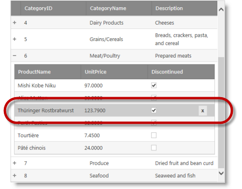

////

|metadata|
{
    "name": "whdg-row-deleting-overview",
    "controlName": [],
    "tags": [],
    "guid": "d6c9f6a9-da2e-4ff9-a124-b77bd90636d7",
    "buildFlags": [],
    "createdOn": "2014-03-10T17:14:37.5074728Z"
}
|metadata|
////

= Row Deleting Overview (WebHierarchicalDataGrid)

== Topic Overview

=== Purpose

This topic provides an overview of the  _WebHierarchicalDataGrid_   __™__  Row Deleting behavior’s features and functionality.

=== Required background

The following topics are prerequisites to understanding this topic:

[options="header", cols="a,a"]
|====
|Topic|Purpose

| link:webhierarchicaldatagrid-behaviors.html[Behaviors]
|This topic describes how behaviors work in the _WebHierarchicalDataGrid_ .

| link:whdg-row-editing-overview.html[Row Editing Overview (WebHierarchicalDataGrid)]
|This topic provides a conceptual overview of the Editing feature (`EditingCore` behavior) of the _WebHierarchicalDataGrid_ .

|====

=== In this topic

This topic contains the following sections:

* <<_Ref382264044,Introduction>>
* <<_Ref382264049,Main Features>>
* <<_Ref382264057,User Interactions and Usability>>
* <<_Ref382264063,Row Deleting Behavior Events>>
* <<_Ref382264072,Related Content>>

** <<_Ref382264076,Topics>>
** <<_Ref382264081,Samples>>

[[_Ref382264044]]

== Introduction

=== Row Deleting summary

The Row Deleting behavior provides deleting functionality for the  _WebHierarchicalDataGrid_  . As with all behaviors, the required client-side HTML and JavaScript are only rendered when the behavior is enabled. By default, rows are deleted by selecting a row and using the delete key. As such, you must include the Selection behavior for the grid and also set RowSelectType to be different than the default value - None. There is an option to enable a delete button to provide a more explicit user interface. As with other Editing behaviors, the Row Deleting behavior is configurable globally or individually for each band.

[[_Ref382264049]]
== Main Features

=== Main features summary chart

The following table summarizes the main features of the  _WebHierarchicalDataGrid_   Row Editing behavior.

[options="header", cols="a,a"]
|====
|Feature|Description

|Deleting with the keyboard
|By default, the Row Deleting behavior provides keyboard support when the user clicks the delete key.

|Delete Button
|When enabled, the delete button displays when the mouse hovers over a row providing a discoverable user interface to delete a row.

|====

[[_Ref381987257]]

[[_Ref382264057]]
== User Interactions and Usability

=== User interactions summary chart

The following table summarizes the user interaction capabilities of the  _WebHierarchicalDataGrid_   Row Deleting behavior.

[options="header", cols="a,a,a,a"]
|====
|The user can…|Using…|Details|Configurable?

|Delete a row
|The Delete key

The Delete button on mouse hover
|When the Row Deleting behavior is enabled along with the Selection behavior, the user can select a row and press the Delete key to delete the selected row.
|image::images/workaround.png[]

The Delete button is enabled using the Row Deleting behavior’s link:{ApiPlatform}web{ApiVersion}~infragistics.web.ui.gridcontrols.rowdeleting~showdeletebutton.html[ShowDeleteButton] property.

|====

[[_Ref381987341]]

[[_Ref382264063]]
== Row Deleting Behavior Events

=== Row deleting behavior events reference

The Row Deleting behavior has the following client-side events used to customize client-side functionality.

[options="header", cols="a,a"]
|====
|Event|Description

|`DeleteButtonDisplaying`
|Fires prior to the Delete button displaying when the mouse hovers over a row. The event applies only when the Delete button is enabled. It is cancellable.

|`DeleteButtonDisplayed`
|Fires after the Delete button displays as a result of hovering the mouse over a row. The event applies only when the Delete button is enabled.

|`DeleteButtonHidden`
|Fires after the Delete button hides when the mouse hovers off a row. The event applies only when the Delete button is enabled.

|====

==== Related Samples:

* link:{SamplesUrl}/data-grid/customized-row-deleting-button[Customized Row Deleting Button]

[[_Ref382264072]]
== Related Content

[[_Ref382264076]]

=== Topics

The following topics provide additional information related to this topic.

[options="header", cols="a,a"]
|====
|Topic|Purpose

| link:webhierarchicaldatagrid-enabling-row-deleting.html[Enabling Row Deleting]
|This topic details how to enable the Row Deleting behavior in the _WebHierarchicalDataGrid_ .

|====

[[_Ref382264081]]

=== Samples

The following samples provide additional information related to this topic.

[options="header", cols="a,a"]
|====
|Sample|Purpose

| link:{SamplesUrl}/data-grid/delete-rows-basic-features[Delete Rows – Basic Features]
|The _WebHierarchicalDataGrid_ includes a delete row behavior that allows an end user to remove one or more rows of data from the bound data source. This sample shows how to setup the behavior so when the user clicks on the delete icon the current row is deleted from the bound data source. This is a _WebDataGrid_™ sample and the same configuration applies to the _WebHierarchicalDataGrid_ .

| link:{SamplesUrl}/data-grid/delete-rows-server-events[Delete Rows – Server Events]
|The _WebHierarchicalDataGrid_ includes a delete row behavior that allows an end user to remove one or more rows of data from the bound data source. This sample shows how to interact with the server events of the behavior. This is a _WebDataGrid_ sample and the same configuration applies to the _WebHierarchicalDataGrid_ .

| link:{SamplesUrl}/hierarchical-data-grid/row-deleting-button[Row Deleting Button]
|This sample demonstrates enabling the Delete button in the _WebHierarchicalDataGrid_ .

| link:{SamplesUrl}/data-grid/customized-row-deleting-button[Customized Row Deleting Button]
|You can customize the appearance of the Row Deleting behavior using the Row Deleting properties. Furthermore, you can use the `DeleteButtonDisplaying` event to prevent the button from appearing. This is a _WebDataGrid_ sample and the same configuration applies to the _WebHierarchicalDataGrid_ .

|====